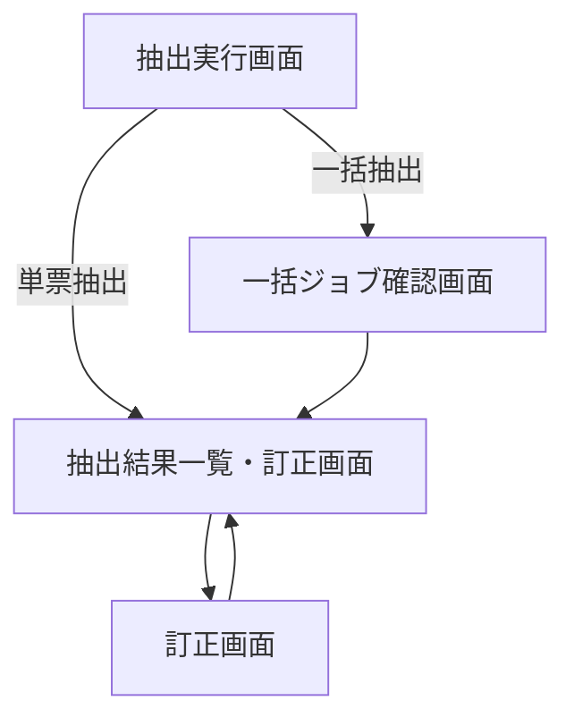
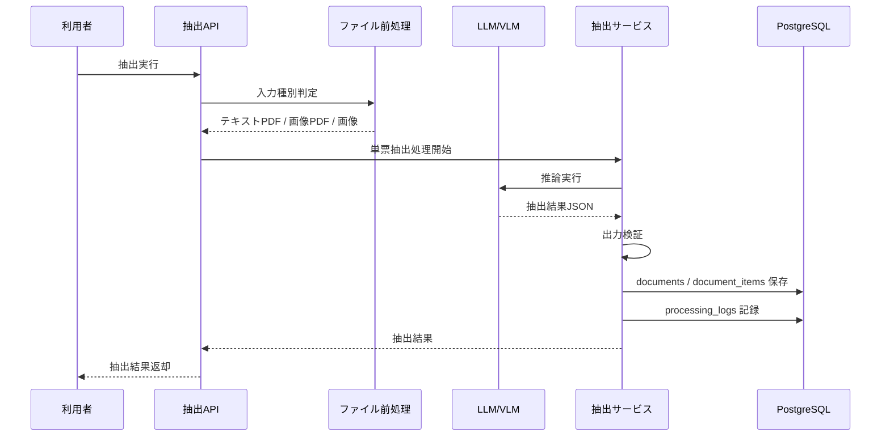
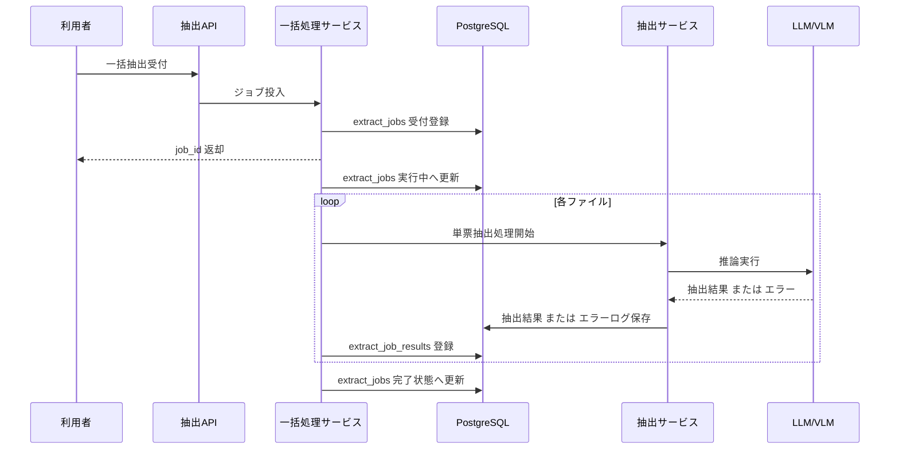

# System 01 基本設計
## 請求書・領収書 データ抽出システム

---

## 1. システム構成設計

### 1.1 全体構成図

```
┌─────────────────────────────────────────────────────────────────┐
│  クライアント（curl / 将来的なWeb画面）                           │
└─────────────────────┬───────────────────────────────────────────┘
                      │ HTTP（multipart/form-data / JSON）
┌─────────────────────▼───────────────────────────────────────────┐
│  FastAPI アプリケーション層                                       │
│  ┌─────────────┐ ┌──────────────┐ ┌────────────────────────────────┐ │
│  │POST /extract│ │POST /extract │ │PATCH /documents/{document_id}  │ │
│  │（単票・同期）│ │/bulk（一括）  │ │/correct（修正再登録）           │ │
│  └──────┬──────┘ └──────┬───────┘ └─────────────┬────────────────┘ │
│         │               │                     │                 │
│  ┌──────▼───────────────▼─────────────────────▼────────────┐   │
│  │  ExtractService（抽出サービス層）                          │   │
│  │  ① ファイル種別判定 → モデル選択                          │   │
│  │  ② テキスト抽出 or VLM 呼び出し判定                      │   │
│  │  ③ プロンプト構築（システムプロンプト + Few-shot）         │   │
│  │  ④ LLM / VLM 呼び出し（LM Studio）                       │   │
│  │  ⑤ 出力バリデーション（Pydantic）                         │   │
│  │  ⑥ 信頼度スコア付与・要確認フラグ制御                     │   │
│  └──────┬───────────────────────────────────────────────────┘   │
│         │                                                        │
│  ┌──────▼──────────────────────┐  ┌───────────────────────────┐ │
│  │  DocumentRepository（DB層） │  │  MLflow トレース送信        │ │
│  │  PostgreSQL / SQLAlchemy    │  │  （各ステップの入出力・時間）│ │
│  └─────────────────────────────┘  └───────────────────────────┘ │
└─────────────────────────────────────────────────────────────────┘
                      │
┌─────────────────────▼───────────────────────────────────────────┐
│  LM Studio ローカルサーバー                                       │
│  ┌─────────────────────┐  ┌──────────────────────────────────┐  │
│  │  Qwen3-27B（Q4量子化）│  │  Qwen3-VL-32B（Q4量子化）       │  │
│  │  テキストPDFの抽出用  │  │  画像スキャンPDF・画像ファイル用 │  │
│  └─────────────────────┘  └──────────────────────────────────┘  │
└─────────────────────────────────────────────────────────────────┘
                      │
┌─────────────────────▼───────────────────────────────────────────┐
│  PostgreSQL                                                       │
│  ┌──────────────┐  ┌─────────────────┐  ┌──────────────────┐   │
│  │  documents   │  │ document_items  │  │ processing_logs  │   │
│  └──────────────┘  └─────────────────┘  └──────────────────┘   │
└─────────────────────────────────────────────────────────────────┘
```

### 1.2 コンポーネント一覧

| コンポーネント | 役割 | 実装ファイルイメージ |
|-------------|------|-------------------|
| FastAPI ルーター | エンドポイント定義・リクエスト受付 | `routers/extract.py` |
| ExtractService | 抽出ロジック全体の制御 | `services/extract_service.py` |
| FileProcessor | ファイル種別判定・テキスト抽出 | `services/file_processor.py` |
| LLMClient | LM Studio Qwen3-27B 呼び出し | `clients/llm_client.py` |
| VLMClient | LM Studio Qwen3-VL-32B 呼び出し | `clients/vlm_client.py` |
| PromptBuilder | プロンプト組み立て（システムプロンプト + Few-shot） | `prompts/extract_prompt.py` |
| OutputValidator | Pydantic によるスキーマ検証 | `validators/extract_validator.py` |
| DocumentRepository | documents / document_items テーブルの CRUD | `repositories/document_repository.py` |
| LogRepository | processing_logs テーブルへの記録 | `repositories/log_repository.py` |
| CSVExporter | 登録済みデータの CSV 生成 | `services/csv_exporter.py` |
| MLflowTracer | トレース情報の MLflow への送信 | `utils/mlflow_tracer.py` |

---

## 2. モデル選定

### 2.1 採用モデルと選定根拠

| 処理対象 | 採用モデル | 選定根拠 |
|---------|-----------|---------|
| テキスト層 PDF（テキスト抽出可能） | Qwen3-27B（Q4量子化） | テキスト入力のみで Vision 不要。コスト・速度を抑えられる |
| 画像スキャン PDF / PNG / JPG / JPEG | Qwen3-VL-32B（Q4量子化） | マルチモーダル対応。画像から直接項目を読み取り可能 |

### 2.2 モデル切り替えロジック

```
入力ファイル受付
    │
    ├─ PDF の場合 → PyMuPDF でテキスト抽出を試みる
    │       ├─ テキスト取得成功（文字数 >= 50）→ Qwen3-27B を使用
    │       └─ テキストなし（スキャンPDF）→ PDF を画像化 → Qwen3-VL-32B を使用
    │
    └─ PNG / JPG / JPEG の場合 → 即座に Qwen3-VL-32B を使用
```

**テキスト判定閾値**：抽出テキストが 50 文字以上の場合はテキスト層PDFと判定する。

### 2.3 LM Studio 接続設定

| 設定項目 | 値 |
|---------|---|
| エンドポイント（共通） | `http://localhost:5858/v1/chat/completions` |
| テキスト用モデル名 | `qwen3.5-27b`（LM Studio のモデル識別子） |
| VLM 用モデル名 | `qwen3.5-27b`（LLM・VLM 共通。`.env.docker` の `VLM_MODEL` で制御） |
| LLM / VLM 1回あたりのタイムアウト | **`.env.docker` の `MODEL_TIMEOUT_SECONDS` に従う**（現在 600秒） |

---

## 3. IF仕様（入出力仕様）

### 3.1 エンドポイント一覧

| メソッド | パス | 概要 | 応答方式 |
|---------|------|------|---------|
| POST | `/extract` | 単票抽出（1ファイル） | 同期（200） |
| POST | `/extract/bulk` | 一括抽出（複数ファイル） | 非同期受付（202）|
| GET | `/extract/bulk/{job_id}` | 一括抽出の結果確認 | 同期（200） |
| GET | `/documents` | 登録済みデータ一覧取得 | 同期（200） |
| GET | `/documents/export` | CSV エクスポート | 同期（200） |
| PATCH | `/documents/{document_id}/correct` | 抽出結果の修正・再登録 | 同期（200） |

---

### 3.2 POST /extract（単票抽出）

**応答方式：同期。**リクエストを受けてから抽出完了まで待機し、結果を 200 で返す。

**リクエスト**

```
Content-Type: multipart/form-data
file: アップロードファイル（PDF / PNG / JPG / JPEG、最大 10MB）
```

**正常レスポンス（200）**

```json
{
  "document_id": 42,
  "file_name": "invoice_20240401.pdf",
  "document_type": "請求書",
  "issue_date": "2024-04-01",
  "supplier_name": "株式会社サンプル商事",
  "supplier_address": "東京都千代田区〇〇1-1-1",
  "recipient_name": "有限会社テスト",
  "items": [
    {"name": "Webシステム開発費", "quantity": 1, "unit_price": 500000, "amount": 500000}
  ],
  "subtotal": 500000,
  "tax_8": 0,
  "tax_10": 50000,
  "total": 550000,
  "payment_due": "2024-04-30",
  "bank_info": {
    "bank_name": "サンプル銀行",
    "branch_name": "渋谷支店",
    "account_type": "普通",
    "account_number": "1234567"
  },
  "invoice_number": "T1234567890123",
  "confidence_score": 0.95,
  "requires_review": false,
  "missing_fields": []
}
```

**エラーレスポンス一覧**

| HTTP | error コード | 発生条件 |
|------|------------|---------|
| 400 | `unsupported_file_type` | 非対応拡張子・MIME タイプ |
| 413 | `file_too_large` | 10MB 超 |
| 409 | `duplicate_file` | 同一ファイルハッシュが既登録。`existing_id` を含む |
| 504 | `llm_timeout` | LLM / VLM が `MODEL_TIMEOUT_SECONDS`（現在 600秒）タイムアウト（リトライなし） |
| 500 | `extraction_failed` | Pydantic バリデーション失敗（リトライなし） |
| 500 | `db_error` | DB 書き込み失敗 |

**409 重複レスポンス例**

```json
{
  "error": "duplicate_file",
  "existing_id": 42,
  "message": "このファイルは既に登録されています。修正する場合は PATCH /documents/{document_id}/correct を使用してください。"
}
```

---

### 3.3 POST /extract/bulk（一括抽出）

**応答方式：非同期受付。** リクエスト受付時点でジョブ ID を返し（202）、処理はバックグラウンドで実行する。ファイル単位で独立して処理し、一部失敗しても他ファイルの処理は継続する（部分成功を許容）。

**リクエスト**

```
Content-Type: multipart/form-data
files: アップロードファイル（1〜5件、各最大 10MB）
```

**受付レスポンス（202 Accepted）**

```json
{
  "job_id": "job_abc123",
  "total_files": 3,
  "status": "queued",
  "results_endpoint": "/extract/bulk/job_abc123"
}
```

---

### 3.4 GET /extract/bulk/{job_id}（一括抽出 結果確認）

**結果確認レスポンス（200）**

`status` の値：`queued`（待機中）/ `running`（処理中）/ `completed`（全成功）/ `partial`（部分成功）/ `failed`（全失敗）

```json
{
  "job_id": "job_abc123",
  "status": "completed",
  "total_files": 3,
  "succeeded": 2,
  "failed": 1,
  "results": [
    {
      "file_name": "invoice_A.pdf",
      "status": "success",
      "document_id": 42,
      "confidence_score": 0.95,
      "requires_review": false
    },
    {
      "file_name": "invoice_B.pdf",
      "status": "success",
      "document_id": 43,
      "confidence_score": 0.72,
      "requires_review": true,
      "missing_fields": ["payment_due"]
    },
    {
      "file_name": "receipt_C.jpg",
      "status": "failed",
      "document_id": null,
      "error": "extraction_failed",
      "message": "JSON バリデーション失敗（リトライ 3 回）"
    }
  ]
}
```

---

### 3.5 PATCH /documents/{document_id}/correct（修正再登録）

要件「修正データを受け取って再登録できる」に対応する。

**設計方針**

- 同一ファイルの再登録は行わない。既存レコードの指定フィールドを上書き更新する。
- 更新対象は `document_id` で特定する（重複ファイルハッシュによる 409 を回避）。
- 修正後は `confidence_score` / `missing_fields` / `requires_review` を**再計算して上書き**する（後述）。
- 更新の操作ログを `processing_logs` に `status: "corrected"` として記録する（audit 目的）。

**フィールドの更新ルール**

| フィールド種別 | 更新方式 |
|-------------|---------|
| スカラー値（`document_type`・`issue_date`・`supplier_name` 等） | 送信したフィールドのみ上書き（送信しないフィールドは不変） |
| `bank_info`（documents テーブルの JSONB カラム） | **全置換**。部分更新不可。修正する場合はオブジェクト全体を送信すること |
| `items`（`document_items` テーブルの明細行） | **既存の明細行を全削除してから再INSERT**。送信しない場合は現在の明細行を保持 |
| 派生値（`confidence_score`・`missing_fields`・`requires_review`） | 送信フィールドで上書き後に**自動再計算**。リクエストで指定不可 |

> **`items` の更新について**：`items` は `documents` テーブルの JSONB カラムではなく、`document_items` テーブルの正規化された明細行として管理する。修正時は対象 `document_id` の既存明細行を全件 DELETE した後、送信された明細リストを順次 INSERT する。

**リクエスト（JSON）**

```json
{
  "supplier_name": "株式会社サンプル商事（修正）",
  "total": 550000,
  "items": [
    {"name": "Webシステム開発費", "quantity": 1, "unit_price": 500000, "amount": 500000}
  ],
  "corrected_fields": ["supplier_name", "total", "items"]
}
```

- `corrected_fields`：修正したフィールド名の一覧（audit 目的のみ。バリデーションには使わない）。

**正常レスポンス（200）**

```json
{
  "document_id": 42,
  "updated_fields": ["supplier_name", "total", "items"],
  "confidence_score": 0.97,
  "missing_fields": [],
  "requires_review": false,
  "updated_at": "2024-04-10T10:30:00"
}
```

**エラーレスポンス**

| HTTP | error コード | 発生条件 |
|------|------------|---------|
| 404 | `document_not_found` | 指定 ID が存在しない |
| 422 | `validation_error` | 送信フィールドの型・形式不正（日付形式・数値型など） |

**audit ログ**（processing_logs テーブルへの追記）

```
status:    "corrected"
error_msg: "corrected_fields: supplier_name, total, items"
```

---

### 3.6 GET /documents（一覧取得）

**クエリパラメータ**

| パラメータ | 型 | 必須 | 説明 |
|----------|----|------|------|
| `date_from` | string（YYYY-MM-DD） | 任意 | 発行日の開始（以降） |
| `date_to` | string（YYYY-MM-DD） | 任意 | 発行日の終了（以前） |
| `supplier` | string | 任意 | 取引先名（部分一致・LIKE 検索） |
| `min_amount` | integer | 任意 | 合計金額の下限（以上） |
| `max_amount` | integer | 任意 | 合計金額の上限（以下） |
| `document_type` | string | 任意 | 文書種別（完全一致） |
| `requires_review` | boolean | 任意 | 要確認フラグでの絞り込み |
| `page` | integer | 任意 | ページ番号（デフォルト: 1） |
| `per_page` | integer | 任意 | 1ページあたりの件数（デフォルト: 20、上限: 100） |
| `sort_by` | string | 任意 | ソート列（`issue_date` / `total` / `created_at`、デフォルト: `created_at`） |
| `sort_order` | string | 任意 | `asc` / `desc`（デフォルト: `desc`） |

**正常レスポンス（200）**

```json
{
  "total": 150,
  "page": 1,
  "per_page": 20,
  "items": [
    {
      "document_id": 42,
      "file_name": "invoice_20240401.pdf",
      "document_type": "請求書",
      "issue_date": "2024-04-01",
      "supplier_name": "株式会社サンプル商事",
      "total": 550000,
      "confidence_score": 0.95,
      "requires_review": false,
      "created_at": "2024-04-01T10:00:00"
    }
  ]
}
```

---

### 3.7 GET /documents/export（CSV エクスポート）

`GET /documents` と同一クエリパラメータを受け付ける（ページング・ソートを除く）。全件を一括出力する。

**レスポンス**

```
Content-Type: text/csv; charset=utf-8-sig
Content-Disposition: attachment; filename="documents_export_20240401.csv"
```

CSV 列定義：

| 列名 | データソース |
|------|------------|
| 文書ID | documents.id |
| ファイル名 | documents.file_name |
| 文書種別 | documents.document_type |
| 発行日 | documents.issue_date |
| 取引先名 | documents.supplier_name |
| 合計金額 | documents.total |
| 消費税（8%） | documents.tax_8 |
| 消費税（10%） | documents.tax_10 |
| 支払期限 | documents.payment_due |
| インボイス番号 | documents.invoice_number |
| 信頼度スコア | documents.confidence_score |
| 要確認フラグ | documents.requires_review |
| 欠損フィールド | documents.missing_fields（JSON を「,」区切り文字列に変換） |
| 登録日時 | documents.created_at |

---

## 4. タイムアウト・並列設計

### 4.1 単票（POST /extract）のタイムアウト設計

単票は**同期処理**であり、リクエストから 200 レスポンスまでの end-to-end 時間が要件「1ファイルあたり 30秒以内」に直接対応する。

**設計方針**

- LLM / VLM 1回呼び出しのタイムアウトを **`MODEL_TIMEOUT_SECONDS`**（現在 600秒）に設定する。残り時間を前後処理（ファイル前処理・DB 登録等）に充てる。
- **単票ではリトライを行わない**。LLM タイムアウトまたはバリデーション失敗が発生した場合はエラー（504 / 500）を即座に返す。
- これにより、初回成功時は 30秒以内の応答を実現できる。

**応答時間の見通し**

| ファイル種別 | 想定処理時間 | 30秒要件との関係 |
|------------|------------|----------------|
| テキスト層 PDF（Qwen3-27B） | 〜15秒 | 余裕あり |
| 画像スキャン PDF / 画像（Qwen3-VL-32B） | 〜20〜26秒 | ギリギリ。VLM の実測値によっては超過の可能性あり |
| タイムアウト（`MODEL_TIMEOUT_SECONDS` 到達時） | 600秒 + エラー応答 | 要件内 |

> **注記**：画像スキャン PDF は VLM 推論コストが高く、初回成功でも 30秒に近づく場合がある。実装時に実測して DPI・リサイズ設定を調整し、30秒以内に収まるよう最適化する。達成できない場合は要件側との再調整が必要。

**単票のタイムアウト定義（統一）**

| 対象 | 値 | 説明 |
|------|---|------|
| LLM / VLM 1回呼び出し | **`MODEL_TIMEOUT_SECONDS`**（現在 600秒） | `asyncio.wait_for` で制御 |
| リトライ | **なし** | 単票は 1回限り。失敗時は即エラー返却 |
| HTTP エンドポイント全体 | **同期応答**（クライアント側のタイムアウトは 60秒以上を推奨） | 非同期ではない |

### 4.2 一括（POST /extract/bulk）のタイムアウト・並列設計

一括は**非同期受付（202）**であり、HTTP 応答時間の制約はない。

| 要素 | 設計 |
|------|------|
| リクエスト受付 | 即座に 202 + job_id を返す |
| バックグラウンド処理 | FastAPI `BackgroundTasks` でジョブとして実行 |
| ファイル間並列 | `asyncio.gather` で最大 5件を並列処理 |
| LLM 同時呼び出し上限 | `asyncio.Semaphore(2)`（VRAM 24GB の制約から仮値 2。実測で調整） |
| LLM / VLM 1回タイムアウト | **`MODEL_TIMEOUT_SECONDS`**（現在 600秒） |
| リトライ対象 | **LLMタイムアウト・バリデーション失敗の両方**（最大 3回、バックオフ 1→2→4秒） |
| ファイル単位の失敗時 | 3回リトライ後も失敗した場合は `status: "failed"` を記録して他ファイルの処理を継続 |

**並列処理の所要時間イメージ（セマフォ=2）**

```
5ファイル同時投入のケース：

t=0s  : ファイルA・B が処理開始
t=0s  : C・D・ はセマフォ待ち
t=20s : A 完了 → C が処理開始
t=25s : B 完了 → D が処理開始
t=40s : C・D 完了 → E 処理開始
t=55s : E 完了

ジョブ全体：最大約55秒（ポーリング方式のため HTTP タイムアウトとは無関係）
```

---

## 5. VLM 呼び出し IF 仕様

### 5.1 呼び出し形式

LM Studio は OpenAI 互換 API（`/v1/chat/completions`）を提供する。VLM の場合も **JSON ボディで画像を渡す**。`multipart/form-data` は使用しない。

**リクエスト（JSON）**

```json
{
  "model": "qwen3-vl-32b-q4",
  "messages": [
    {
      "role": "system",
      "content": "<システムプロンプト>"
    },
    {
      "role": "user",
      "content": [
        {
          "type": "text",
          "text": "以下の画像から請求書・領収書の情報を抽出してください。"
        },
        {
          "type": "image_url",
          "image_url": {
            "url": "data:image/png;base64,<BASE64エンコードされた画像データ>"
          }
        }
      ]
    }
  ],
  "temperature": 0.1,
  "max_tokens": 1500
}
```

- `Content-Type: application/json`（multipart ではない）
- 画像は `data:image/png;base64,{base64}` 形式で JSON ボディに埋め込む
- PNG は `data:image/png`、JPG は `data:image/jpeg` を使用

### 5.2 画像の前処理（VLM 入力制約対応）

| 処理 | 内容 |
|------|------|
| リサイズ | 長辺を最大 1920px に収める（Qwen3-VL-32B の推奨入力サイズ） |
| PDF → 画像変換 | PyMuPDF で DPI=200 に変換（精度と速度のバランス。実測で調整） |
| 形式 | PNG（可逆圧縮。品質優先） |

---

## 6. パイプライン設計詳細

### 6.1 処理フロー（POST /extract 単票・同期）

```
① リクエスト受付
   - ファイル受信（multipart/form-data）
   - 拡張子チェック（PDF / PNG / JPG / JPEG のみ許可）
   - MIME タイプチェック
   - ファイルサイズチェック（10MB 以下）
   - ファイルハッシュ（SHA-256）算出 → 重複チェック（documents テーブル）
     → 重複あり：409 を即時返却して終了

② ファイル前処理（FileProcessor）
   - PDF → PyMuPDF でテキスト抽出試行（文字数 < 50 ならスキャン PDF と判定）
   - スキャン PDF / 画像 → リサイズ処理（長辺 1920px）・PNG 変換
   - 一時ファイルに保存（finally ブロックで確実に削除）

③ プロンプト構築（PromptBuilder）
   - システムプロンプト（固定）
   - Few-shot サンプル（正例3件・誤例3件）
   - 抽出対象フィールドの JSON スキーマを付与

④ LLM / VLM 呼び出し（LLMClient / VLMClient）
   - テキストモード：テキストを JSON ボディに埋め込んで POST
   - VLM モード：画像を Base64 化して JSON ボディの content 配列に含めて POST
   - タイムアウト：asyncio.wait_for（`MODEL_TIMEOUT_SECONDS` に従う）
   - タイムアウト発生 → 504 を返却して終了（リトライなし）

⑤ 出力バリデーション（OutputValidator）
   - JSON パース（json.loads）
   - Pydantic スキーマ検証（ExtractedDocumentSchema）
   - バリデーション失敗 → 500 を返却して終了（リトライなし）

⑥ 信頼度スコア・派生値算出
   - confidence_score 算出（後述）
   - missing_fields 特定
   - requires_review 判定（confidence_score < 0.7 → true）

⑦ DB 登録（DocumentRepository）
   - documents テーブルへの INSERT
   - document_items テーブルへの INSERT（明細行）

⑧ ログ記録（LogRepository）
   - processing_logs テーブルへ成否・エラー内容を記録

⑨ MLflow トレース送信（MLflowTracer）

⑩ 200 レスポンス返却
```

### 6.2 処理フロー（POST /extract/bulk 一括・非同期）

```
① リクエスト受付（ファイル件数チェック：1〜5件）
② ジョブ ID 生成 → DB に extract_jobs レコード（status: queued）を作成
③ 202 Accepted + job_id をクライアントに即返却
④ BackgroundTasks でバックグラウンド処理を開始

--- バックグラウンド処理 ---
⑤ asyncio.gather で全ファイルを並列処理
   ┌ asyncio.Semaphore(2) で LLM 同時呼び出し数を制限
   ├ 各ファイルを単票フロー（①〜⑨）と同様に処理
   │  【リトライ方針】LLMタイムアウト・バリデーション失敗の両方がリトライ対象
   │  最大3回リトライ（バックオフ 1秒→2秒→4秒）
   │  3回失敗後はそのファイルを failed として次のファイルへ
   └ ファイルごとの成否を extract_job_results テーブルに記録

⑥ 全ファイル完了後、extract_jobs を status: completed / partial / failed に更新
```

> **単票と一括のリトライ方針の違い**：単票は同期・30秒応答要件があるためリトライなし。一括は非同期・応答時間制約がないため、LLMタイムアウト・バリデーション失敗のどちらも最大3回リトライする。

### 6.3 処理フロー（PATCH /documents/{document_id}/correct 修正再登録）

```
① リクエスト受付
   - document_id の存在確認 → なければ 404
   - 送信フィールドの型・形式バリデーション（Pydantic）→ 失敗時は 422

② フィールドの更新（トランザクション内で一括実行）
   - スカラー値：送信されたフィールドのみ documents テーブルを UPDATE
   - bank_info（JSONB）：documents テーブルの bank_info カラムを全置換
   - items（明細行）：
       1. document_items から対象 document_id の既存行を全件 DELETE
       2. 送信された items リストを document_items に全件 INSERT

③ 派生値の再計算
   - 更新後の全フィールド状態で confidence_score を再計算
   - 更新後の全フィールドで missing_fields を再特定
   - 再計算後の confidence_score で requires_review を再判定
   - 上記3値と updated_at を documents テーブルに上書き更新

④ audit ログ記録（processing_logs テーブルへの追記）

⑤ MLflow トレース送信

⑥ 200 レスポンス返却（再計算後の confidence_score・missing_fields・requires_review を含む）
```

---

## 7. 非機能設計

### 7.1 レイテンシ設計

| 処理ステップ | 想定時間 | 備考 |
|------------|--------|------|
| ファイル受信・前処理 | 〜1秒 | PyMuPDF は高速 |
| Qwen3-27B 推論（テキスト） | 〜10〜20秒 | Q4量子化・RTX3090 |
| Qwen3-VL-32B 推論（画像） | 〜15〜25秒 | VLM は推論コストが高い |
| Pydantic バリデーション | 〜0.1秒 | 無視できるレベル |
| DB 登録 | 〜0.5秒 | PostgreSQL ローカル |
| **単票合計（テキストPDF）** | **〜15秒** | 30秒要件を十分に満たす |
| **単票合計（画像スキャン）** | **〜20〜26秒** | 30秒要件をギリギリ。実測で要確認 |
| **LLM タイムアウト到達時** | **`MODEL_TIMEOUT_SECONDS` + エラー応答** | 504 を返す。リトライなし |

### 7.2 コスト設計

LM Studio 経由の完全ローカル実行のため **API コストはゼロ**。MLflow でトークン数・処理時間を記録して将来のコスト分析に備える。

### 7.3 セキュリティ設計

| 脅威 | 対策 |
|------|------|
| 悪意あるファイルのアップロード | 拡張子チェック + MIME タイプ検証 |
| 大容量ファイルによる DoS | 10MB 上限チェック |
| 処理後のファイル残存 | try-finally で成功・失敗問わず一時ファイルを削除 |
| プロンプトインジェクション | 抽出項目は固定 JSON スキーマで指定。自由文入力を受け付けない設計 |
| DB インジェクション | SQLAlchemy ORM 経由でパラメータバインド。生 SQL 不使用 |

---

## 8. ガードレール設計（詳細）

### 8.1 入力ガードレール

| チェック内容 | 実装方法 | 違反時の動作 |
|------------|---------|------------|
| ファイル形式 | 拡張子 + MIME タイプ検証 | 400 返却・ログ記録 |
| ファイルサイズ | FastAPI アップロードサイズ制限 | 413 返却 |
| ファイル件数（bulk） | 受付時に `len(files)` チェック | 400 返却（「1〜5件で指定してください」） |
| 重複ファイル | SHA-256 ハッシュで documents テーブル検索 | 409 返却（既存 ID と修正エンドポイントを案内） |

### 8.2 出力ガードレール

| チェック内容 | 実装方法 | リトライ | 違反時の動作 |
|------------|---------|---------|------------|
| JSON 形式不正 | `json.loads()` で例外キャッチ | **単票：なし / 一括：最大3回（バックオフ 1→2→4秒）** | 単票→500、一括→ファイル単位 failed |
| Pydantic バリデーション失敗 | `ValidationError` キャッチ | 同上 | 同上 |
| LLM タイムアウト | `asyncio.wait_for`（`MODEL_TIMEOUT_SECONDS` に従う） | 同上 | 単票→504、一括→リトライ後 failed |
| 信頼度スコア低 | 必須フィールド充足率算出 | 関係なし | `requires_review: true` 付与（登録は継続） |

### 8.3 信頼度スコア・派生値算出ロジック

抽出後（単票）および修正後（PATCH）の両方で以下のロジックを実行する。

```python
REQUIRED_FIELDS = ["document_type", "issue_date", "supplier_name", "total"]
OPTIONAL_FIELDS = ["items", "tax_8", "tax_10", "payment_due", "bank_info", "invoice_number"]

def calc_derived_values(doc: dict) -> dict:
    required_ok = sum(1 for f in REQUIRED_FIELDS if doc.get(f) is not None)
    optional_ok = sum(1 for f in OPTIONAL_FIELDS if doc.get(f) is not None)

    confidence_score = round(
        (required_ok / len(REQUIRED_FIELDS)) * 0.7
        + (optional_ok / len(OPTIONAL_FIELDS)) * 0.3,
        2
    )
    missing_fields = (
        [f for f in REQUIRED_FIELDS if doc.get(f) is None]
        + [f for f in OPTIONAL_FIELDS if doc.get(f) is None]
    )
    requires_review = confidence_score < 0.7

    return {
        "confidence_score": confidence_score,
        "missing_fields": missing_fields,
        "requires_review": requires_review,
    }
```

---

## 9. プロンプト設計（詳細）

### 9.1 システムプロンプト

```
あなたは請求書・領収書のデータ抽出専門のAIです。
アップロードされた文書画像またはテキストから、指定された項目を正確に抽出してください。

ルール：
1. 必ず以下の JSON フォーマットで返すこと（コードブロックなし、JSON のみ）
2. 読み取れない項目は null にすること（推測で埋めないこと）
3. 金額は数値のみで返すこと（カンマ・円記号を除く整数）
4. 日付は YYYY-MM-DD 形式に統一すること
5. 文書種別が不明な場合は "不明" とすること
6. インボイス登録番号は T から始まる 13 桁の番号を抽出すること

出力 JSON スキーマ：
{schema_json}
```

### 9.2 Few-shot サンプル設計

**正例（3パターン）**
- 標準的な請求書（テキスト層 PDF）
- 手書き要素を含む領収書（画像）
- 英語表記の請求書

**誤例（3パターン）**
- 金額に円記号が残っている（修正例を提示）
- 日付が「令和6年4月1日」のまま（YYYY-MM-DD 変換を提示）
- 読み取れない項目を推測で埋めている（null にすべき例を提示）

### 9.3 プロンプトバージョン管理方針

- プロンプトは `prompts/` ディレクトリ配下に `.py` ファイルで管理
- バージョンは定数（`PROMPT_VERSION = "v1.0"`）で明示
- バージョン変更時は MLflow の run_name に反映してトレース結果を比較可能にする

---

## 10. データベース設計（詳細）

### 10.1 documents テーブル（完全定義）

要件定義の DDL に加え、基本設計で必要な列を追記した完全版を以下に示す。

```sql
CREATE TABLE documents (
    id               SERIAL PRIMARY KEY,
    file_name        VARCHAR(255) NOT NULL,
    file_hash        VARCHAR(64) UNIQUE NOT NULL,   -- 重複チェック用（SHA-256）
    document_type    VARCHAR(20),                    -- 請求書 / 領収書 / 納品書 / 不明
    issue_date       DATE,
    supplier_name    VARCHAR(255),
    supplier_address TEXT,
    recipient_name   VARCHAR(255),
    subtotal         NUMERIC(12,0),
    tax_8            NUMERIC(12,0),
    tax_10           NUMERIC(12,0),
    total            NUMERIC(12,0),
    payment_due      DATE,
    bank_info        JSONB,
    invoice_number   VARCHAR(20),
    confidence_score NUMERIC(3,2),
    missing_fields   JSONB,
    requires_review  BOOLEAN NOT NULL DEFAULT FALSE, -- 要確認フラグ
    corrected_fields JSONB,                          -- 最後に修正されたフィールド名（audit用）
    created_at       TIMESTAMP DEFAULT NOW(),
    updated_at       TIMESTAMP DEFAULT NOW()         -- 修正再登録時も更新する
);
```

> **レスポンスの `updated_at` とDBカラムの対応**：修正再登録（PATCH）時は `updated_at` を現在時刻に更新する。`corrected_at` は使用しない（`updated_at` に統一）。

### 10.2 document_items テーブル（要件定義のまま）

明細行は documents テーブルの JSONB カラムではなく、このテーブルで正規化して管理する。修正時は対象の全行を DELETE してから再 INSERT する。

```sql
CREATE TABLE document_items (
    id          SERIAL PRIMARY KEY,
    document_id INTEGER REFERENCES documents(id),
    name        VARCHAR(255),
    quantity    NUMERIC(10,2),
    unit_price  NUMERIC(12,0),
    amount      NUMERIC(12,0)
);
```

### 10.3 processing_logs テーブル（要件定義のまま）

```sql
CREATE TABLE processing_logs (
    id           SERIAL PRIMARY KEY,
    file_name    VARCHAR(255),
    status       VARCHAR(20),    -- success / error / corrected
    error_msg    TEXT,
    processed_at TIMESTAMP DEFAULT NOW()
);
```

### 10.4 一括処理用テーブル（基本設計追加）

```sql
CREATE TABLE extract_jobs (
    id            VARCHAR(50) PRIMARY KEY,
    status        VARCHAR(20) NOT NULL,    -- queued / running / completed / partial / failed
    total_files   INTEGER NOT NULL,
    succeeded     INTEGER DEFAULT 0,
    failed        INTEGER DEFAULT 0,
    created_at    TIMESTAMP DEFAULT NOW(),
    completed_at  TIMESTAMP
);

CREATE TABLE extract_job_results (
    id          SERIAL PRIMARY KEY,
    job_id      VARCHAR(50) REFERENCES extract_jobs(id),
    file_name   VARCHAR(255),
    status      VARCHAR(20),               -- success / failed
    document_id INTEGER REFERENCES documents(id),
    error       VARCHAR(50),
    message     TEXT,
    created_at  TIMESTAMP DEFAULT NOW()
);
```

### 10.5 インデックス設計

```sql
-- documents テーブル
CREATE UNIQUE INDEX idx_documents_file_hash     ON documents(file_hash);
CREATE INDEX idx_documents_issue_date           ON documents(issue_date);
CREATE INDEX idx_documents_supplier_name        ON documents(supplier_name varchar_pattern_ops);  -- LIKE 検索対応（VARCHAR型）
CREATE INDEX idx_documents_total                ON documents(total);
CREATE INDEX idx_documents_created_at           ON documents(created_at DESC);
CREATE INDEX idx_documents_requires_review      ON documents(requires_review) WHERE requires_review = TRUE;

-- document_items テーブル
CREATE INDEX idx_document_items_document_id     ON document_items(document_id);

-- processing_logs テーブル
CREATE INDEX idx_processing_logs_processed_at   ON processing_logs(processed_at DESC);
CREATE INDEX idx_processing_logs_status         ON processing_logs(status);

-- 一括処理テーブル
CREATE INDEX idx_job_results_job_id             ON extract_job_results(job_id);
```

---

## 11. MLflow トレース設計

### 11.1 記録するメトリクス・パラメータ

| 種別 | キー | 値の例 |
|------|------|--------|
| param | file_type | "pdf_text" / "pdf_scan" / "image" |
| param | model_used | "qwen3-27b" / "qwen3-vl-32b" |
| param | prompt_version | "v1.0" |
| metric | input_tokens | 1250 |
| metric | output_tokens | 380 |
| metric | latency_ms | 15200 |
| metric | confidence_score | 0.92 |
| metric | retry_count | 0（単票は常に0、一括は0〜3） |
| tag | status | "success" / "timeout" / "failed" |
| tag | requires_review | "false" |
| tag | job_id | "job_abc123"（一括時のみ） |

### 11.2 MLflow 実験の構成

- 実験名：`system01_invoice_extraction`
- Run 名：`{file_name}_{timestamp}`
- アーティファクト：バリデーション失敗時の生出力 JSON を保存

---

## 12. 技術スタック（詳細）

| 用途 | ライブラリ / ツール | バージョン方針 |
|------|------------------|-------------|
| API サーバー | FastAPI | 最新安定版 |
| ASGI サーバー | uvicorn | 最新安定版 |
| PDF テキスト抽出 | PyMuPDF（fitz） | 最新安定版 |
| 画像処理 | Pillow | 最新安定版 |
| LLM / VLM クライアント | httpx（非同期 HTTP） | 最新安定版 |
| 出力バリデーション | Pydantic v2 | v2系 |
| ORM | SQLAlchemy | v2系（async 対応） |
| DB | PostgreSQL | 15 以上 |
| トレース | MLflow | 最新安定版 |
| テスト | pytest + pytest-asyncio | 最新安定版 |
| 設定管理 | python-dotenv | 最新安定版 |

---

## 13. ディレクトリ構成（案）

```
system01_invoice_extraction/
├── main.py
├── config.py
├── routers/
│   └── extract.py             # 全エンドポイント定義
├── services/
│   ├── extract_service.py     # 抽出ロジック全体制御
│   ├── bulk_service.py        # 一括処理・ジョブ管理
│   ├── file_processor.py      # ファイル種別判定・前処理
│   ├── confidence_calculator.py  # 派生値（confidence_score 等）算出
│   └── csv_exporter.py
├── clients/
│   ├── llm_client.py          # Qwen3-27B（JSON ボディ）
│   └── vlm_client.py          # Qwen3-VL-32B（JSON + Base64画像）
├── prompts/
│   └── extract_prompt.py
├── validators/
│   └── extract_validator.py   # Pydantic スキーマ
├── repositories/
│   ├── document_repository.py
│   ├── job_repository.py
│   └── log_repository.py
├── models/
│   └── db_models.py
├── schemas/
│   └── extract_schema.py
├── utils/
│   └── mlflow_tracer.py
└── tests/
    ├── test_extract.py
    ├── test_bulk.py
    ├── test_correct.py
    └── fixtures/
```

---

## 14. 運用時調整パラメータ

| 項目 | 内容 | 調整方針 |
|------|------|---------|
| 画像スキャンPDFの前処理 | VLM推論が `MODEL_TIMEOUT_SECONDS` に近づく場合は DPI とリサイズ幅を下げて調整する | 初回性能検証で既定値を確定し、以後は設定値で管理 |
| VLM 入力解像度上限 | Qwen3-VL-32B に渡す画像サイズ上限を超えないよう前処理側で制御する | 初回実測値を上限設定に反映する |
| セマフォ上限値 | VRAM 使用量に応じて同時呼び出し数を調整する | 既定値は 2、負荷試験結果で 1〜3 の範囲で見直す |
| Few-shot サンプル数 | 抽出精度とトークン消費のバランスを取る | 既定値は 3、精度不足時のみ増減する |
| ジョブ結果保持期間 | extract_jobs / extract_job_results の削除ポリシーを運用設定で管理する | 既定値は 7 日、保存要件に応じて変更する |

## 15. 画面一覧

| 画面名 | 目的 | 備考 |
|---|---|---|
| 抽出実行画面 | 条件入力と処理開始を行う | 基本設計時点の主要画面 |
| 一括ジョブ確認画面 | 主要操作の起点画面として利用する | 基本設計時点の主要画面 |
| 抽出結果一覧・訂正画面 | 検索条件指定と対象一覧確認を行う | 基本設計時点の主要画面 |
| 訂正画面 | 主要操作の起点画面として利用する | 基本設計時点の主要画面 |

## 16. 権限制御

| ロール | 利用可能画面 | 主要操作 |
|---|---|---|
| 操作担当 | 抽出実行画面, 一括ジョブ確認画面 | 抽出実行, ジョブ進捗確認 |
| 経理確認者 | 抽出結果一覧・訂正画面, 訂正画面 | 抽出値確認, 訂正, CSV出力 |
| 管理者 | 全画面 | 運用確認, ログ確認 |

## 17. 主要導線

- 単票抽出: 抽出実行画面でファイル投入後、抽出結果一覧・訂正画面で確認する。
- 一括抽出: 抽出実行画面から受付し、一括ジョブ確認画面で進捗を追う。
- 訂正: 一覧から訂正画面へ遷移し、保存後に一覧へ戻る。

## 18. 画面遷移図



- 初期画面は `抽出実行画面` とする。
- 一括抽出時は `一括ジョブ確認画面` を経由して結果一覧へ遷移する。
- 訂正完了後は `抽出結果一覧・訂正画面` に戻す。

## 19. 画面項目定義
### 19.1 抽出実行画面

| 項目ID | 項目名 | UI種別 | 必須 | 入力/表示内容 |
|---|---|---|---|---|
| `mode` | 実行モード | ラジオ | ○ | `single` / `bulk` |
| `file` | 対象ファイル | ファイル選択 | ○ | 単票時は1件 |
| `files` | 対象ファイル一覧 | ファイル選択 | ○ | 一括時は1〜5件 |
| `submit_extract` | 抽出開始 | ボタン | ○ | 単票抽出実行 |
| `submit_bulk` | 一括抽出開始 | ボタン | ○ | 一括ジョブ受付 |
| `extract_result` | 抽出結果 | JSON表示/フォーム |  | 抽出値、信頼度、要確認フラグ |
| `missing_fields` | 欠落項目 | バッジ一覧 |  | `missing_fields[]` |
| `requires_review` | 要確認 | チェック表示 |  | true/false |

### 19.2 一括ジョブ確認画面

| 項目ID | 項目名 | UI種別 | 表示内容 |
|---|---|---|---|
| `job_id` | ジョブID | テキスト | 受付時発行ID |
| `job_status` | ジョブ状態 | ステータス表示 | `queued/running/completed/partial/failed` |
| `total_files` | 総件数 | 数値 | 受付件数 |
| `succeeded` | 成功件数 | 数値 | 成功数 |
| `failed` | 失敗件数 | 数値 | 失敗数 |
| `job_results_grid` | ファイル別結果 | 表 | `file_name`, `status`, `document_id`, `error_code` |

### 19.3 抽出結果一覧・訂正画面

| 項目ID | 項目名 | UI種別 | 備考 |
|---|---|---|---|
| `date_from` | 発行日From | 日付 | 検索条件 |
| `date_to` | 発行日To | 日付 | 検索条件 |
| `supplier` | 取引先名 | テキスト | 部分一致 |
| `min_amount` | 金額下限 | 数値 | 検索条件 |
| `max_amount` | 金額上限 | 数値 | 検索条件 |
| `document_type` | 文書種別 | プルダウン | 完全一致 |
| `requires_review_filter` | 要確認のみ | チェックボックス | true のみ抽出 |
| `document_grid` | 一覧表 | 表 | `document_id`, `file_name`, `issue_date`, `supplier_name`, `total`, `review_status` |
| `export_csv` | CSV出力 | ボタン | 現在条件で出力 |
| `edit_document` | 訂正 | ボタン | 訂正画面へ遷移 |

### 19.4 訂正画面

| 項目ID | 項目名 | UI種別 | 更新規則 |
|---|---|---|---|
| `document_type` | 文書種別 | プルダウン | 単一更新 |
| `issue_date` | 発行日 | 日付 | 単一更新 |
| `supplier_name` | 取引先名 | テキスト | 単一更新 |
| `recipient_name` | 宛先名 | テキスト | 単一更新 |
| `subtotal` | 小計 | 数値 | 単一更新 |
| `tax_8` | 8%税額 | 数値 | 単一更新 |
| `tax_10` | 10%税額 | 数値 | 単一更新 |
| `total` | 合計 | 数値 | 単一更新 |
| `payment_due` | 支払期限 | 日付 | 単一更新 |
| `bank_info` | 振込先情報 | サブフォーム | 全置換 |
| `items_grid` | 明細一覧 | 明細表 | 全削除後再登録 |
| `save_correction` | 訂正保存 | ボタン | PATCH 実行 |

## 20. シーケンス図
### 20.1 単票抽出



### 20.2 一括抽出



