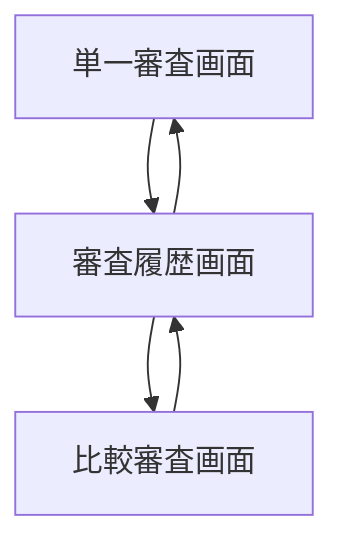
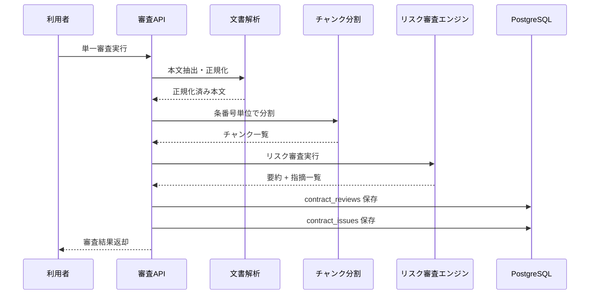
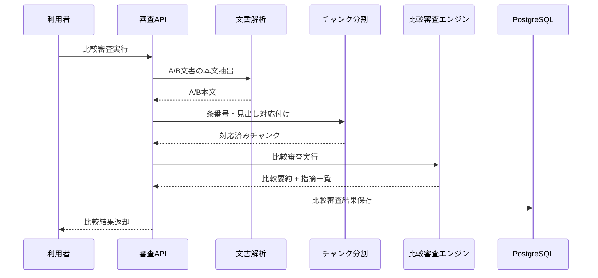

# System 02 基本設計
## 契約書・文書 リスク審査システム

---

## 1. システム構成設計

### 1.1 全体構成

```
クライアント
    ↓
FastAPI
    ├─ POST /review
    ├─ POST /compare
    ├─ GET /reviews
    ├─ GET /reviews/{review_id}
    └─ GET /reviews/compare
    ↓
ReviewService
    ├─ DocumentParser
    ├─ ChunkService
    ├─ RiskReviewEngine
    ├─ CompareReviewEngine
    └─ IssueAggregator
    ↓
LLM Client（Qwen3-27B / LM Studio）
    ↓
OutputValidator（Pydantic）
    ↓
PostgreSQL（contract_reviews, contract_issues）
```

### 1.2 コンポーネント一覧

| コンポーネント | 役割 |
|---|---|
| ReviewRouter | 審査系 API の入口 |
| DocumentParser | PDF / docx / txt の本文抽出 |
| ChunkService | 長文分割、比較対象文書の対応単位生成 |
| RiskReviewEngine | 単一文書のリスク・不利条項・抜け漏れ抽出 |
| CompareReviewEngine | 新旧・契約相手別比較、差分審査 |
| IssueAggregator | issue 一覧と summary の統合 |
| ReviewRepository | review / issue 保存・検索 |
| MLflowTracer | 実行時間、入力サイズ、判定結果のトレース |

---

## 2. 主要設計方針

### 2.1 入力処理方針

- 単一審査は 1 文書、比較審査は 2 文書を受け付ける
- 受入前にファイル形式・ページ数・サイズを検証する
- 本文抽出後に条番号、見出し、箇条書きを維持したまま審査用テキストへ整形する

### 2.2 チャンキング方針

- 第1優先は条文見出し・条番号単位
- 条文構造が取れない場合は文字数ベースで 3,000 文字前後に分割する
- 比較審査では文書 A / 文書 B を同じ条番号・見出しで対応付けて比較する

### 2.3 AI 出力方針

- 文書種別判定、論点抽出、問題 severity 判定、修正文案生成を 1 回の出力スキーマに統合する
- issue は `risk_type / severity / clause_ref / description / suggestion` を必須項目とする
- 「法的助言の確定判断」ではなく「一次審査コメント」として出力する

---

## 3. IF仕様

### 3.1 エンドポイント一覧

| メソッド | パス | 役割 | 応答方式 |
|---|---|---|---|
| POST | `/review` | 単一文書審査 | 同期 |
| POST | `/compare` | 2 文書比較審査 | 同期 |
| GET | `/reviews` | 審査結果一覧 | 同期 |
| GET | `/reviews/{review_id}` | 審査結果詳細 | 同期 |
| GET | `/reviews/compare` | 過去審査結果比較 | 同期 |

### 3.2 API設計要点

- `POST /review`
  - 入力: 文書ファイルまたはテキスト
  - 出力: summary, recommendation, issues[]
- `POST /compare`
  - 入力: 比較対象 2 文書
  - 出力: 差分論点、追加リスク、変更推奨点
- `GET /reviews/compare`
  - 入力: 比較対象 review_id 群
  - 出力: issue 数、severity 分布、推奨度差分

---

## 4. 処理フロー

### 4.1 単一審査

```
入力受付
  ↓
形式・ページ数検証
  ↓
本文抽出
  ↓
文書種別判定
  ↓
チャンキング
  ↓
リスク審査プロンプト実行
  ↓
issue 集約・重複除去
  ↓
Pydantic 検証
  ↓
DB 保存
  ↓
レスポンス返却
```

### 4.2 比較審査

```
2 文書受付
  ↓
本文抽出・正規化
  ↓
条番号 / 見出し対応付け
  ↓
差分抽出
  ↓
比較審査プロンプト実行
  ↓
差分論点・追加リスク整理
  ↓
DB 保存
```

---

## 5. データ設計

### 5.1 テーブル設計

| テーブル | 主な保持内容 |
|---|---|
| `contract_reviews` | 文書種別、recommendation、summary、review_type、source_hash |
| `contract_issues` | review_id ごとの individual issue |

### 5.2 リレーション

- `contract_reviews` 1 : N `contract_issues`
- 比較審査時は `contract_reviews.review_type = compare` とし、比較対象 2 文書の識別子を JSON で保持する

---

## 6. プロンプト・AI制御設計

### 6.1 プロンプト種別

| 種別 | 用途 |
|---|---|
| 文書種別判定プロンプト | NDA / 業務委託 / 売買 / 雇用等の判定 |
| リスク審査プロンプト | 不利条項・抜け漏れ・曖昧表現の抽出 |
| 比較審査プロンプト | 新旧差分・相手修正の影響分析 |

### 6.2 コンテキスト投入項目

- 文書本文
- 条番号・見出し
- 審査観点テンプレート
- perspective（委託側 / 受託側 / 契約類型別ロール）

---

## 7. ガードレール・エラー処理設計

- 50 ページ超過や 2 文書合計 100 ページ超過は受付前に拒否する
- JSON 崩れ時は同一入力で最大 2 回まで再試行する
- 参照根拠が取れない指摘は `confidence=low` を付与する
- 法的確定表現は禁止し、参考情報としての文体に統一する
- 比較対象の片方だけ本文抽出失敗した場合は review を `failed` として保存する

---

## 8. 非機能・運用設計

- 単一審査は同期処理、比較審査も同期処理を基本とする
- 重い文書でも 90 秒以内を上限とし、超過時は timeout エラーを返す
- 本文・issue・recommendation は UTF-8 で保存する
- トレースにはページ数、chunk 数、LLM 呼び出し時間、issue 数を残す

---

## 9. 技術スタック

| 用途 | 技術 |
|---|---|
| API | FastAPI |
| LLM | Qwen3-27B / LM Studio |
| 文書抽出 | PyMuPDF, python-docx |
| バリデーション | Pydantic |
| DB | PostgreSQL, SQLAlchemy |
| トレース | MLflow |

## 10. 画面一覧

| 画面名 | 目的 | 備考 |
|---|---|---|
| 単一審査画面 | 主要操作の起点画面として利用する | 基本設計時点の主要画面 |
| 比較審査画面 | 主要操作の起点画面として利用する | 基本設計時点の主要画面 |
| 審査履歴画面 | 過去結果の参照と再実行判断を行う | 基本設計時点の主要画面 |

## 11. 権限制御

| ロール | 利用可能画面 | 主要操作 |
|---|---|---|
| 審査担当 | 単一審査画面, 比較審査画面 | 契約審査, 比較確認 |
| 管理者 | 審査履歴画面を含む全画面 | 履歴参照, 監査 |

## 12. 主要導線

- 単一審査: 単一審査画面でファイルと視点を指定して結果確認する。
- 比較審査: 比較審査画面で2文書を投入し差分を確認する。
- 履歴確認: 審査履歴画面から過去結果を再参照する。

## 13. 画面遷移図



- 単票審査と比較審査は独立した起点画面とする。
- 実行結果は `審査履歴画面` から再参照できる構成とする。

## 14. 画面項目定義
### 14.1 単一審査画面

| 項目ID | 項目名 | UI種別 | 必須 | 備考 |
|---|---|---|---|---|
| `review_type` | 審査種別 | プルダウン | ○ | 契約書/規約/覚書など |
| `input_mode` | 入力方法 | ラジオ | ○ | ファイル/テキスト |
| `source_file` | 審査対象ファイル | ファイル選択 |  | PDF/docx/txt |
| `source_text` | 審査対象本文 | テキストエリア |  | テキスト入力時 |
| `submit_review` | 審査実行 | ボタン | ○ | POST `/review` |
| `summary` | 全体要約 | テキスト表示 |  | LLM 出力 |
| `recommendation` | 一次審査結果 | バッジ表示 |  | `要修正` など |
| `issues_grid` | 指摘一覧 | 表 |  | `severity`, `risk_type`, `clause_ref`, `suggestion` |

### 14.2 比較審査画面

| 項目ID | 項目名 | UI種別 | 必須 | 備考 |
|---|---|---|---|---|
| `file_a` | 比較対象A | ファイル選択 | ○ | 現行版など |
| `file_b` | 比較対象B | ファイル選択 | ○ | 改訂版など |
| `perspective` | 審査視点 | プルダウン | ○ | 当事者ロール |
| `submit_compare` | 比較実行 | ボタン | ○ | POST `/compare` |
| `compare_summary` | 差分要約 | テキスト表示 |  | 主要変更点 |
| `compare_issues_grid` | 差分指摘一覧 | 表 |  | 追加/削除/変更 |

### 14.3 審査履歴画面

| 項目ID | 項目名 | UI種別 | 備考 |
|---|---|---|---|
| `from_date` | 開始日 | 日付 | 検索条件 |
| `to_date` | 終了日 | 日付 | 検索条件 |
| `document_type` | 文書種別 | プルダウン | 検索条件 |
| `recommendation` | 一次審査結果 | プルダウン | 検索条件 |
| `review_grid` | 審査一覧 | 表 | `review_id`, `review_type`, `document_type`, `recommendation`, `created_at` |

## 15. シーケンス図
### 15.1 単一審査



### 15.2 比較審査



