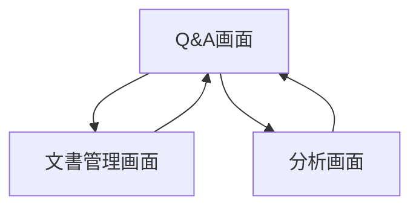
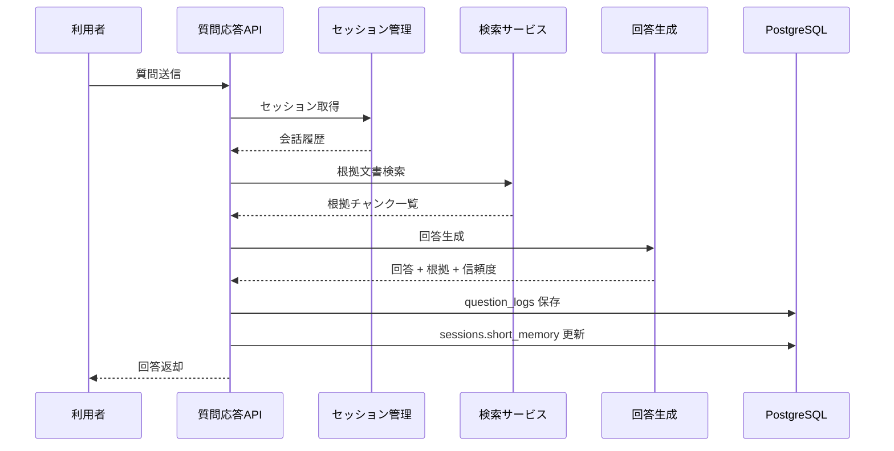
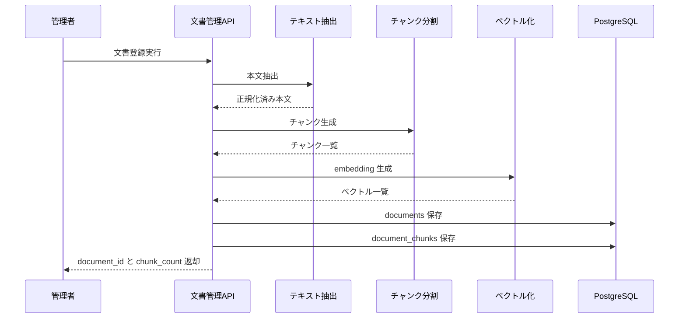

# System 03 基本設計
## プロジェクト文書 自然言語Q&Aシステム

---

## 1. システム構成設計

### 1.1 全体構成

```
クライアント
    ↓
FastAPI
    ├─ POST /ask
    ├─ POST /ask/feedback
    ├─ POST /documents
    ├─ DELETE /documents/{id}
    ├─ GET /documents
    └─ GET /analytics/*
    ↓
DocumentIngestionService
    ├─ TextExtractor
    ├─ ChunkService
    └─ EmbeddingIndexer
    ↓
AskService
    ├─ SessionService
    ├─ Retriever（pgvector）
    ├─ AnswerGenerator
    └─ FeedbackService
    ↓
PostgreSQL（documents, document_chunks, sessions, question_logs）
```

### 1.2 コンポーネント一覧

| コンポーネント | 役割 |
|---|---|
| DocumentRouter | 文書登録・削除・一覧 API |
| AskRouter | 質問応答・フィードバック API |
| TextExtractor | PDF / docx / md / txt の本文抽出 |
| ChunkService | セクション単位チャンキング |
| EmbeddingService | ベクトル化と pgvector 保存 |
| Retriever | キーワード + ベクトルのハイブリッド検索 |
| SessionService | 短期メモリ管理 |
| AnalyticsService | 人気質問・未回答質問の集計 |

---

## 2. 主要設計方針

### 2.1 登録処理方針

- 文書登録時に project_id, category, access_scope を必須とする
- 登録後に本文抽出、チャンク化、埋め込み生成を順に実行する
- チャンク単位で `document_id + chunk_no` をユニークに保持する

### 2.2 検索方針

- 第1段階でアクセス権・有効状態・project_id をフィルタする
- 第2段階でキーワード検索と類似検索を併用する
- 上位 5 件を回答コンテキストとして LLM に渡す

### 2.3 回答方針

- 回答本文、根拠チャンク、警告、未解決フラグを固定スキーマで返す
- 根拠不足時は断定せず、参照不足を明示する

---

## 3. IF仕様

### 3.1 エンドポイント一覧

| メソッド | パス | 役割 |
|---|---|---|
| GET | `/projects` | プロジェクト一覧取得 |
| POST | `/ask` | 文書根拠付き Q&A |
| POST | `/ask/feedback` | 回答品質フィードバック |
| POST | `/documents` | 文書登録 |
| PUT | `/documents/{document_id}` | 文書更新（再ベクトル化） |
| DELETE | `/documents/{document_id}` | 文書無効化 |
| GET | `/documents` | 文書一覧 |
| GET | `/analytics/popular-questions` | よくある質問集計 |
| GET | `/analytics/unanswered-questions` | 未回答質問集計 |

### 3.2 API設計要点

- `GET /projects`
  - 出力: project_id, name の一覧配列
  - 用途: 画面上のプロジェクトプルダウンが参照する一覧情報を返す
- `POST /ask`
  - 入力: session_id, project_id, question
  - 出力: answer, sources[], warning, escalation
- `POST /documents`
  - 入力: project_id, category, file or text
  - 出力: document_id, chunk_count, status
- `PUT /documents/{document_id}`
  - 既存文書の内容更新後に再チャンク化・再 embedding を実行する
- `DELETE /documents/{document_id}`
  - 論理削除で実装し、検索対象から除外する

---

## 4. 処理フロー

### 4.1 文書登録

```
文書受付
  ↓
形式検証
  ↓
本文抽出
  ↓
チャンク化
  ↓
埋め込み生成
  ↓
documents / document_chunks 保存
```

### 4.2 質問応答

```
質問受付
  ↓
セッション取得
  ↓
権限・project フィルタ
  ↓
ハイブリッド検索
  ↓
LLM 回答生成
  ↓
出力検証
  ↓
question_logs 保存
```

---

## 5. データ設計

### 5.1 テーブル設計

| テーブル | 主な保持内容 |
|---|---|
| `documents` | 文書メタデータ、project_id、category、status |
| `document_chunks` | chunk 本文、embedding、chunk_no |
| `sessions` | 会話セッション、短期メモリ |
| `question_logs` | 質問、回答、source、feedback |

### 5.2 データ整合方針

- 文書削除は `status=inactive` の論理削除
- `document_chunks` は `documents.status=active` のみ検索対象
- question_logs には実際に使った chunk_id 一覧を保存する

---

## 6. プロンプト・AI制御設計

### 6.1 回答生成プロンプト

- 参照チャンクだけを根拠に回答する
- 根拠が不足する場合は「文書上は確認できない」と返す
- 回答本文と根拠一覧を分離して返す

### 6.2 コンテキスト構成

- 最新の質問
- セッション内の直近会話
- 検索上位チャンク
- 文書タイトル、カテゴリ、更新日

---

## 7. ガードレール・エラー処理設計

- 権限外・無効化済み文書は検索対象から除外する
- 同一質問の連投はレート制御する
- プロンプトインジェクションを含む質問は warning を返す
- 根拠ゼロ回答は禁止し、未解決として記録する

---

## 8. 非機能・運用設計

- Q&A は同期応答、文書登録も同期を基本とする
- embedding 生成失敗時は文書を `indexing_failed` で保持する
- 人気質問・未回答質問は日次集計バッチで更新する

---

## 9. 技術スタック

| 用途 | 技術 |
|---|---|
| API | FastAPI |
| LLM | Qwen3-27B / LM Studio |
| 埋め込み | nomic-embed-text / LM Studio |
| ベクトルDB | PostgreSQL + pgvector |
| RAG | LlamaIndex |
| ORM | SQLAlchemy |
| トレース | MLflow |

## 10. 画面一覧

| 画面名 | 目的 | 備考 |
|---|---|---|
| Q&A 画面 | 質問入力と回答確認を行う | 基本設計時点の主要画面 |
| 文書管理画面 | 設定変更・マスタ保守・監視を行う | 基本設計時点の主要画面 |
| 分析画面 | 分析結果確認または比較を行う | 基本設計時点の主要画面 |

## 11. 権限制御

| ロール | 利用可能画面 | 主要操作 |
|---|---|---|
| プロジェクトメンバー | Q&A 画面 | 質問, 回答確認, フィードバック |
| 文書管理者 | 文書管理画面 | 文書登録, 更新, 無効化 |
| 管理者 | 分析画面を含む全画面 | FAQ候補確認, 未回答分析 |

## 12. 主要導線

- 質問応答: Q&A 画面で質問し、根拠付き回答を確認する。
- 文書保守: 文書管理画面で登録・更新後、Q&A 画面で反映確認する。
- 分析: 分析画面で頻出質問と未回答を確認する。

## 13. 画面遷移図



- 利用者導線の中心は `Q&A画面` とする。
- 文書登録・更新後は `Q&A画面` で即時確認できる導線とする。

## 14. 画面項目定義
### 14.1 Q&A 画面

| 項目ID | 項目名 | UI種別 | 必須 | 備考 |
|---|---|---|---|---|
| `project_id` | プロジェクト | プルダウン | ○ | `GET /projects` から取得した一覧を表示。検索対象切替 |
| `session_id` | セッションID | 隠し項目 | ○ | 会話継続用 |
| `question` | 質問文 | テキストエリア | ○ | POST `/ask` |
| `category_filter` | カテゴリ絞込 | 複数選択 |  | 任意 |
| `submit_ask` | 質問送信 | ボタン | ○ | 回答生成 |
| `answer` | 回答本文 | テキスト表示 |  | 根拠付き回答 |
| `sources_grid` | 参照根拠一覧 | 表 |  | `document_name`, `section`, `excerpt` |
| `rating` | 回答評価 | ラジオ |  | 役立った/役立たない |
| `feedback_comment` | コメント | テキストエリア |  | POST `/ask/feedback` |

### 14.2 文書管理画面

| 項目ID | 項目名 | UI種別 | 必須 | 備考 |
|---|---|---|---|---|
| `file` | 登録ファイル | ファイル選択 | ○ | PDF/docx/md/txt |
| `project_id` | プロジェクト | プルダウン | ○ | 所属プロジェクト |
| `category` | カテゴリ | プルダウン | ○ | 手順書/設計書など |
| `version` | 版数 | テキスト |  | 任意 |
| `access_roles` | 閲覧権限 | 複数選択 | ○ | ロール配列 |
| `submit_document` | 登録 | ボタン | ○ | POST `/documents` |
| `document_grid` | 文書一覧 | 表 |  | `document_id`, `file_name`, `category`, `version`, `is_active` |
| `reindex_document` | 更新 | ボタン |  | PUT `/documents/{document_id}` |
| `disable_document` | 無効化 | ボタン |  | DELETE `/documents/{document_id}` |

### 14.3 分析画面

| 項目ID | 項目名 | UI種別 | 備考 |
|---|---|---|---|
| `popular_questions_grid` | 人気質問一覧 | 表 | 質問、件数、平均評価 |
| `unanswered_questions_grid` | 未回答一覧 | 表 | 質問、理由、発生日 |

## 15. シーケンス図
### 15.1 質問応答



### 15.2 文書登録



