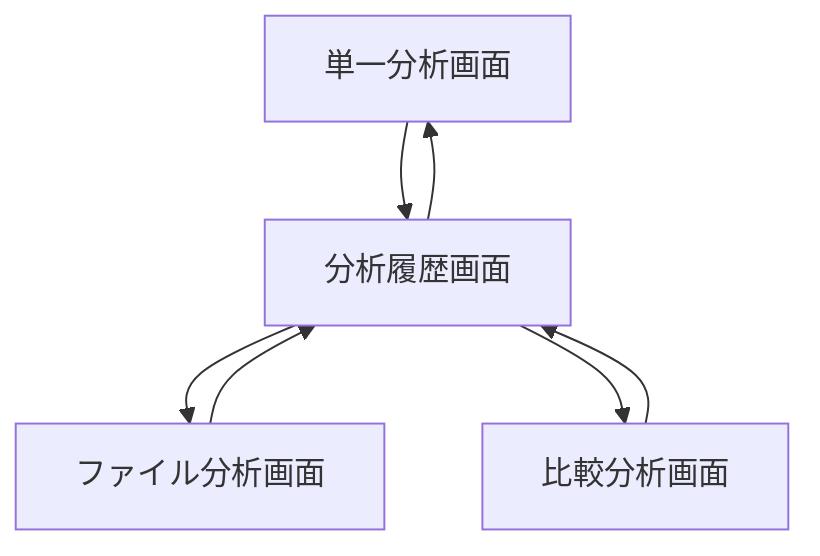
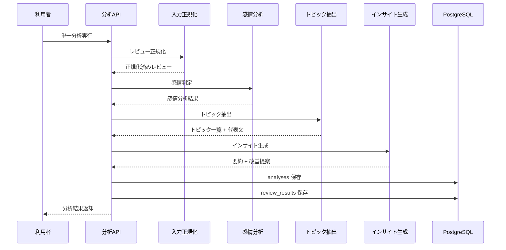
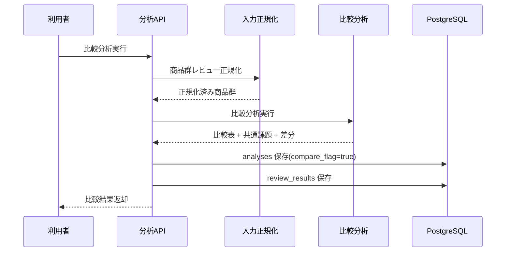

# System 04 基本設計
## 商品・サービス レビュー分析＆インサイト抽出システム

---

## 1. システム構成設計

### 1.1 全体構成

```
クライアント
    ↓
FastAPI
    ├─ POST /analyze
    ├─ POST /analyze/file
    ├─ POST /compare
    ├─ GET /analyses
    └─ GET /analyses/{analysis_id}
    ↓
ReviewAnalysisService
    ├─ InputNormalizer
    ├─ SentimentAnalyzer
    ├─ TopicExtractor
    ├─ InsightGenerator
    └─ CompareAnalyzer
    ↓
PostgreSQL（analyses, review_results）
```

### 1.2 コンポーネント一覧

| コンポーネント | 役割 |
|---|---|
| AnalysisRouter | 分析 API 受付 |
| InputNormalizer | JSON / CSV のレビュー正規化 |
| SentimentAnalyzer | ポジ・ネガ・中立と強度判定 |
| TopicExtractor | トピック抽出と代表文抽出 |
| InsightGenerator | 課題要約と改善提案生成 |
| CompareAnalyzer | 複数商品の比較分析 |
| AnalysisRepository | 分析結果保存 |

---

## 2. 主要設計方針

### 2.1 入力設計

- `POST /analyze` は JSON 直接入力を同期処理する
- `POST /analyze/file` は CSV / JSON ファイルを受け付け、正規化後に同一分析パイプラインへ流す
- 1 件ごとに `text / score / date / product_name` を標準形式へ変換する

### 2.2 分析設計

- individual review ごとに sentiment と topics を付与する
- product 単位で topic 集計、代表レビュー抽出、改善提案生成を行う
- 比較分析では商品ごとに同一 topic 軸へ再集約する

---

## 3. IF仕様

### 3.1 エンドポイント一覧

| メソッド | パス | 役割 | 応答方式 |
|---|---|---|---|
| POST | `/analyze` | 単一商品のレビュー分析 | 同期 |
| POST | `/analyze/file` | ファイル入力分析 | 同期 |
| POST | `/compare` | 複数商品比較 | 同期 |
| GET | `/analyses` | 過去分析一覧 | 同期 |
| GET | `/analyses/{analysis_id}` | 分析詳細 | 同期 |

### 3.2 出力設計要点

- 返却単位は `analysis_id`
- 本文には `sentiment_summary / topics / insights / individual_results` を含める
- `POST /compare` では比較表、差分 summary、商品別 strengths / weaknesses を返す

---

## 4. 処理フロー

### 4.1 単一分析

```
入力受付
  ↓
レビュー配列正規化
  ↓
individual review 分析
  ↓
topic 集約
  ↓
改善提案生成
  ↓
DB 保存
```

### 4.2 比較分析

```
商品群受付
  ↓
商品単位分析
  ↓
共通トピック軸へ整列
  ↓
差分比較
  ↓
比較結果保存
```

---

## 5. データ設計

| テーブル | 主な保持内容 |
|---|---|
| `analyses` | product_name, total_reviews, summary, compare_flag |
| `review_results` | individual review の sentiment / topics / score |

- `review_results.analysis_id` で親分析に従属させる
- 比較分析は `analyses.compare_flag = true` とし、比較対象商品一覧を JSON で保持する

---

## 6. プロンプト・AI制御設計

### 6.1 AI処理単位

| 処理 | 役割 |
|---|---|
| sentiment 判定 | positive / negative / neutral |
| topic 抽出 | 商品特性、課題、改善対象の分類 |
| insight 生成 | positive_summary, negative_summary, improvements |
| compare 生成 | 商品間差分の文章化 |

### 6.2 出力ルール

- individual review の topics は複数可
- 改善提案には `priority / issue / suggestion` を必須で含める
- 代表レビューは topic ごとに 1〜3 件まで採用する

---

## 7. ガードレール・エラー処理設計

- レビュー本文が空のデータは除外し、除外件数をログに残す
- 同一 review の重複投入はハッシュで除外する
- topic 名が過度に細分化された場合は後処理で統合する
- 改善提案はレビュー根拠があるものだけ返す

---

## 8. 非機能・運用設計

- 10,000 件分析では個票分析を分割して処理し、最後に集約する
- 大量データでは DB 保存をバルクインサートにする
- 指標として件数、平均感情スコア、topic 数、処理時間を残す

---

## 9. 技術スタック

| 用途 | 技術 |
|---|---|
| API | FastAPI |
| LLM | Qwen3-27B / LM Studio |
| バリデーション | Pydantic |
| DB | PostgreSQL, SQLAlchemy |
| バックグラウンド補助 | FastAPI BackgroundTasks |
| トレース | MLflow |

## 10. 画面一覧

| 画面名 | 目的 | 備考 |
|---|---|---|
| 単一分析画面 | 分析結果確認または比較を行う | 基本設計時点の主要画面 |
| ファイル分析画面 | 分析結果確認または比較を行う | 基本設計時点の主要画面 |
| 比較分析画面 | 分析結果確認または比較を行う | 基本設計時点の主要画面 |
| 分析履歴画面 | 過去結果の参照と再実行判断を行う | 基本設計時点の主要画面 |

## 11. 権限制御

| ロール | 利用可能画面 | 主要操作 |
|---|---|---|
| 分析担当 | 単一分析画面, ファイル分析画面, 比較分析画面 | レビュー分析, 商品比較 |
| 管理者 | 分析履歴画面を含む全画面 | 履歴確認, 結果管理 |

## 12. 主要導線

- 単一分析: 単一分析画面でレビュー群を投入して結果確認する。
- 比較分析: 比較分析画面で複数商品を比較する。
- 履歴確認: 分析履歴画面から過去結果を再参照する。

## 13. 画面遷移図



- 分析種別ごとに起点画面を分ける。
- 過去結果の再閲覧と再比較は `分析履歴画面` を起点にする。

## 14. 画面項目定義
### 14.1 単一分析画面

| 項目ID | 項目名 | UI種別 | 必須 | 備考 |
|---|---|---|---|---|
| `product_name` | 商品名 | テキスト | ○ | 分析対象 |
| `reviews_json` | レビュー入力 | テキストエリア | ○ | JSON 配列 |
| `submit_analyze` | 分析開始 | ボタン | ○ | POST `/analyze` |
| `sentiment_summary` | 感情サマリ | 集計カード |  | positive/negative/neutral |
| `topics_grid` | トピック一覧 | 表 |  | 件数、代表文 |
| `insights_panel` | 改善提案 | テキスト表示 |  | 優先度付き表示 |
| `individual_results_grid` | 個別結果 | 表 |  | sentiment, score, topics |

### 14.2 ファイル分析画面

| 項目ID | 項目名 | UI種別 | 必須 | 備考 |
|---|---|---|---|---|
| `review_file` | レビューファイル | ファイル選択 | ○ | CSV/JSON |
| `submit_analyze_file` | ファイル分析開始 | ボタン | ○ | POST `/analyze/file` |
| `invalid_rows` | 取込失敗件数 | テキスト表示 |  | エラー件数表示 |

### 14.3 比較分析画面

| 項目ID | 項目名 | UI種別 | 必須 | 備考 |
|---|---|---|---|---|
| `products_json` | 比較対象入力 | テキストエリア | ○ | 商品群 JSON |
| `submit_compare` | 比較開始 | ボタン | ○ | POST `/compare` |
| `compare_table` | 比較表 | 表 |  | 商品別スコア・トピック差分 |
| `strengths_panel` | 強み | テキスト表示 |  | 商品別 |
| `weaknesses_panel` | 弱み | テキスト表示 |  | 商品別 |

### 14.4 分析履歴画面

| 項目ID | 項目名 | UI種別 | 備考 |
|---|---|---|---|
| `from_date` | 開始日 | 日付 | 検索条件 |
| `to_date` | 終了日 | 日付 | 検索条件 |
| `product_filter` | 商品名 | テキスト | 部分一致 |
| `analysis_grid` | 分析一覧 | 表 | `analysis_id`, `product_name`, `total_reviews`, `created_at` |

## 15. シーケンス図
### 15.1 単一分析



### 15.2 比較分析



