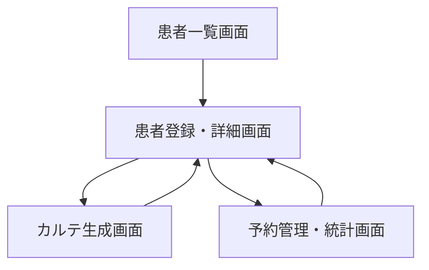
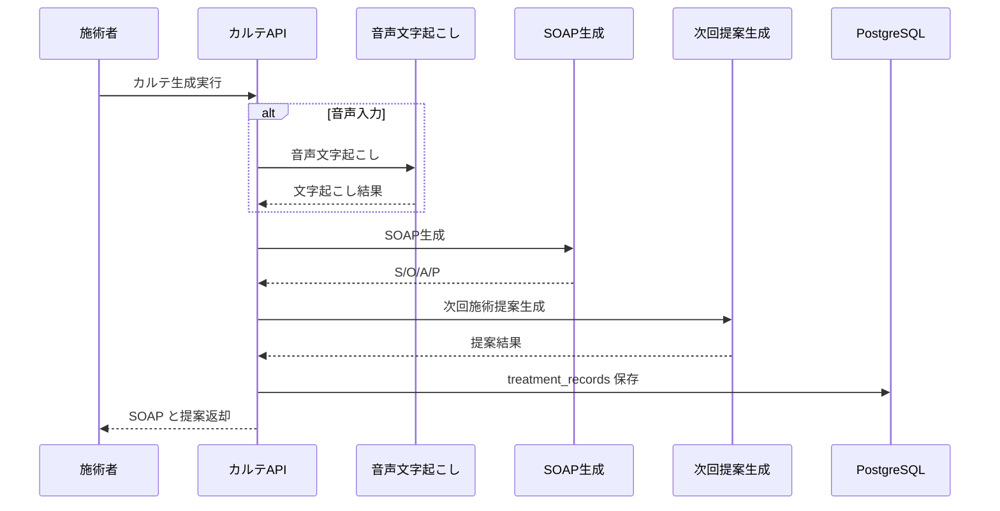
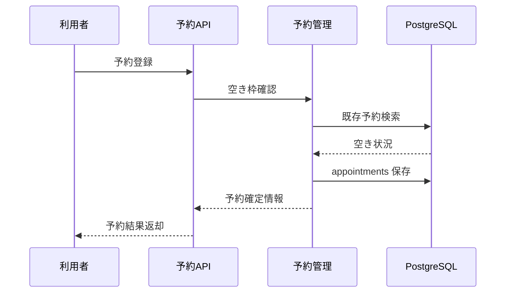

# System 05 基本設計
## 個人経営整体院向け 院内電子カルテシステム

---

## 1. システム構成設計

### 1.1 全体構成

```
院長・施術者 / 受付 / 患者（院内端末）
    ↓
FastAPI + Jinja2
    ├─ 患者管理
    ├─ カルテ生成
    ├─ 音声文字起こし
    ├─ 次回施術提案
    ├─ 予約管理
    └─ バックアップ管理
    ↓
MedicalRecordService
    ├─ SOAPGenerator
    ├─ VoiceTranscriber
    ├─ SuggestionService
    └─ AppointmentService
    ↓
PostgreSQL（patients, treatment_records, appointments, backup_logs）
```

### 1.2 コンポーネント一覧

| コンポーネント | 役割 |
|---|---|
| PatientController | 患者 CRUD |
| RecordController | SOAP 生成、履歴参照 |
| VoiceTranscriber | faster-whisper による文字起こし |
| SuggestionService | 過去カルテ参照による次回施術提案 |
| AppointmentService | 予約登録、空き枠確認、状態更新 |
| StatsService | 月次来院数・売上・患者属性の集計 |
| BackupService | pg_dump 実行、履歴管理 |
| AuditLogService | カルテ訂正履歴と操作監査の記録 |
| AccessControlService | ロール別アクセス判定 |
| Jinja2 Frontend | 院内ブラウザ画面 |

---

## 2. 主要設計方針

### 2.1 利用環境

- 院内ネットワーク内のローカル運用とする
- API と画面は同一 FastAPI プロセスで提供する
- 患者向け操作は院内端末からの予約受付に限定する

### 2.2 カルテ生成方針

- テキストメモと音声入力の両方を SOAP 生成の入口にする
- 音声入力は `faster-whisper → SOAPGenerator` の直列処理とする
- 保存前に施術者が確認・修正できる UI を必須とする

### 2.3 次回施術提案方針

- 対象患者の過去カルテのみを検索対象にする
- 禁忌事項、直近の症状変化、前回施術内容をコンテキストに含める

### 2.4 認証・監査方針

- 施術者 / 受付担当 / 管理者の3ロールで機能を分離する
- 保存済みカルテの修正は `修正理由` を必須にし、修正前後の差分を訂正履歴へ保存する
- 患者情報参照、カルテ更新、予約更新、バックアップ実行は監査ログに記録する

### 2.5 院内予約受付・復旧方針

- 患者向け端末は予約受付専用とし、カルテ・履歴には遷移させない
- 再診予約は `患者ID + 生年月日` または `患者ID + 電話番号下4桁` で本人確認する
- バックアップは日次自動実行に加え、月1回の復旧手順確認を運用要件とする

---

## 3. IF仕様

### 3.1 エンドポイント一覧

| メソッド | パス | 役割 |
|---|---|---|
| POST | `/patients` | 患者登録 |
| GET | `/patients` | 患者一覧 |
| GET | `/patients/{patient_id}` | 患者詳細 |
| POST | `/records/generate` | SOAP 生成 |
| POST | `/records/generate/voice` | 音声入力 SOAP 生成 |
| PATCH | `/records/{record_id}` | 保存済みカルテ修正 |
| GET | `/records/{record_id}/history` | カルテ訂正履歴取得 |
| GET | `/patients/{patient_id}/suggestion` | 次回施術提案 |
| POST | `/appointments` | 予約登録 |
| GET | `/appointments` | 予約一覧 |
| GET | `/appointments/available-slots` | 空き枠確認 |
| PATCH | `/appointments/{appointment_id}/status` | 予約状態更新 |
| GET | `/stats/monthly` | 月次統計取得 |
| POST | `/backup/run` | 手動バックアップ |
| GET | `/backup/history` | バックアップ履歴 |

### 3.2 画面設計要点

- 施術者向け: ダッシュボード、患者詳細、カルテ入力、予約管理、統計、バックアップ
- 患者向け: 空き枠確認、予約入力、本人確認、予約完了

---

## 4. 処理フロー

### 4.1 SOAP生成

```
施術メモ入力
  ↓
音声の場合は文字起こし
  ↓
SOAP 生成プロンプト実行
  ↓
生成結果確認
  ↓
treatment_records 保存
```

### 4.2 次回施術提案

```
患者ID受付
  ↓
過去カルテ検索
  ↓
禁忌事項・直近施術内容取得
  ↓
提案生成
  ↓
画面表示
```

### 4.3 バックアップ

```
定時 or 手動実行
  ↓
pg_dump
  ↓
圧縮保存
  ↓
backup_logs 記録
```

### 4.4 月次統計取得

```
対象月指定
  ↓
appointments / treatment_records / patients 集計
  ↓
来院数・売上・患者属性・来院頻度を算出
  ↓
JSON レスポンス返却
```

---

## 5. データ設計

| テーブル | 主な保持内容 |
|---|---|
| `patients` | 患者基本情報、禁忌事項、来院回数 |
| `treatment_records` | SOAP カルテ、施術日時、提案メモ |
| `record_revisions` | カルテ訂正履歴、修正理由、修正者 |
| `appointments` | 予約日時、メニュー、状態、確認番号 |
| `backup_logs` | 実行時刻、結果、保存先 |
| `access_audit_logs` | 参照・更新・バックアップ実行の監査情報 |

- `patients` 1 : N `treatment_records`
- `patients` 1 : N `appointments`
- `treatment_records` 1 : N `record_revisions`
- 月次統計は `patients` / `treatment_records` / `appointments` を集計して生成し、統計専用テーブルは持たない

---

## 6. プロンプト・AI制御設計

### 6.1 プロンプト種別

| 種別 | 用途 |
|---|---|
| SOAP生成プロンプト | メモ / 文字起こしから S/O/A/P 生成 |
| 次回施術提案プロンプト | 過去履歴から重点部位・注意点提案 |

### 6.2 出力ルール

- SOAP は 4 区分を必須とする
- 提案は禁忌事項と矛盾しないことを優先する
- 推測で確定診断を書かない

---

## 7. ガードレール・エラー処理設計

- 院外送信は行わず、すべてローカル処理とする
- 重複予約は登録前に時間帯重複チェックを行う
- 音声文字起こし失敗時は元音声を保持せず、再入力を促す
- バックアップ失敗時はダッシュボードに警告表示する
- カルテ修正時は修正理由なしの上書きを禁止する
- 受付担当は SOAP 本文を参照できない
- 患者向け端末からは予約登録関連の画面・API に限定して公開する

---

## 8. 非機能・運用設計

- SOAP 生成は 60 秒以内を上限とする
- ローカル PC 障害時に備えて日次バックアップを保持する
- 患者情報とカルテ本文は監査ログ対象とする
- ログ・トレースには氏名・電話番号の平文を残さない
- 月1回の復旧手順確認結果を運用記録として残す

---

## 9. 技術スタック

| 用途 | 技術 |
|---|---|
| API / 画面 | FastAPI + Jinja2 |
| LLM | Qwen3-27B / LM Studio |
| 音声文字起こし | faster-whisper |
| ベクトル検索 | PostgreSQL + pgvector |
| ORM | SQLAlchemy |
| バックアップ | pg_dump, APScheduler |
| トレース | MLflow |

## 10. 画面一覧

| 画面名 | 目的 | 備考 |
|---|---|---|
| 患者一覧画面 | 検索条件指定と対象一覧確認を行う | 基本設計時点の主要画面 |
| 患者登録・詳細画面 | 主要操作の起点画面として利用する | 基本設計時点の主要画面 |
| カルテ生成画面 | カルテ生成・確認・保存を行う | 基本設計時点の主要画面 |
| 予約管理・統計画面 | 設定変更・マスタ保守・監視を行う | 基本設計時点の主要画面 |
| 院内予約受付画面 | 患者向け予約受付と本人確認を行う | 院内端末専用 |

## 11. 権限制御

| ロール | 利用可能画面 | 主要操作 |
|---|---|---|
| 施術者 | 患者一覧画面, 患者登録・詳細画面, カルテ生成画面 | 患者参照, SOAP生成, カルテ修正 |
| 受付担当 | 患者一覧画面, 予約管理・統計画面 | 予約登録, 状態更新, 空き枠確認 |
| 管理者 | 全画面 | 統計確認, バックアップ確認, 監査ログ確認 |

- 患者向け院内端末は予約関連画面のみ利用可能とし、患者ロールとしては扱わない

## 12. 主要導線

- 患者導線: 患者一覧画面から患者詳細へ入り、カルテ生成へ進む。
- 予約導線: 患者詳細または予約管理・統計画面から予約登録・更新を行う。
- 運用導線: 管理者は予約管理・統計画面から月次統計とバックアップ状況を確認する。

## 13. 画面遷移図



- `患者一覧画面` を主導線とし、患者単位で詳細・カルテ・予約へ遷移する。
- カルテ生成完了後は患者詳細へ戻し、次回施術提案を連続確認できるようにする。

## 14. 画面項目定義
### 14.1 患者一覧画面

| 項目ID | 項目名 | UI種別 | 必須 | 備考 |
|---|---|---|---|---|
| `patient_name` | 氏名 | テキスト |  | 検索条件 |
| `phone` | 電話番号 | テキスト |  | 検索条件 |
| `visit_count_min` | 来院回数下限 | 数値 |  | 検索条件 |
| `search_patients` | 検索 | ボタン | ○ | GET `/patients` |
| `patient_grid` | 患者一覧 | 表 |  | `patient_id`, `name`, `phone`, `visit_count`, `last_visit_date` |
| `create_patient` | 新規患者登録 | ボタン |  | 登録画面へ遷移 |

### 14.2 患者登録・詳細画面

| 項目ID | 項目名 | UI種別 | 必須 | 備考 |
|---|---|---|---|---|
| `name` | 氏名 | テキスト | ○ | 患者基本情報 |
| `kana` | ふりがな | テキスト |  | 任意 |
| `phone` | 電話番号 | テキスト | ○ | 一意チェック対象候補 |
| `birth_date` | 生年月日 | 日付 |  | 任意 |
| `gender` | 性別 | プルダウン |  | 任意 |
| `contraindications` | 禁忌事項 | テキストエリア |  | 複数行 |
| `save_patient` | 保存 | ボタン | ○ | POST `/patients` |
| `recent_records` | 直近カルテ | 表 |  | SOAP 概要表示 |
| `appointments_grid` | 予約一覧 | 表 |  | 予約状態確認 |

### 14.3 カルテ生成画面

| 項目ID | 項目名 | UI種別 | 必須 | 備考 |
|---|---|---|---|---|
| `patient_id` | 対象患者 | hidden/選択 | ○ | 患者詳細から遷移 |
| `input_mode` | 入力方法 | ラジオ | ○ | メモ/音声 |
| `record_memo` | 施術メモ | テキストエリア |  | POST `/records/generate` |
| `voice_file` | 音声ファイル | ファイル選択 |  | POST `/records/generate/voice` |
| `generate_record` | カルテ生成 | ボタン | ○ | AI 実行 |
| `soap_subjective` | S | テキストエリア |  | 出力確認・手修正可 |
| `soap_objective` | O | テキストエリア |  | 出力確認・手修正可 |
| `soap_assessment` | A | テキストエリア |  | 出力確認・手修正可 |
| `soap_plan` | P | テキストエリア |  | 出力確認・手修正可 |
| `correction_reason` | 修正理由 | テキストエリア |  | PATCH `/records/{record_id}` 時に必須 |
| `record_history` | 訂正履歴 | 表 |  | GET `/records/{record_id}/history` |
| `next_suggestion` | 次回施術提案 | テキスト表示 |  | 理由・注意点含む |

### 14.4 予約管理・統計画面

| 項目ID | 項目名 | UI種別 | 備考 |
|---|---|---|---|
| `appointment_date` | 予約日 | 日付 | 検索条件 |
| `available_slots` | 空き枠一覧 | 表 | GET `/appointments/available-slots` |
| `patient_verify_key` | 本人確認キー | テキスト | 再診時の患者ID |
| `patient_verify_subkey` | 本人確認補助 | テキスト | 生年月日または電話番号下4桁 |
| `appointment_grid` | 予約一覧 | 表 | GET `/appointments` |
| `appointment_status` | 予約状態 | プルダウン | PATCH `/appointments/{appointment_id}/status` |
| `monthly_stats` | 月次統計 | 集計カード | GET `/stats/monthly` |
| `run_backup` | バックアップ実行 | ボタン | POST `/backup/run` |
| `backup_history` | バックアップ履歴 | 表 | GET `/backup/history` |

### 14.5 院内予約受付画面

| 項目ID | 項目名 | UI種別 | 備考 |
|---|---|---|---|
| `new_or_returning` | 初回/再診 | ラジオ | 初回 / 再診 |
| `patient_id` | 患者ID | テキスト | 再診時のみ |
| `verify_birth_date` | 生年月日 | 日付 | 本人確認 |
| `verify_phone_last4` | 電話番号下4桁 | テキスト | 本人確認代替 |
| `booking_menu` | 施術メニュー | プルダウン | 予約対象 |
| `booking_slot` | 空き枠 | 表 | GET `/appointments/available-slots` |
| `booking_confirm` | 予約確定 | ボタン | POST `/appointments` |
| `booking_no` | 予約確認番号 | テキスト表示 | 予約完了後表示 |

## 15. シーケンス図
### 15.1 カルテ生成



### 15.2 予約登録



