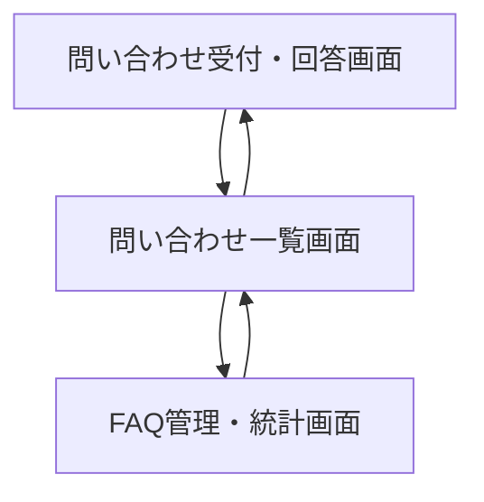
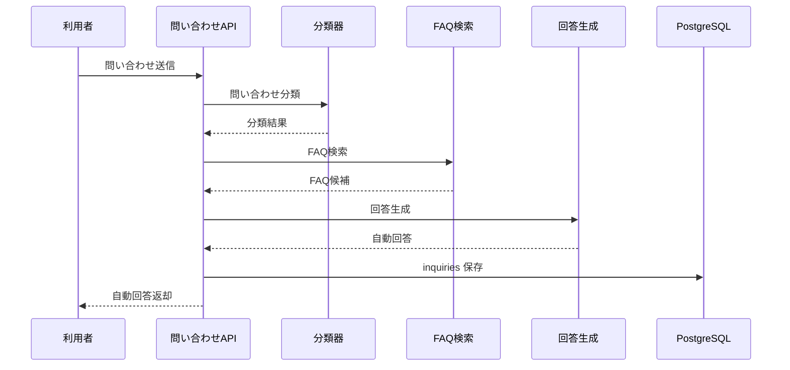
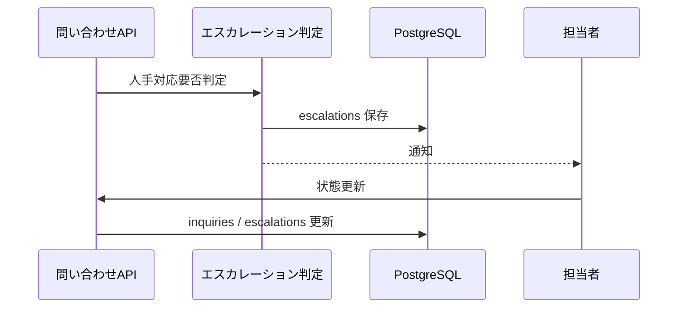

# System 06 基本設計
## カスタマーサポート 自動応答＆エスカレーションシステム

---

## 1. システム構成設計

### 1.1 全体構成

```
ユーザー
    ↓
FastAPI
    ├─ POST /inquiries
    ├─ POST /inquiries/{id}/feedback
    ├─ PATCH /inquiries/{id}/status
    ├─ POST /faq
    ├─ POST /faq/import
    └─ GET /stats/summary
    ↓
InquiryService
    ├─ SessionService
    ├─ InquiryClassifier
    ├─ RAG Retriever
    ├─ ResponseGenerator
    └─ EscalationService
    ↓
WebhookNotifier
    ↓
PostgreSQL（inquiries, faqs, sessions, escalations）
```

### 1.2 コンポーネント一覧

| コンポーネント | 役割 |
|---|---|
| InquiryRouter | 問い合わせ API 受付 |
| InquiryClassifier | category / priority / confidence 判定 |
| FAQRetriever | FAQ と過去対応履歴の検索 |
| ResponseGenerator | 自動回答本文の生成 |
| EscalationService | 自動回答可否判定、通知 |
| FeedbackService | 解決評価反映 |
| FAQAdminService | FAQ 登録・一括取込 |

---

## 2. 主要設計方針

### 2.1 自動回答判定

- `confidence=高` かつ FAQ 根拠がある場合のみ自動回答する
- `confidence=中` は回答案を生成しつつレビュー待ちにできる構造にする
- `confidence=低` または返金・障害・個別調査案件はエスカレーションする

### 2.2 セッション設計

- session_id 単位で短期会話履歴を保持する
- 同一問い合わせの再送でも会話文脈を継続できるようにする

---

## 3. IF仕様

### 3.1 エンドポイント一覧

| メソッド | パス | 役割 |
|---|---|---|
| POST | `/inquiries` | 問い合わせ受付と自動回答 |
| POST | `/inquiries/{inquiry_id}/feedback` | 解決フィードバック |
| PATCH | `/inquiries/{inquiry_id}/status` | 担当者更新 |
| POST | `/faq` | FAQ 登録 |
| POST | `/faq/import` | FAQ 一括取込 |
| GET | `/inquiries` | 問い合わせ一覧 |
| GET | `/stats/summary` | 集計 |

### 3.2 応答設計要点

- `POST /inquiries` は同期応答
- response.type は `auto` / `escalated` / `review` を使用する
- escalation 発生時は `escalation_id` を返す

---

## 4. 処理フロー

### 4.1 問い合わせ対応

```
問い合わせ受付
  ↓
個人情報マスキング
  ↓
カテゴリ・優先度判定
  ↓
FAQ / 過去対応検索
  ↓
自動回答生成
  ↓
信頼度判定
  ├─ 高: 自動回答
  ├─ 中: レビュー待ち
  └─ 低: エスカレーション通知
  ↓
inquiries / escalations 保存
```

---

## 5. データ設計

| テーブル | 主な保持内容 |
|---|---|
| `inquiries` | 問い合わせ本文、分類結果、応答結果、状態 |
| `faqs` | FAQ 本文、embedding、カテゴリ |
| `sessions` | 会話履歴、session_id |
| `escalations` | 担当者、理由、通知状態 |

- `inquiries.session_id` と `sessions.session_id` で会話を紐付ける
- `inquiries.escalation_id` は任意で保持する

---

## 6. プロンプト・AI制御設計

### 6.1 AI処理単位

| 処理 | 内容 |
|---|---|
| 分類プロンプト | category / priority / confidence |
| 回答生成プロンプト | FAQ 根拠付き回答 |
| エスカレーション判定 | 自動回答可否と理由 |

### 6.2 出力ルール

- FAQ 根拠がない回答を自動回答として返さない
- order_id など識別子はマスキング後の本文で推論しない
- 次アクションは配列で保持する

---

## 7. ガードレール・エラー処理設計

- 氏名、メール、注文番号は保存前にマスキングする
- 緊急度高案件は Webhook 通知を即時送信する
- FAQ 検索ゼロ件時は無理に回答せずエスカレーションする
- JSON 崩れ時は 2 回まで再試行する

---

## 8. 非機能・運用設計

- 24 時間運用を前提にする
- FAQ 一括取込はバッチ実行し、完了後に再インデックスする
- 問い合わせ分類件数、解決率、エスカレーション率を日次集計する

---

## 9. 技術スタック

| 用途 | 技術 |
|---|---|
| API | FastAPI |
| LLM | Qwen3-27B / LM Studio |
| 埋め込み | nomic-embed-text |
| ベクトルDB | PostgreSQL + pgvector |
| 通知 | httpx, Webhook |
| ORM | SQLAlchemy |
| トレース | MLflow |

## 10. 画面一覧

| 画面名 | 目的 | 備考 |
|---|---|---|
| 問い合わせ受付・回答画面 | 主要操作の起点画面として利用する | 基本設計時点の主要画面 |
| 問い合わせ一覧画面 | 検索条件指定と対象一覧確認を行う | 基本設計時点の主要画面 |
| FAQ管理・統計画面 | 設定変更・マスタ保守・監視を行う | 基本設計時点の主要画面 |

## 11. 権限制御

| ロール | 利用可能画面 | 主要操作 |
|---|---|---|
| 一次対応担当 | 問い合わせ受付・回答画面, 問い合わせ一覧画面 | 問い合わせ確認, 状態更新 |
| FAQ管理者 | FAQ管理・統計画面 | FAQ登録, FAQ取込, 傾向確認 |
| 管理者 | 全画面 | エスカレーション監視 |

## 12. 主要導線

- 受付導線: 問い合わせ受付・回答画面で回答生成し、問い合わせ一覧画面で状態を更新する。
- FAQ導線: FAQ管理・統計画面で FAQ を整備し、問い合わせ傾向を確認する。

## 13. 画面遷移図



- 受付直後の確認とエスカレーション判断は `問い合わせ一覧画面` で行う。
- FAQ反映と問い合わせ傾向確認は `FAQ管理・統計画面` に集約する。

## 14. 画面項目定義
### 14.1 問い合わせ受付・回答画面

| 項目ID | 項目名 | UI種別 | 必須 | 備考 |
|---|---|---|---|---|
| `channel` | 受付チャネル | プルダウン | ○ | メール/チャット/フォーム |
| `customer_text` | 問い合わせ本文 | テキストエリア | ○ | POST `/inquiries` |
| `customer_id` | 顧客ID | テキスト |  | 任意 |
| `submit_inquiry` | 送信 | ボタン | ○ | 自動回答実行 |
| `category` | 分類結果 | テキスト表示 |  | AI 出力 |
| `priority` | 優先度 | バッジ表示 |  | high/medium/low |
| `response_text` | 自動回答 | テキスト表示 |  | 根拠 FAQ に基づく |
| `escalated` | エスカレーション要否 | アイコン表示 |  | true/false |
| `feedback_resolved` | 解決可否 | ラジオ |  | POST `/inquiries/{id}/feedback` |
| `feedback_rating` | 満足度 | 数値 |  | 1〜5 |
| `feedback_comment` | コメント | テキストエリア |  | 任意 |

### 14.2 問い合わせ一覧画面

| 項目ID | 項目名 | UI種別 | 備考 |
|---|---|---|---|
| `status_filter` | 状態 | プルダウン | `open/answered/escalated/closed` |
| `category_filter` | 分類 | プルダウン | 任意 |
| `priority_filter` | 優先度 | プルダウン | 任意 |
| `inquiry_grid` | 問い合わせ一覧 | 表 | `inquiry_id`, `channel`, `category`, `priority`, `status`, `created_at` |
| `update_status` | 状態更新 | ボタン | PATCH `/inquiries/{inquiry_id}/status` |

### 14.3 FAQ管理・統計画面

| 項目ID | 項目名 | UI種別 | 備考 |
|---|---|---|---|
| `faq_question` | FAQ質問 | テキスト | POST `/faq` |
| `faq_answer` | FAQ回答 | テキストエリア | POST `/faq` |
| `faq_category` | FAQカテゴリ | プルダウン | 任意 |
| `faq_file` | FAQ一括取込ファイル | ファイル選択 | POST `/faq/import` |
| `stats_summary` | サマリ統計 | 集計カード | GET `/stats/summary` |
| `unanswered_list` | 未回答傾向 | 表 | 低評価/根拠不足を集約 |

## 15. シーケンス図
### 15.1 自動回答



### 15.2 エスカレーション



