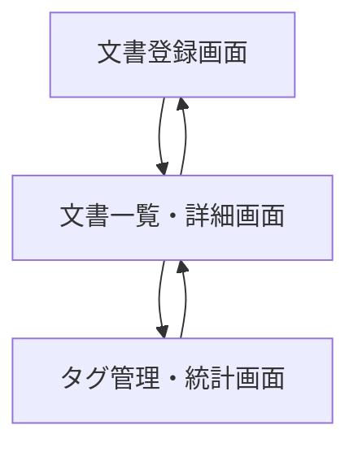
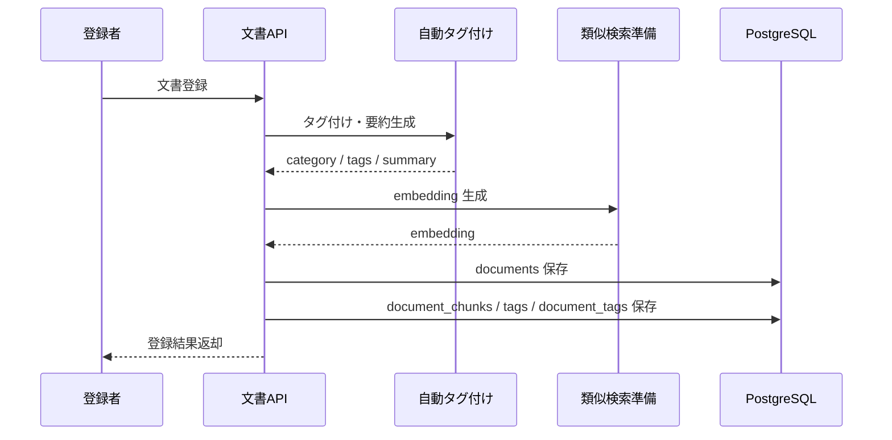
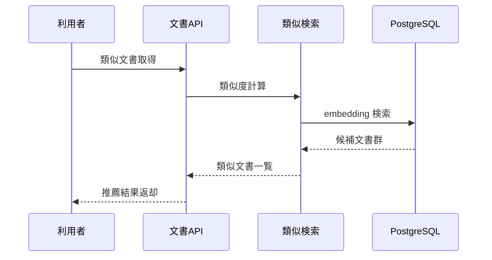

# System 07 基本設計
## プロジェクト内ドキュメント 自動タグ付け＆類似ドキュメント推薦システム

---

## 1. システム構成設計

> **デプロイ前提：1デプロイ = 1プロジェクト**
> 本システムは1デプロイインスタンスが1プロジェクトに対応する前提で設計されている。アクセス制御は `access_roles`（ロールベース）のみで実現する。`project_id` によるデータ分離・プロジェクト一覧取得APIは将来対応予定。

### 1.1 全体構成

```
クライアント
    ↓
FastAPI
    ├─ POST /documents
    ├─ POST /documents/bulk
    ├─ GET /documents
    ├─ GET /documents/{id}
    ├─ GET /documents/{id}/similar
    ├─ GET /tags
    ├─ POST /tags/merge
    └─ GET /stats/*
    ↓
DocumentCatalogService
    ├─ TextExtractor
    ├─ TaggingEngine
    ├─ SimilarityEngine
    ├─ DuplicateDetector
    └─ AccessAnalytics
    ↓
PostgreSQL（documents, document_chunks, tags, document_tags, access_logs）
```

### 1.2 コンポーネント一覧

| コンポーネント | 役割 |
|---|---|
| CatalogRouter | 文書登録・検索 API |
| TaggingEngine | 自動タグ付け、カテゴリ分類、要約 |
| SimilarityEngine | 類似文書検索 |
| DuplicateDetector | 重複候補算出 |
| TagAdminService | タグ統合、表記ゆれ解消 |
| AccessAnalytics | 利用頻度・未参照文書集計 |

---

## 2. 主要設計方針

### 2.1 登録方針

- 文書登録時に本文抽出、カテゴリ付与、タグ候補生成を実行する
- タグは既存タグ辞書と突合して表記ゆれを抑制する
- embedding は文書本文と chunk 双方に付与し、類似文書検索に使う

### 2.2 類似推薦方針

- 類似度上位文書を返すだけでなく、同じカテゴリ・同じタグの文書を優先する
- 同一ファイルハッシュは重複候補として別出力する

---

## 3. IF仕様

### 3.1 エンドポイント一覧

| メソッド | パス | 役割 |
|---|---|---|
| POST | `/documents` | 単一登録 |
| POST | `/documents/bulk` | 一括登録 |
| GET | `/documents` | 一覧・検索 |
| GET | `/documents/{document_id}` | 詳細 |
| GET | `/documents/{document_id}/similar` | 類似文書推薦 |
| PUT | `/documents/{document_id}/tags` | タグ更新 |
| GET | `/tags` | タグ一覧 |
| POST | `/tags/merge` | タグ統合 |
| GET | `/stats/access` | アクセス統計 |
| GET | `/stats/unused-documents` | 未活用文書一覧 |

---

## 4. 処理フロー

### 4.1 文書登録

```
文書受付
  ↓
本文抽出
  ↓
自動タグ付け・カテゴリ分類
  ↓
要約生成
  ↓
embedding 生成
  ↓
documents / chunks / tags 保存
```

### 4.2 類似文書推薦

```
対象文書指定
  ↓
同一カテゴリ・タグ候補取得
  ↓
ベクトル類似検索
  ↓
重複候補除外
  ↓
推薦結果返却
```

### 4.3 タグ更新

```
対象文書指定
  ↓
更新タグ入力
  ↓
既存タグとの差分判定
  ↓
document_tags 更新
```

---

## 5. データ設計

| テーブル | 主な保持内容 |
|---|---|
| `documents` | タイトル、カテゴリ、要約、hash、status |
| `document_chunks` | chunk 本文、embedding |
| `tags` | 正規タグ名、同義語 |
| `document_tags` | 文書とタグの中間 |
| `access_logs` | 閲覧履歴 |

- タグ統合時は `document_tags` の参照先を新タグへ寄せる
- 類似検索は `document_chunks.embedding` を利用する

---

## 6. プロンプト・AI制御設計

### 6.1 AI処理

- カテゴリ分類
- タグ候補生成
- 要約生成

### 6.2 ルール

- カテゴリは固定選択肢から返す
- 新規タグは既存タグに類似する場合フラグを立てる
- 要約は 3 行以内に固定する

---

## 7. ガードレール・エラー処理設計

- 権限外文書は検索・推薦対象から除外する
- 同一ハッシュの登録は reject する
- 50,000 文字超の本文は chunking して処理する
- タグ merge は管理者権限のみ許可する
- 権限外文書の除外は `access_roles` のロールベース制御による（プロジェクト分離は将来対応予定）

---

## 8. 非機能・運用設計

- 一括登録はバルクインサートを使用する
- アクセス統計は日次集計テーブルに反映する
- 未使用文書は最終アクセス日時で判定する

---

## 9. 技術スタック

| 用途 | 技術 |
|---|---|
| API | FastAPI |
| LLM | Qwen3-27B / LM Studio |
| 埋め込み | nomic-embed-text |
| ベクトルDB | PostgreSQL + pgvector |
| RAG | LlamaIndex |
| ORM | SQLAlchemy |
| トレース | MLflow |

## 10. 画面一覧

| 画面名 | 目的 | 備考 |
|---|---|---|
| 文書登録画面 | 主要操作の起点画面として利用する | 基本設計時点の主要画面 |
| 文書一覧・詳細画面 | 一覧参照と詳細確認・更新起点にする | 基本設計時点の主要画面 |
| タグ管理・統計画面 | 設定変更・マスタ保守・監視を行う | 基本設計時点の主要画面 |

## 11. 権限制御

| ロール | 利用可能画面 | 主要操作 |
|---|---|---|
| 文書登録者 | 文書登録画面 | 文書登録, 一括登録 |
| 利用者 | 文書一覧・詳細画面 | 文書検索, 類似文書確認 |
| ナレッジ管理者 | タグ管理・統計画面 | タグ統制, アクセス確認 |

## 12. 主要導線

- 登録導線: 文書登録画面で登録後、文書一覧・詳細画面で内容と類似文書を確認する。
- タグ導線: タグ管理・統計画面でタグ統制後、文書詳細へ戻って反映を確認する。

## 13. 画面遷移図



- 文書登録後は一覧・詳細に戻し、タグや類似文書推薦を確認する。
- タグ統制作業は `タグ管理・統計画面` から文書詳細へ戻れるようにする。

## 14. 画面項目定義
### 14.1 文書登録画面

| 項目ID | 項目名 | UI種別 | 必須 | 備考 |
|---|---|---|---|---|
| `file` | 文書ファイル | ファイル選択 | ○ | POST `/documents` |
| `registered_by` | 登録者 | テキスト | ○ | ユーザーID |
| `access_roles` | 閲覧権限 | 複数選択 | ○ | JSON 配列相当 |
| `submit_document` | 登録 | ボタン | ○ | 自動タグ付け実行 |
| `auto_tags` | 自動タグ結果 | テキスト表示 |  | category/sub_category/document_type/importance |
| `summary` | 要約 | テキスト表示 |  | 3行以内 |

### 14.2 文書一覧・詳細画面

| 項目ID | 項目名 | UI種別 | 備考 |
|---|---|---|---|
| `keyword` | キーワード | テキスト | 検索条件 |
| `category` | カテゴリ | プルダウン | 検索条件 |
| `tags` | タグ | 複数選択 | 検索条件 |
| `document_type` | 文書種別 | プルダウン | 検索条件 |
| `importance` | 重要度 | プルダウン | 検索条件 |
| `search_mode` | 検索モード | ラジオ | keyword/vector/hybrid |
| `document_grid` | 文書一覧 | 表 | `document_id`, `file_name`, `category`, `importance`, `registered_at` |
| `similar_documents` | 類似文書一覧 | 表 | 類似度付き表示 |

### 14.3 タグ管理・統計画面

| 項目ID | 項目名 | UI種別 | 備考 |
|---|---|---|---|
| `tags_editor` | タグ編集 | 複数入力 | PUT `/documents/{document_id}/tags` |
| `merge_from` | 統合元タグ | プルダウン | POST `/tags/merge` |
| `merge_to` | 統合先タグ | プルダウン | POST `/tags/merge` |
| `access_stats_grid` | アクセス統計 | 表 | GET `/stats/access` |
| `unused_documents_grid` | 未活用文書一覧 | 表 | GET `/stats/unused-documents` |

## 15. シーケンス図
### 15.1 文書登録



### 15.2 類似文書推薦



