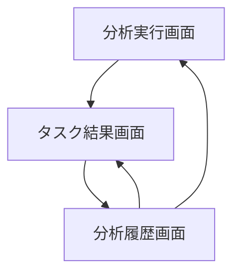
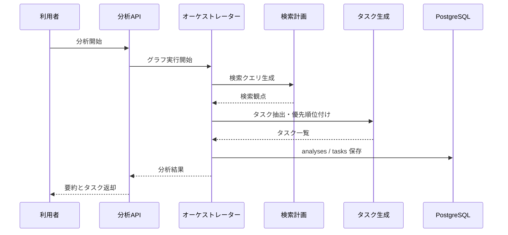
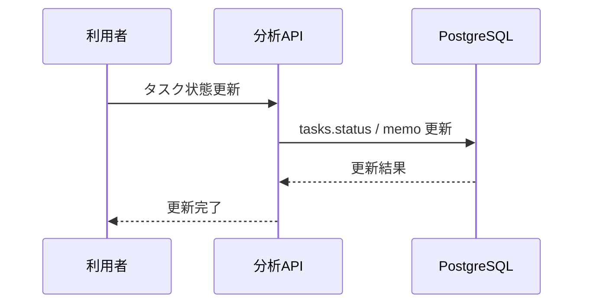

# System 08 基本設計
## 未体験作業 タスク洗い出し＆優先順位付けエージェント

---

## 1. システム構成設計

### 1.1 全体構成

```
クライアント
    ↓
FastAPI
    ├─ POST /analyze
    ├─ GET /analyses/{id}
    ├─ GET /analyses
    ├─ PATCH /analyses/{id}/tasks/{task_id}
    └─ GET /analyses/{id}/export
    ↓
TaskDiscoveryAgent
    ├─ QueryPlanner
    ├─ WebSearchTool
    ├─ SearchEvaluator
    ├─ TaskGenerator
    └─ PriorityScorer
    ↓
PostgreSQL（analyses, tasks）
```

### 1.2 コンポーネント一覧

| コンポーネント | 役割 |
|---|---|
| AnalyzeRouter | テーマ分析 API |
| LangGraph Orchestrator | 単一エージェントの状態制御 |
| QueryPlanner | 検索クエリ生成 |
| SearchEvaluator | 追加検索要否判定 |
| TaskGenerator | タスク洗い出し |
| PriorityScorer | urgency / importance / quadrant 算出 |
| ExportService | JSON / Markdown / CSV 出力 |

---

## 2. 主要設計方針

### 2.1 エージェント状態

- state は `theme / search_results / search_queries / tasks / step_count` を保持する
- step_count が 10 に達した時点で追加検索を停止する
- 途中結果でも最終タスク化を必ず行う

### 2.2 タスク設計

- 1 task ごとに `priority / urgency / importance / dependencies` を保持する
- 最初の 1 週間で着手すべきタスク群を別集計する
- 類似テーマの過去分析を参考候補として提示できるようにする

---

## 3. IF仕様

### 3.1 エンドポイント一覧

| メソッド | パス | 役割 |
|---|---|---|
| POST | `/analyze` | テーマ分析 |
| GET | `/analyses/{analysis_id}` | 分析詳細 |
| GET | `/analyses` | 履歴一覧 |
| PATCH | `/analyses/{analysis_id}/tasks/{task_id}` | タスク状態更新 |
| GET | `/analyses/{analysis_id}/export` | 出力エクスポート |

### 3.2 応答設計要点

- `POST /analyze` は同期で analysis 結果を返す
- task は `task_id` 単位で状態更新可能とする
- export は `json / markdown / csv` を query で切り替える

---

## 4. 処理フロー

```
テーマ受付
  ↓
検索クエリ生成
  ↓
Web検索
  ↓
結果評価
  ├─ 不足: 追加検索
  └─ 十分: タスク化へ
  ↓
タスク洗い出し
  ↓
優先順位付け
  ↓
analyses / tasks 保存
```

---

## 5. データ設計

| テーブル | 主な保持内容 |
|---|---|
| `analyses` | テーマ、背景、検索回数、summary |
| `tasks` | category、priority、quadrant、dependencies、status |

- `tasks.analysis_id` で親分析に紐付ける
- 手動更新した status は再分析しても上書きしない

---

## 6. プロンプト・AI制御設計

### 6.1 AI処理

- 検索クエリ生成
- 検索十分性判定
- タスク洗い出し
- 優先順位・象限判定

### 6.2 出力ルール

- 依存関係は task_id 配列で返す
- 参考 URL は title と URL をセットで保持する
- 推測だけのタスクは `confidence=low` とする

---

## 7. ガードレール・エラー処理設計

- 機密情報が入力に含まれる場合は検索前に警告する
- 5 分超過時は途中結果で終了する
- Web検索失敗時は既存検索結果だけでタスク化する
- 検索結果の URL 重複は除外する

---

## 8. 非機能・運用設計

- 1 分析あたり検索上限 10 回
- 保存済み分析は export を再生成できる
- 操作ログに検索回数、検索先、分析時間を残す

---

## 9. 技術スタック

| 用途 | 技術 |
|---|---|
| API | FastAPI |
| エージェント | LangGraph / LangChain |
| LLM | Qwen3-27B / LM Studio |
| Web検索 | web_search tool |
| DB | PostgreSQL, SQLAlchemy |
| トレース | MLflow |

## 10. 画面一覧

| 画面名 | 目的 | 備考 |
|---|---|---|
| 分析実行画面 | 条件入力と処理開始を行う | 基本設計時点の主要画面 |
| タスク結果画面 | 実行結果と進捗を確認する | 基本設計時点の主要画面 |
| 分析履歴画面 | 過去結果の参照と再実行判断を行う | 基本設計時点の主要画面 |

## 11. 権限制御

| ロール | 利用可能画面 | 主要操作 |
|---|---|---|
| 依頼者 | 分析実行画面, タスク結果画面 | 分析起動, タスク確認 |
| 管理者 | 分析履歴画面を含む全画面 | 状態更新, 出力確認 |

## 12. 主要導線

- 分析導線: 分析実行画面で分析開始後、タスク結果画面で優先順位を確認する。
- 履歴導線: 分析履歴画面から過去分析を参照し再実行判断を行う。

## 13. 画面遷移図



- 実行後は結果確認を優先し、その後に履歴比較へ進む導線とする。
- 再分析は `分析履歴画面` から `分析実行画面` へ戻れるようにする。

## 14. 画面項目定義
### 14.1 分析実行画面

| 項目ID | 項目名 | UI種別 | 必須 | 備考 |
|---|---|---|---|---|
| `theme` | テーマ | テキスト | ○ | 分析対象 |
| `background` | 背景 | テキストエリア |  | 任意 |
| `goal` | 目的 | テキストエリア | ○ | 分析の狙い |
| `constraints` | 制約条件 | テキストエリア |  | 任意 |
| `submit_analysis` | 分析開始 | ボタン | ○ | POST `/analyze` |
| `analysis_summary` | 分析要約 | テキスト表示 |  | 生成結果 |

### 14.2 タスク結果画面

| 項目ID | 項目名 | UI種別 | 備考 |
|---|---|---|---|
| `tasks_grid` | タスク一覧 | 表 | `title`, `category`, `priority`, `quadrant`, `status` |
| `dependencies` | 依存関係 | テキスト表示 | タスク詳細 |
| `evidence` | 根拠 | テキスト表示 | 検索結果要約 |
| `task_status` | 状態更新 | プルダウン | PATCH `/analyses/{analysis_id}/tasks/{task_id}` |
| `export_markdown` | Markdown出力 | ボタン | GET `/analyses/{analysis_id}/export?format=markdown` |
| `export_csv` | CSV出力 | ボタン | GET `/analyses/{analysis_id}/export?format=csv` |

### 14.3 分析履歴画面

| 項目ID | 項目名 | UI種別 | 備考 |
|---|---|---|---|
| `analysis_grid` | 分析履歴 | 表 | `analysis_id`, `theme`, `status`, `search_count`, `created_at` |
| `open_analysis` | 詳細表示 | ボタン | GET `/analyses/{analysis_id}` |

## 15. シーケンス図
### 15.1 分析実行



### 15.2 タスク状態更新



