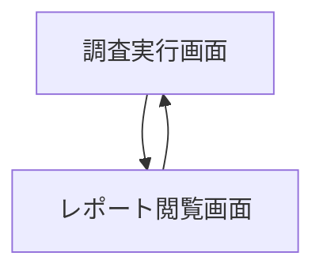
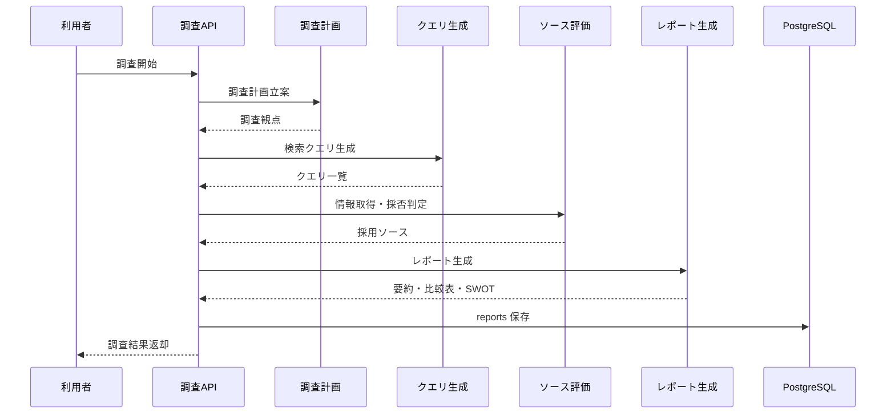
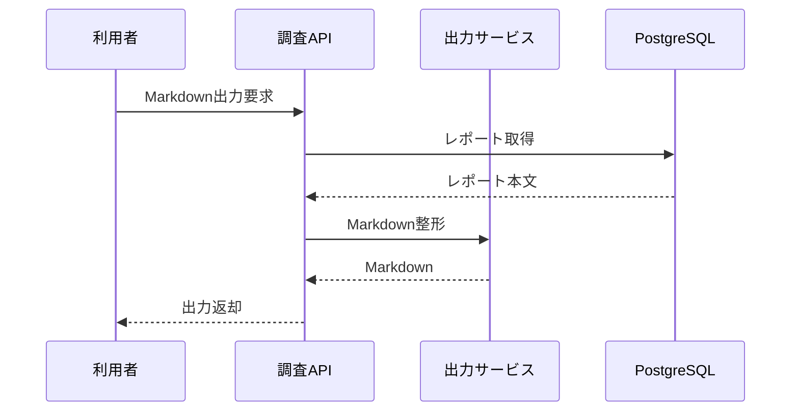

# System 09 基本設計
## 市場競合調査 エージェント

---

## 1. システム構成設計

### 1.1 全体構成

```
クライアント
    ↓
FastAPI
    ├─ POST /research
    ├─ GET /reports
    ├─ GET /reports/{id}
    └─ GET /reports/{id}/export
    ↓
ResearchAgent
    ├─ ResearchPlanner
    ├─ QueryGenerator
    ├─ WebSearchTool
    ├─ WebFetchTool
    ├─ SourceEvaluator
    └─ ReportComposer
    ↓
PostgreSQL（reports）
```

### 1.2 コンポーネント一覧

| コンポーネント | 役割 |
|---|---|
| ResearchRouter | 調査 API |
| ResearchPlanner | 調査計画立案 |
| QueryGenerator | 検索クエリ生成 |
| SourceEvaluator | 情報の採否、重複排除 |
| ReportComposer | executive_summary, comparison, SWOT 生成 |
| ExportService | Markdown エクスポート |

---

## 2. 主要設計方針

### 2.1 エージェントループ

- state は `targets / plan / search_results / summaries / step_count` を保持する
- step_count 上限は 20、timeout は 10 分とする
- 情報源は URL 単位で dedupe し、採用根拠を保持する

### 2.2 レポート設計

- `executive_summary / key_findings / companies / comparison_table / swot / trends / limitations` を固定構造にする
- 情報源 URL を各会社情報に紐付ける

---

## 3. IF仕様

### 3.1 エンドポイント一覧

| メソッド | パス | 役割 |
|---|---|---|
| POST | `/research` | 調査実行 |
| GET | `/reports` | 過去レポート一覧 |
| GET | `/reports/{report_id}` | レポート詳細 |
| GET | `/reports/{report_id}/export` | Markdown 出力 |

### 3.2 応答設計要点

- `POST /research` は同期で report を返す
- 同一対象の再調査時は過去 report を比較候補として参照できる
- export は保存済み JSON から Markdown を再生成する

---

## 4. 処理フロー

```
調査依頼受付
  ↓
調査計画立案
  ↓
検索クエリ生成
  ↓
Web検索 / Web取得
  ↓
情報評価
  ├─ 不足: 追加調査
  └─ 十分: レポート生成
  ↓
reports 保存
```

---

## 5. データ設計

| テーブル | 主な保持内容 |
|---|---|
| `reports` | research_type, targets, key_findings, companies, comparison_table, swot, markdown |

- reports は調査対象、調査日時、検索回数、limitations を保持する
- 過去比較用に target 名の正規化キーを持つ

---

## 6. プロンプト・AI制御設計

### 6.1 AI処理

- 調査計画立案
- 検索クエリ生成
- 情報評価
- レポート構造化生成

### 6.2 出力ルール

- 推測だけの内容は limitations に明示する
- comparison_table は固定列数の表構造で返す
- 情報源なしの company 情報は保存しない

---

## 7. ガードレール・エラー処理設計

- 取得不能 URL は検索結果から除外し、失敗ログだけ保持する
- 同一内容の転載記事は代表 URL 1 件に統合する
- 公開情報のみを対象とし、非公開情報を推定しない
- 調査件数過多で timeout の場合は途中までのレポートを返す

---

## 8. 非機能・運用設計

- 日本語・英語の公開ページを対象にする
- 最新情報を優先し、古い情報は採用時に日付を付ける
- レポート比較では過去との差分サマリーを生成可能にする

---

## 9. 技術スタック

| 用途 | 技術 |
|---|---|
| API | FastAPI |
| エージェント | LangGraph / LangChain |
| LLM | Qwen3-27B / LM Studio |
| 検索 | web_search, web_fetch |
| DB | PostgreSQL, SQLAlchemy |
| トレース | MLflow |

## 10. 画面一覧

| 画面名 | 目的 | 備考 |
|---|---|---|
| 調査実行画面 | 条件入力と処理開始を行う | 基本設計時点の主要画面 |
| レポート閲覧画面 | 主要操作の起点画面として利用する | 基本設計時点の主要画面 |

## 11. 権限制御

| ロール | 利用可能画面 | 主要操作 |
|---|---|---|
| 調査担当 | 調査実行画面, レポート閲覧画面 | 調査起動, レポート確認 |
| 管理者 | 全画面 | 結果管理, 出力 |

## 12. 主要導線

- 調査導線: 調査実行画面で条件を指定し、完了後にレポート閲覧画面で結果を確認する。

## 13. 画面遷移図



- `調査実行画面` を入口とし、完了後は `レポート閲覧画面` に遷移する。
- 再調査や条件変更はレポート閲覧画面から戻す。

## 14. 画面項目定義
### 14.1 調査実行画面

| 項目ID | 項目名 | UI種別 | 必須 | 備考 |
|---|---|---|---|---|
| `research_type` | 調査種別 | プルダウン | ○ | 競合比較/市場把握など |
| `theme` | 調査テーマ | テキスト | ○ | 調査対象 |
| `target_companies` | 対象企業群 | 複数入力 | ○ | 企業名配列 |
| `focus_points` | 観点 | テキストエリア |  | 価格/機能/ポジション等 |
| `period_from` | 開始日 | 日付 |  | 任意 |
| `period_to` | 終了日 | 日付 |  | 任意 |
| `submit_research` | 調査開始 | ボタン | ○ | POST `/research` |
| `executive_summary` | 要約 | テキスト表示 |  | 実行後表示 |

### 14.2 レポート閲覧画面

| 項目ID | 項目名 | UI種別 | 備考 |
|---|---|---|---|
| `report_grid` | レポート一覧 | 表 | `report_id`, `research_type`, `targets`, `created_at` |
| `key_findings` | 主要発見 | テキスト表示 | レポート詳細 |
| `comparison_table` | 比較表 | 表 | 企業比較 |
| `swot_panel` | SWOT | テキスト表示 | 企業別/全体 |
| `sources_grid` | 出典一覧 | 表 | URL, 採用理由 |
| `export_markdown` | Markdown出力 | ボタン | GET `/reports/{report_id}/export` |

## 15. シーケンス図
### 15.1 調査実行



### 15.2 レポート出力



