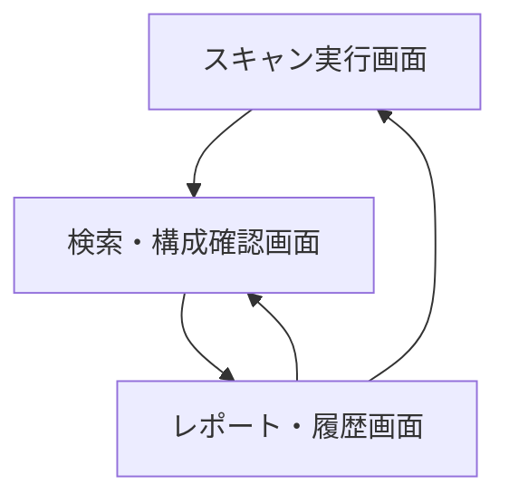
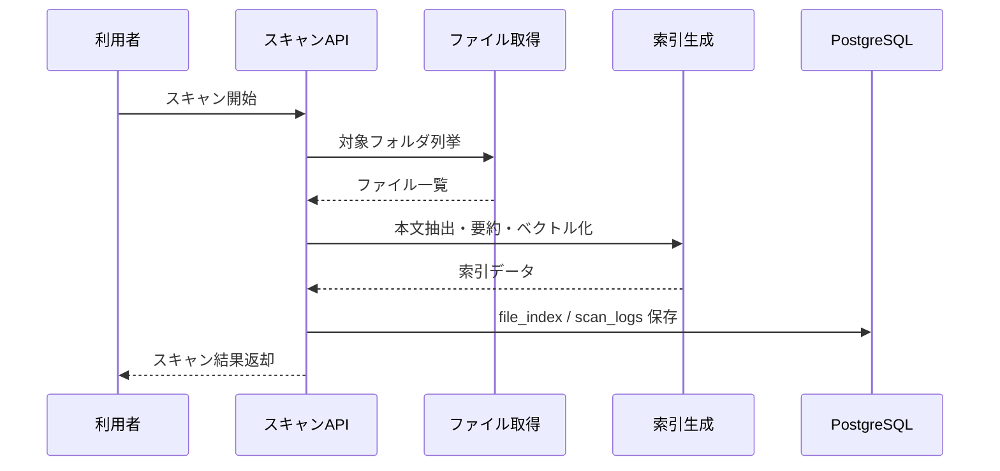
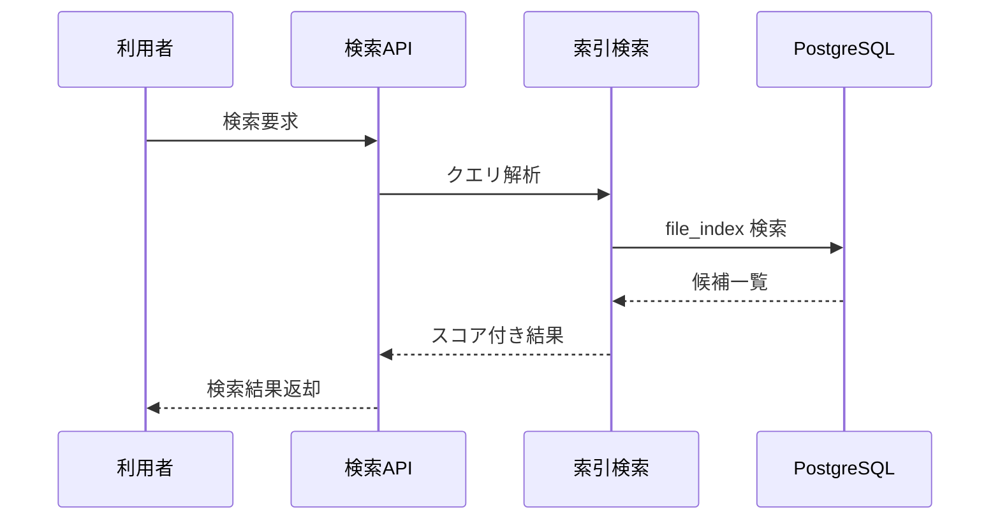

# System 10 基本設計
## 構成管理補助・ドキュメント所在検索システム

---

## 1. システム構成設計

> **デプロイ前提：1デプロイ = 1プロジェクト（初回開発）**
> 本システムは初回開発において、1デプロイインスタンスが1プロジェクト（1スキャン対象フォルダ群）に対応する前提で設計する。スキャン対象フォルダは `docker-compose.yml` の volume mount で固定する。
> 複数プロジェクトの切り替え・一覧管理・プロジェクト別データ分離は**将来対応予定**。
> また、スキャン対象フォルダの新規登録・更新・削除をメンテナンス画面から行えるようにすることも**将来対応予定**。

---

## 1. システム構成設計

### 1.1 全体構成

```
クライアント
    ↓
FastAPI
    ├─ POST /scan
    ├─ GET /search
    ├─ GET /map
    ├─ GET /report
    ├─ GET /duplicates
    └─ GET /scans
    ↓
IndexingService
    ├─ MCP Filesystem Client（read-only）
    ├─ FileMetadataCollector
    ├─ TextExtractor
    ├─ EmbeddingIndexer
    ├─ StructureMapBuilder
    └─ DuplicateDetector
    ↓
PostgreSQL（file_index, scan_logs, duplicate_groups）
```

### 1.2 コンポーネント一覧

| コンポーネント | 役割 |
|---|---|
| ScanRouter | スキャン・検索 API |
| MCPFilesystemClient | ローカル / 共有フォルダ参照 |
| FileMetadataCollector | パス、更新日、サイズ、拡張子収集 |
| TextExtractor | 文書本文抽出 |
| IndexingService | embedding 生成とインデックス登録 |
| StructureMapBuilder | フォルダ構造と最新版候補マップ生成 |
| DuplicateDetector | 類似ファイル・重複文書抽出 |

---

## 2. 主要設計方針

### 2.1 スキャン方針

- MCP filesystem は読み取り専用で利用する
- 対象ファイルは形式別に本文抽出可否を切り替える
- `file_index` にメタデータと要約、必要に応じて embedding を保存する

### 2.2 検索方針

- ファイル名、フォルダ名、本文のキーワード検索
- 類似検索による自然文検索
- 最新版推定は更新日時、ファイル名パターン、フォルダ位置で補助判定する

---

## 3. IF仕様

### 3.1 エンドポイント一覧

| メソッド | パス | 役割 |
|---|---|---|
| POST | `/scan` | フォルダスキャンとインデックス作成 |
| GET | `/search` | 自然文・キーワード検索 |
| GET | `/map` | 構成マップ取得 |
| GET | `/report` | 構成管理レポート取得 |
| GET | `/duplicates` | 重複候補取得 |
| GET | `/scans` | スキャン履歴取得 |

### 3.2 応答設計要点

- `POST /scan` は plan ではなく index 作成結果を返す
- `/search` は `matched_files / snippets / reason` を返す
- `/map` はフォルダツリーと最新版候補を返す

---

## 4. 処理フロー

```
スキャン要求受付
  ↓
MCP でフォルダ列挙
  ↓
対象ファイル抽出
  ↓
本文抽出 / 要約
  ↓
embedding 生成
  ↓
重複・最新版候補算出
  ↓
file_index / duplicate_groups / scan_logs 保存
```

---

## 5. データ設計

| テーブル | 主な保持内容 |
|---|---|
| `file_index` | path, title, category, latest_flag, summary, embedding |
| `scan_logs` | scan 対象、件数、失敗件数、実行時刻 |
| `duplicate_groups` | 重複候補グループ、代表ファイル、候補一覧 |

- `file_index.path` を自然キーとして扱う
- スキャン再実行時は path 単位で upsert する

---

## 6. プロンプト・AI制御設計

### 6.1 AI処理

- ファイル内容要約
- カテゴリ推定
- 構成マップ用説明文生成
- 類似候補説明

### 6.2 出力ルール

- 本文抽出できないファイルはメタデータのみ保持する
- 最新版推定は AI 単独にせず、ルール判定を併用する

---

## 7. ガードレール・エラー処理設計

- `.git` や `node_modules` など除外パターンを強制適用する
- 巨大バイナリや実行ファイル本文は読まない
- 権限不足パスはスキップして scan_logs に記録する
- 上書きや削除操作は一切行わない

---

## 8. 非機能・運用設計

- 定期スキャンは手動起点またはスケジューラ起点の両対応
- 検索応答は index 作成済みデータのみを対象にして高速化する
- スキャン結果の件数差分を運用レポートに残す

---

## 9. 技術スタック

| 用途 | 技術 |
|---|---|
| API | FastAPI |
| Filesystem 参照 | MCP filesystem |
| LLM | Qwen3-27B / LM Studio |
| 埋め込み | nomic-embed-text |
| ベクトルDB | PostgreSQL + pgvector |
| ORM | SQLAlchemy |
| トレース | MLflow |

## 10. 画面一覧

| 画面名 | 目的 | 備考 |
|---|---|---|
| スキャン実行画面 | 条件入力と処理開始を行う | 基本設計時点の主要画面 |
| 検索・構成確認画面 | 主要操作の起点画面として利用する | 基本設計時点の主要画面 |
| レポート・履歴画面 | 過去結果の参照と再実行判断を行う | 基本設計時点の主要画面 |

## 11. 権限制御

| ロール | 利用可能画面 | 主要操作 |
|---|---|---|
| 利用者 | スキャン実行画面, 検索・構成確認画面 | スキャン起動, 文書検索 |
| 管理者 | レポート・履歴画面を含む全画面 | 重複確認, 履歴監視 |

## 12. 主要導線

- スキャン導線: スキャン実行画面から索引更新を起動し、検索・構成確認画面で検索する。
- 監視導線: レポート・履歴画面で重複候補や構成レポートを確認する。

## 13. 画面遷移図



- スキャン完了後は検索・構成確認へ遷移し、必要に応じて履歴・重複レポートへ進む。
- 定期スキャン再実行は履歴画面から起動できる前提とする。

## 14. 画面項目定義
### 14.1 スキャン実行画面

| 項目ID | 項目名 | UI種別 | 必須 | 備考 |
|---|---|---|---|---|
| `target_paths` | 対象フォルダ | 複数入力 | ○ | POST `/scan` |
| `scan_mode` | スキャン種別 | ラジオ | ○ | full / incremental |
| `submit_scan` | スキャン開始 | ボタン | ○ | 索引更新実行 |
| `scan_result` | スキャン結果 | 集計表示 |  | 件数・失敗件数 |

### 14.2 検索・構成確認画面

| 項目ID | 項目名 | UI種別 | 備考 |
|---|---|---|---|
| `query` | 検索語 | テキスト | 自然文/キーワード |
| `search_mode` | 検索モード | ラジオ | keyword/vector/hybrid |
| `path_prefix` | フォルダ絞込 | テキスト | 任意 |
| `latest_only` | 最新版のみ | チェックボックス | 任意 |
| `search_result_grid` | 検索結果 | 表 | `path`, `title`, `category`, `latest_flag` |
| `folder_map` | 構成マップ | ツリー表示 | GET `/map` |
| `duplicates_grid` | 重複候補 | 表 | GET `/duplicates` |

### 14.3 レポート・履歴画面

| 項目ID | 項目名 | UI種別 | 備考 |
|---|---|---|---|
| `report_panel` | 構成管理レポート | テキスト表示 | GET `/report` |
| `scan_logs_grid` | スキャン履歴 | 表 | GET `/scans` |

## 15. シーケンス図
### 15.1 スキャン実行



### 15.2 自然文検索



