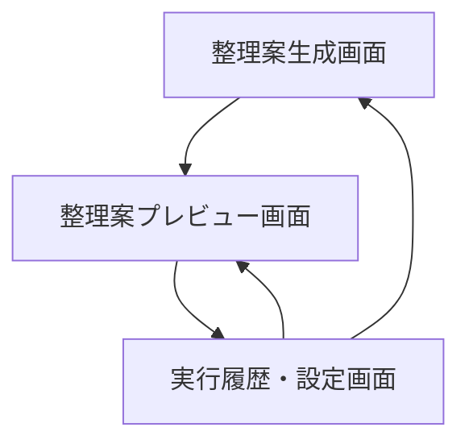
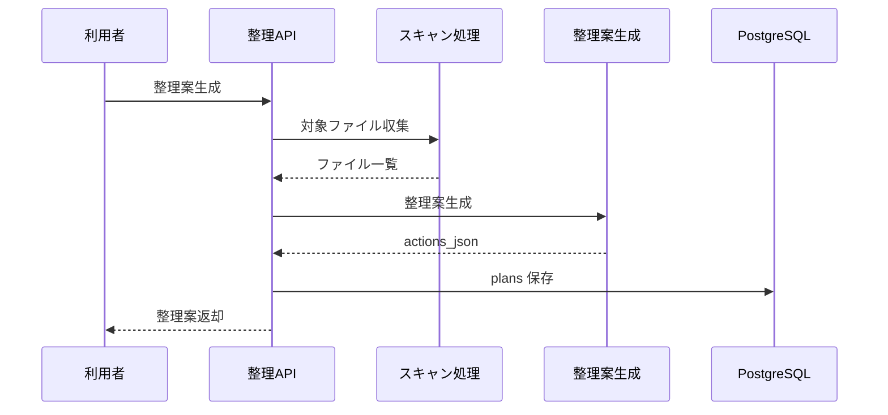
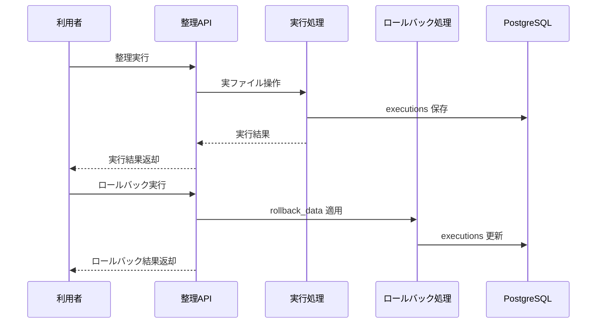

# System 11 基本設計
## ローカルPCファイル自動整理エージェント

---

> **デプロイ前提：1デプロイ = 1整理対象フォルダ（初回開発）**
> 本システムは初回開発において、1デプロイインスタンスが1つの整理対象フォルダに対応する前提で設計する。整理対象フォルダは `docker-compose.yml` の volume mount で固定する。
> 複数フォルダの切り替え・一覧管理・フォルダ別データ分離は**将来対応予定**。
> また、整理対象フォルダの新規登録・更新・削除をメンテナンス画面から行えるようにすることも**将来対応予定**。

---

## 1. システム構成設計

### 1.1 全体構成

```
ユーザー
    ↓
FastAPI
    ├─ POST /scan
    ├─ POST /execute
    ├─ POST /rollback/{execution_id}
    ├─ GET /executions
    ├─ GET /executions/{execution_id}/report
    └─ POST /settings
    ↓
FileOrganizerAgent
    ├─ MCP Filesystem Client
    ├─ ScanService
    ├─ PlanGenerator
    ├─ PreviewService
    ├─ ExecutionService
    └─ RollbackService
    ↓
PostgreSQL（plans, executions, settings）
```

### 1.2 コンポーネント一覧

| コンポーネント | 役割 |
|---|---|
| OrganizerRouter | スキャン、実行、ロールバック API |
| ScanService | 監視フォルダ内ファイルの収集 |
| PlanGenerator | move / rename / archive の整理案生成 |
| PreviewService | 実行前プレビュー生成 |
| ExecutionService | 実ファイル操作 |
| RollbackService | 実行結果の巻き戻し |
| SettingsService | 監視設定管理 |

---

## 2. 主要設計方針

### 2.1 整理案生成

- スキャン時点ではファイル操作せず、必ず plan を作成する
- 整理案は `action_type / source_path / dest_path / reason / confidence` を持つ
- `confidence` が低い案はデフォルトで実行対象外にする

### 2.2 実行方針

- 実行前にユーザー承認を必須にする
- 実行時は move / rename / archive のみ許可する
- 完全削除は扱わない

### 2.3 安全実行方針

- 実行はファイル単位で行い、成功 / 失敗 / スキップを分けて保存する
- 目標パスの競合時は上書きせず `conflict` として停止する
- ロック中ファイルは `locked` としてスキップし、後続ファイルの処理を継続する
- シンボリックリンク・ジャンクション・ショートカットは解析対象に含めても実行対象には含めない
- パス比較は Windows の絶対パス正規化後に大小文字を無視して判定する

---

## 3. IF仕様

### 3.1 エンドポイント一覧

| メソッド | パス | 役割 |
|---|---|---|
| POST | `/scan` | 整理案生成 |
| POST | `/execute` | 承認済み整理案の実行 |
| POST | `/rollback/{execution_id}` | ロールバック |
| GET | `/executions` | 実行履歴 |
| GET | `/executions/{execution_id}/report` | 実行レポート |
| POST | `/settings` | 設定更新 |

### 3.2 応答設計要点

- `/scan` は plan を返す
- `/execute` は execution_id を返し、実行ログを保存する
- `/rollback` は execution_id 単位で逆操作を実行する

---

## 4. 処理フロー

### 4.1 整理案作成

```
監視フォルダ指定
  ↓
MCP でファイル列挙
  ↓
ファイル内容 / 種別判定
  ↓
整理案生成
  ↓
プレビュー返却
  ↓
plans 保存
```

### 4.2 実行

```
承認済み action 選択
  ↓
パス検証
  ↓
MCP で move / rename / archive 実行
  ↓
rollback 情報保存
  ↓
実行レポート生成
```

---

## 5. データ設計

| テーブル | 主な保持内容 |
|---|---|
| `plans` | スキャン結果、actions、summary |
| `executions` | 実行対象 action、結果、rollback 情報 |
| `execution_items` | ファイル単位の実行結果、競合・ロック・失敗理由 |
| `settings` | watch_folders、exclude_patterns、mode |

- execution は plan から派生し、実行時点の action をスナップショット保存する
- rollback は `execution_items.rollbackable = true` の成功操作だけを対象にする

---

## 6. プロンプト・AI制御設計

### 6.1 AI処理

- ファイル内容判定
- 整理先カテゴリ推定
- リネーム候補生成
- アーカイブ判定

### 6.2 出力ルール

- 既知のパターンに当てはまるものはルール優先で分類する
- AI 判断だけで削除を提案しない
- confidence 0.8 未満は確認対象にする

---

## 7. ガードレール・エラー処理設計

- 監視外パスへの移動は拒否する
- システムフォルダ、隠しフォルダ、実行ファイルは既定で除外する
- rollback 用に元パスと変更後パスを必ず保存する
- 部分失敗時は成功 / 失敗を action 単位で分けて記録する
- ファイル名衝突時は自動リネームせず、プレビューへ `競合` として差し戻す
- ロック中ファイルは実行せず、再実行候補として保持する
- リンク系ファイルは `skipped_by_policy` として処理対象外にする

---

## 8. 非機能・運用設計

- スキャンと実行は分離し、承認なし自動実行を既定で無効にする
- 大量ファイル時は 100 件単位で実行を分割する
- 定期実行時もプレビュー先行モードを標準とする
- 実行レポートはファイル単位の結果一覧を保持し、成功分だけロールバック可能にする

---

## 9. 技術スタック

| 用途 | 技術 |
|---|---|
| API | FastAPI |
| Filesystem 操作 | MCP filesystem |
| エージェント | LangGraph |
| LLM | Qwen3-27B / LM Studio |
| ORM | SQLAlchemy |
| スケジューラ | APScheduler |
| トレース | MLflow |

## 10. 画面一覧

| 画面名 | 目的 | 備考 |
|---|---|---|
| 整理案生成画面 | 主要操作の起点画面として利用する | 基本設計時点の主要画面 |
| 整理案プレビュー画面 | 実行前の差分・影響確認を行う | 基本設計時点の主要画面 |
| 実行履歴・設定画面 | 条件入力と処理開始を行う | 基本設計時点の主要画面 |

## 11. 権限制御

| ロール | 利用可能画面 | 主要操作 |
|---|---|---|
| 利用者 | 整理案生成画面, 整理案プレビュー画面 | 整理案生成, 実行前確認 |
| 管理者 | 実行履歴・設定画面を含む全画面 | 実行, ロールバック, 設定変更 |

## 12. 主要導線

- 整理導線: 整理案生成画面で案を作成し、整理案プレビュー画面で内容確認後に実行する。
- 運用導線: 実行履歴・設定画面から結果確認とロールバックを行う。

## 13. 画面遷移図



- 危険操作を避けるため、実行前に必ず `整理案プレビュー画面` を経由する。
- ロールバックやモード切替は `実行履歴・設定画面` から行う。

## 14. 画面項目定義
### 14.1 整理案生成画面

| 項目ID | 項目名 | UI種別 | 必須 | 備考 |
|---|---|---|---|---|
| `watch_folders` | 監視フォルダ | 複数入力 | ○ | POST `/scan` |
| `exclude_patterns` | 除外パターン | 複数入力 |  | 任意 |
| `mode` | 実行モード | ラジオ | ○ | preview / execute |
| `submit_scan` | 整理案生成 | ボタン | ○ | AI 整理案生成 |
| `plan_summary` | 整理案要約 | テキスト表示 |  | 実行前確認 |

### 14.2 整理案プレビュー画面

| 項目ID | 項目名 | UI種別 | 備考 |
|---|---|---|---|
| `actions_grid` | 整理案一覧 | 表 | `action_type`, `source_path`, `target_path`, `reason` |
| `conflict_state` | 競合状態 | バッジ | conflict / locked / skipped |
| `approve_plan` | 実行承認 | ボタン | POST `/execute` |
| `execute_result` | 実行結果 | テキスト表示 | 成功件数/失敗件数 |

### 14.3 実行履歴・設定画面

| 項目ID | 項目名 | UI種別 | 備考 |
|---|---|---|---|
| `executions_grid` | 実行履歴 | 表 | GET `/executions` |
| `execution_items_grid` | ファイル別結果 | 表 | success / failed / locked / conflict |
| `execution_report` | 実行レポート | テキスト表示 | GET `/executions/{execution_id}/report` |
| `rollback` | ロールバック | ボタン | POST `/rollback/{execution_id}` |
| `settings_editor` | 監視設定 | フォーム | POST `/settings` |

## 15. シーケンス図
### 15.1 整理案生成



### 15.2 実行・ロールバック



