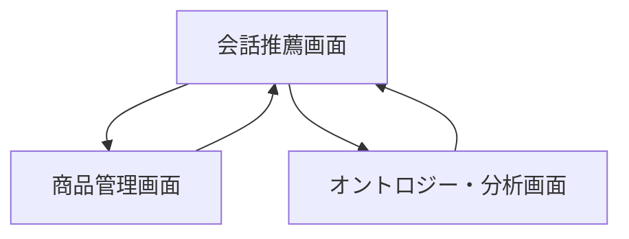
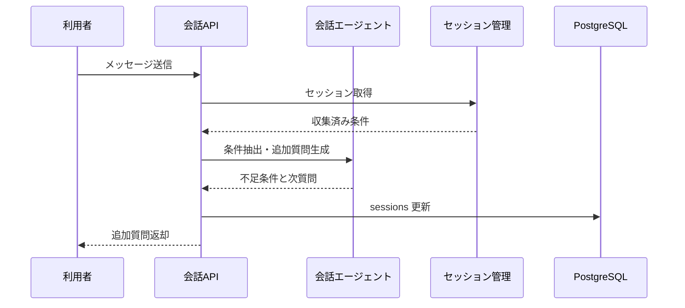
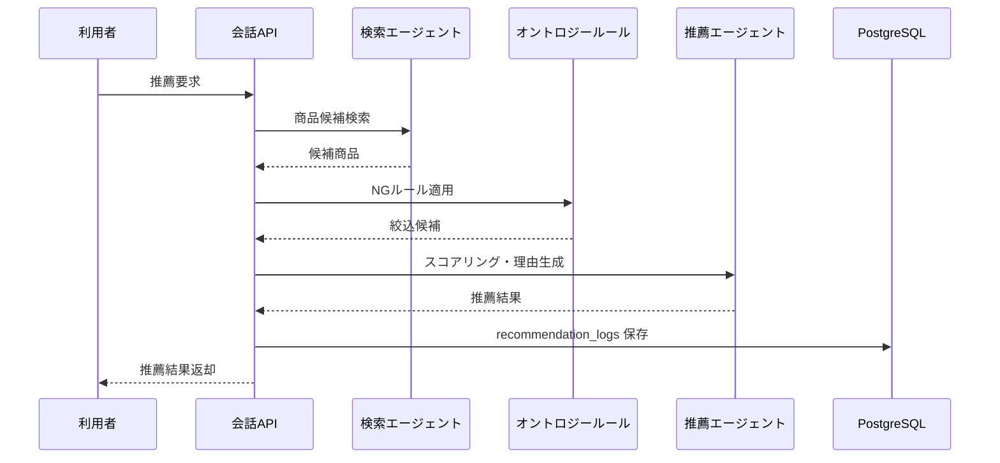

# System 12 基本設計
## ギフのC コンシェルジュ＆推薦システム

---

## 1. システム構成設計

### 1.1 全体構成

```
ユーザー
    ↓
FastAPI
    ├─ POST /chat
    ├─ POST /chat/feedback
    ├─ POST /products
    ├─ POST /ontology/scenes
    ├─ POST /ontology/ng-rules
    └─ GET /analytics/recommendations
    ↓
GiftRecommendationOrchestrator
    ├─ ConversationAgent
    ├─ SearchAgent
    ├─ OntologyRuleEngine
    ├─ RecommendationAgent
    └─ SessionMemoryService
    ↓
PostgreSQL（products, scenes, recipients, ng_rules, sessions, recommendation_logs）
```

### 1.2 コンポーネント一覧

| コンポーネント | 役割 |
|---|---|
| ChatRouter | 会話と推薦 API |
| ConversationAgent | 条件ヒアリング、追加質問生成 |
| SearchAgent | 商品候補検索 |
| OntologyRuleEngine | NG 条件除外、シーン・相手との整合判定 |
| RecommendationAgent | 候補スコアリング、理由生成 |
| SessionMemoryService | 収集済み条件、推薦済み商品管理 |
| ProductAdminService | 商品・オントロジー管理 |

---

## 2. 主要設計方針

### 2.1 マルチエージェント分担

- ConversationAgent が不足条件を埋める
- SearchAgent が商品 DB と embedding 検索で候補を出す
- OntologyRuleEngine が NG 条件、贈答マナー、保存条件を判定する
- RecommendationAgent が候補を再ランクし、理由文を生成する

### 2.2 セッション設計

- session_id 単位で scene, recipient, budget, preferences, ng_items を保持する
- 同一商品を再推薦しないよう recommendation_logs を参照する

---

## 3. IF仕様

### 3.1 エンドポイント一覧

| メソッド | パス | 役割 |
|---|---|---|
| POST | `/chat` | 条件収集 / 推薦 |
| POST | `/chat/feedback` | 推薦フィードバック |
| POST | `/products` | 商品登録 |
| PUT | `/products/{product_id}` | 商品更新 |
| POST | `/ontology/scenes` | シーン登録 |
| POST | `/ontology/ng-rules` | NG ルール登録 |
| GET | `/analytics/recommendations` | 推薦ログ集計 |

### 3.2 応答設計要点

- `/chat` は `response_type = question / recommendation` を返す
- recommendation には `reason / suitable_for / cautions / wrapping / score` を含める
- feedback は次の検索条件調整に反映する

---

## 4. 処理フロー

### 4.1 条件収集

```
初回メッセージ受付
  ↓
既知条件判定
  ↓
不足条件抽出
  ↓
追加質問生成
```

### 4.2 推薦生成

```
条件充足
  ↓
商品候補検索
  ↓
オントロジー / NG ルール適用
  ↓
候補スコアリング
  ↓
理由生成
  ↓
recommendation_logs 保存
```

### 4.3 商品更新

```
対象商品指定
  ↓
商品属性更新
  ↓
embedding 再生成
  ↓
products 更新
```

---

## 5. データ設計

| テーブル | 主な保持内容 |
|---|---|
| `products` | 商品属性、価格、カテゴリ、embedding |
| `scenes` | 贈答シーン定義 |
| `recipients` | 相手属性定義 |
| `ng_rules` | NG 条件ルール |
| `sessions` | 会話条件、会話履歴 |
| `recommendation_logs` | 提案商品、score、feedback |

---

## 6. プロンプト・AI制御設計

### 6.1 AI処理

- 不足条件抽出
- 追加質問生成
- 推薦理由生成
- フィードバック反映

### 6.2 ルール設計

- NG 商品はスコア対象から除外する
- シーンと recipient の不整合がある候補は減点する
- 理由文は商品属性と条件を必ず対応付ける

---

## 7. ガードレール・エラー処理設計

- アレルギー、年齢制限、アルコール等の NG 条件を優先判定する
- 推薦根拠のない商品は返さない
- 条件不足のまま推薦に進まない
- 会話ログは匿名化して保存する

---

## 8. 非機能・運用設計

- 会話応答 15 秒以内、推薦生成 30 秒以内を目標にする
- 商品登録後に embedding を再生成する
- analytics は日次集計で人気シーン・よく除外される NG を出す

---

## 9. 技術スタック

| 用途 | 技術 |
|---|---|
| API | FastAPI |
| エージェント | LangGraph |
| LLM | Qwen3-27B / LM Studio |
| 埋め込み | nomic-embed-text |
| ベクトルDB | PostgreSQL + pgvector |
| ORM | SQLAlchemy |
| トレース | MLflow |

## 10. 画面一覧

| 画面名 | 目的 | 備考 |
|---|---|---|
| 会話推薦画面 | 会話型で条件収集と推薦確認を行う | 基本設計時点の主要画面 |
| 商品管理画面 | 設定変更・マスタ保守・監視を行う | 基本設計時点の主要画面 |
| オントロジー・分析画面 | 分析結果確認または比較を行う | 基本設計時点の主要画面 |

## 11. 権限制御

| ロール | 利用可能画面 | 主要操作 |
|---|---|---|
| 利用者 | 会話推薦画面 | 条件入力, 推薦確認, フィードバック |
| 商品管理者 | 商品管理画面 | 商品登録, 更新 |
| 分析担当 | オントロジー・分析画面 | ルール更新, 推薦傾向確認 |

## 12. 主要導線

- 推薦導線: 会話推薦画面で条件を集め、推薦候補を確認する。
- 保守導線: 商品管理画面で商品更新後、会話推薦画面で反映確認する。
- 分析導線: オントロジー・分析画面でルールや傾向を確認する。

## 13. 画面遷移図



- 利用者導線は `会話推薦画面` を中心にする。
- 商品やルール更新後は同一会話条件で再推薦を確認できるようにする。

## 14. 画面項目定義
### 14.1 会話推薦画面

| 項目ID | 項目名 | UI種別 | 必須 | 備考 |
|---|---|---|---|---|
| `session_id` | セッションID | hidden | ○ | 会話継続用 |
| `message` | 会話入力 | テキストエリア | ○ | POST `/chat` |
| `chat_history` | 会話履歴 | チャット表示 |  | 質問/回答 |
| `collected_conditions` | 収集済み条件 | バッジ表示 |  | シーン/相手/予算等 |
| `recommendations` | 推薦結果 | カード一覧 |  | 商品名、理由、注意点、ラッピング |
| `feedback_like` | 良い/悪い | ラジオ |  | POST `/chat/feedback` |
| `feedback_reason` | 不満理由 | テキストエリア |  | NG 理由補正 |

### 14.2 商品管理画面

| 項目ID | 項目名 | UI種別 | 備考 |
|---|---|---|---|
| `product_name` | 商品名 | テキスト | POST `/products` |
| `price` | 価格 | 数値 | POST `/products` |
| `category` | カテゴリ | プルダウン | POST `/products` |
| `tags` | 商品タグ | 複数入力 | POST `/products` |
| `active_flag` | 有効フラグ | チェックボックス | PUT `/products/{product_id}` |
| `products_grid` | 商品一覧 | 表 | 商品管理 |

### 14.3 オントロジー・分析画面

| 項目ID | 項目名 | UI種別 | 備考 |
|---|---|---|---|
| `scene_name` | シーン名 | テキスト | POST `/ontology/scenes` |
| `ng_rule_editor` | NGルール | フォーム | POST `/ontology/ng-rules` |
| `recommendation_analytics` | 推薦統計 | 集計カード | GET `/analytics/recommendations` |

## 15. シーケンス図
### 15.1 条件ヒアリング



### 15.2 推薦生成



