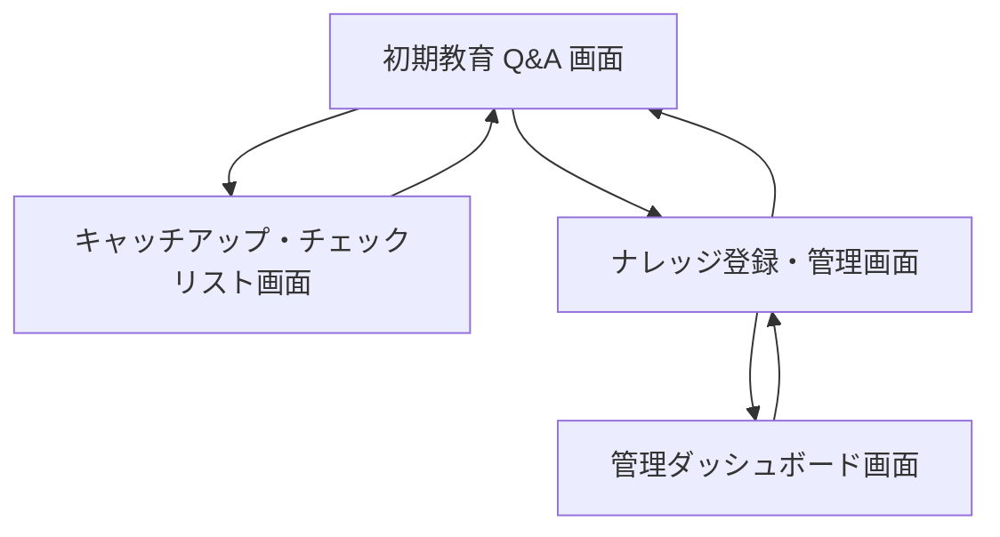
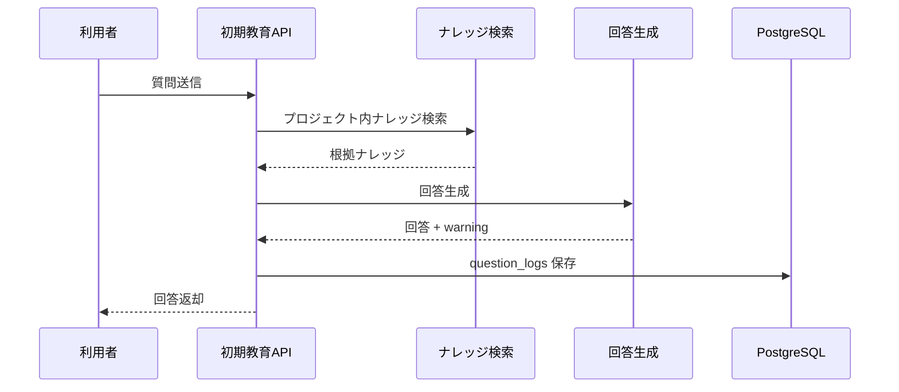
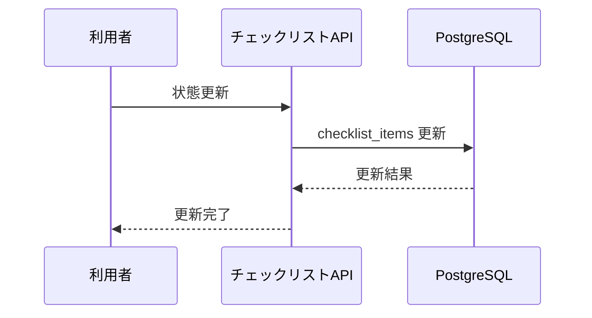

# System 13 基本設計
## プロジェクト参画者向け 初期教育エージェント

---

## 1. システム構成設計

### 1.1 全体構成

```
参画者 / 管理者
    ↓
FastAPI
    ├─ GET /projects
    ├─ POST /ask
    ├─ GET /catchup-report
    ├─ POST /knowledge
    ├─ POST /knowledge/file
    ├─ GET /knowledge
    ├─ GET /users/{user_id}/checklist
    ├─ PATCH /users/{user_id}/checklist/{item_id}
    └─ GET /admin/dashboard
    ↓
OnboardingService
    ├─ KnowledgeIngestion
    ├─ AskService
    ├─ CatchupReportService
    ├─ ChecklistService
    └─ SessionMemoryService
    ↓
PostgreSQL（projects, knowledge, members, sessions, question_logs, checklist_items）
```

### 1.2 コンポーネント一覧

| コンポーネント | 役割 |
|---|---|
| AskRouter | 会話型 Q&A |
| KnowledgeRouter | ナレッジ登録 |
| CatchupReportService | 緊急キャッチアップレポート生成 |
| ChecklistService | 初期教育チェックリスト管理 |
| AdminDashboardService | 質問傾向、未回答質問の可視化 |

---

## 2. 主要設計方針

### 2.1 ナレッジ設計

- `経緯・背景 / 設計 / ルール / 用語 / 地雷情報 / 関係者情報 / 現状課題 / ドキュメント所在` をカテゴリとして持つ
- 文書だけでなく口頭知見や暗黙知も登録対象にする

### 2.2 回答設計

- 回答本文に加えて `warning / related_info / escalation` を返す
- 初期教育用途のため、地雷情報と最初に読むべき資料を優先表示する

---

## 3. IF仕様

### 3.1 エンドポイント一覧

| メソッド | パス | 役割 |
|---|---|---|
| GET | `/projects` | プロジェクト一覧取得 |
| POST | `/ask` | 初期教育 Q&A |
| GET | `/catchup-report` | 緊急キャッチアップレポート |
| POST | `/knowledge` | ナレッジ直接登録 |
| POST | `/knowledge/file` | ファイル登録 |
| GET | `/knowledge` | ナレッジ一覧 |
| GET | `/users/{user_id}/checklist` | チェックリスト取得 |
| PATCH | `/users/{user_id}/checklist/{item_id}` | チェックリスト更新 |
| GET | `/admin/dashboard` | 管理ダッシュボード |

---

## 4. 処理フロー

### 4.1 ナレッジ登録

```
入力受付
  ↓
カテゴリ判定
  ↓
要約・タグ付与
  ↓
embedding 生成
  ↓
knowledge 保存
```

### 4.2 初期教育 Q&A

```
質問受付
  ↓
role / 参画日数取得
  ↓
関連ナレッジ検索
  ↓
回答生成
  ↓
warning / related_info 付与
  ↓
question_logs 保存
```

### 4.3 キャッチアップレポート

```
project_id, role 受付
  ↓
重要ナレッジ抽出
  ↓
最重要課題 / 地雷 / キーパーソン整理
  ↓
checklist 初期化
```

---

## 5. データ設計

| テーブル | 主な保持内容 |
|---|---|
| `projects` | プロジェクト基本情報 |
| `knowledge` | カテゴリ、本文、importance、embedding |
| `members` | role、参画日、対象プロジェクト |
| `sessions` | 会話履歴 |
| `question_logs` | 質問、回答、warning、source |
| `checklist_items` | user_id ごとの学習進捗 |

---

## 6. プロンプト・AI制御設計

### 6.1 AI処理

- ナレッジ分類
- 初期教育向け回答生成
- 緊急キャッチアップレポート生成
- 優先学習項目の抽出

### 6.2 出力ルール

- 警告事項は通常回答より優先して表示する
- 回答不能時は関係者案内へフォールバックする
- role ごとに説明粒度を調整する

---

## 7. ガードレール・エラー処理設計

- プロジェクト間のナレッジ混在を禁止する
- 地雷情報は warning フラグ付きで返す
- 未確認情報や口頭知見は `source_type=informal` を保持する
- 回答に必要なナレッジが不足している場合は未回答として記録する

---

## 8. 非機能・運用設計

- Q&A は同期、レポート生成も同期で返す
- ダッシュボード集計は日次で更新する
- checklist の更新は楽観ロックで競合回避する

---

## 9. 技術スタック

| 用途 | 技術 |
|---|---|
| API | FastAPI |
| LLM | Qwen3-27B / LM Studio |
| 埋め込み | nomic-embed-text |
| ベクトルDB | PostgreSQL + pgvector |
| RAG | LlamaIndex |
| ORM | SQLAlchemy |
| トレース | MLflow |

## 10. 画面一覧

| 画面名 | 目的 | 備考 |
|---|---|---|
| 初期教育 Q&A 画面 | 質問入力と回答確認を行う | 基本設計時点の主要画面 |
| キャッチアップ・チェックリスト画面 | 学習進捗や確認状態を更新する | 基本設計時点の主要画面 |
| ナレッジ登録・管理画面 | 設定変更・マスタ保守・監視を行う | 基本設計時点の主要画面 |
| 管理ダッシュボード画面 | 設定変更・マスタ保守・監視を行う | 基本設計時点の主要画面 |

## 11. 権限制御

| ロール | 利用可能画面 | 主要操作 |
|---|---|---|
| 参画者 | 初期教育 Q&A 画面, キャッチアップ・チェックリスト画面 | 質問, 進捗更新 |
| ベテランメンバー | ナレッジ登録・管理画面 | ナレッジ登録, 更新 |
| 管理者 | 管理ダッシュボード画面を含む全画面 | 未回答確認, 進捗監視 |

## 12. 主要導線

- 参画導線: 初期教育 Q&A 画面で質問し、キャッチアップ・チェックリスト画面で進捗更新する。
- 管理導線: ナレッジ登録・管理画面で内容整備後、管理ダッシュボード画面で状況監視する。

## 13. 画面遷移図



- 参画者の主導線は `初期教育 Q&A 画面` と `キャッチアップ・チェックリスト画面` の往復とする。
- 管理者導線は `ナレッジ登録・管理画面` と `管理ダッシュボード画面` を中心にする。

## 14. 画面項目定義
### 14.1 初期教育 Q&A 画面

| 項目ID | 項目名 | UI種別 | 必須 | 備考 |
|---|---|---|---|---|
| `project_id` | プロジェクト | プルダウン | ○ | `GET /projects` から取得した一覧を表示。対象プロジェクト切替 |
| `user_id` | 利用者ID | hidden/テキスト | ○ | ログイン利用者 |
| `question` | 質問文 | テキストエリア | ○ | POST `/ask` |
| `submit_ask` | 質問送信 | ボタン | ○ | 回答生成 |
| `answer` | 回答 | テキスト表示 |  | 根拠付き回答 |
| `sources_grid` | 参照ナレッジ | 表 |  | 文書名、カテゴリ、抜粋 |
| `warning` | 注意事項 | バッジ/テキスト |  | 確認が必要な点 |

### 14.2 キャッチアップ・チェックリスト画面

| 項目ID | 項目名 | UI種別 | 備考 |
|---|---|---|---|
| `catchup_report` | キャッチアップレポート | テキスト表示 | GET `/catchup-report` |
| `priority_topics` | 優先読了項目 | 表 | 重要度順 |
| `checklist_grid` | チェックリスト | 表 | GET `/users/{user_id}/checklist` |
| `check_item_status` | チェック状態 | チェックボックス | PATCH `/users/{user_id}/checklist/{item_id}` |

### 14.3 ナレッジ登録・管理画面

| 項目ID | 項目名 | UI種別 | 備考 |
|---|---|---|---|
| `knowledge_title` | ナレッジタイトル | テキスト | 任意 |
| `knowledge_body` | ナレッジ本文 | テキストエリア | POST `/knowledge` |
| `knowledge_file` | ナレッジファイル | ファイル選択 | POST `/knowledge/file` |
| `category` | カテゴリ | プルダウン | 任意 |
| `importance` | 重要度 | プルダウン | 高/中/低 |
| `is_landmine` | 地雷情報フラグ | チェックボックス | 注意喚起用 |
| `knowledge_grid` | ナレッジ一覧 | 表 | GET `/knowledge` |

### 14.4 管理ダッシュボード画面

| 項目ID | 項目名 | UI種別 | 備考 |
|---|---|---|---|
| `admin_dashboard` | ダッシュボード | 集計カード/表 | GET `/admin/dashboard` |
| `unanswered_questions` | 未回答質問 | 表 | FAQ 候補抽出 |
| `low_progress_members` | 進捗低位者 | 表 | チェックリスト進捗 |

## 15. シーケンス図
### 15.1 初期教育 Q&A



### 15.2 チェックリスト更新



