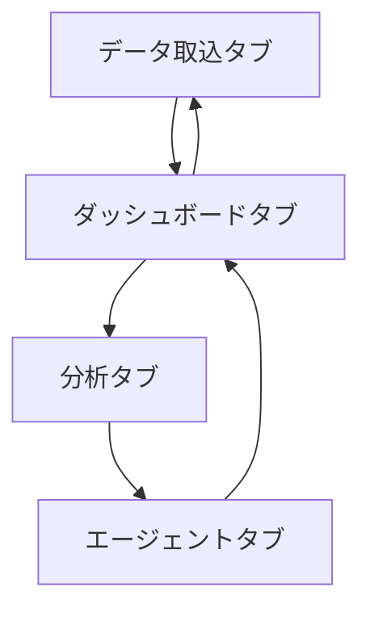
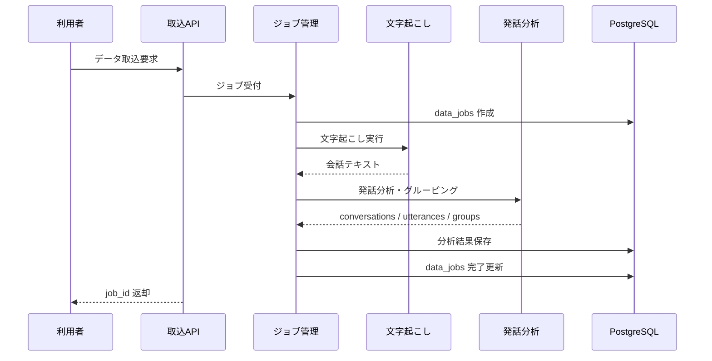
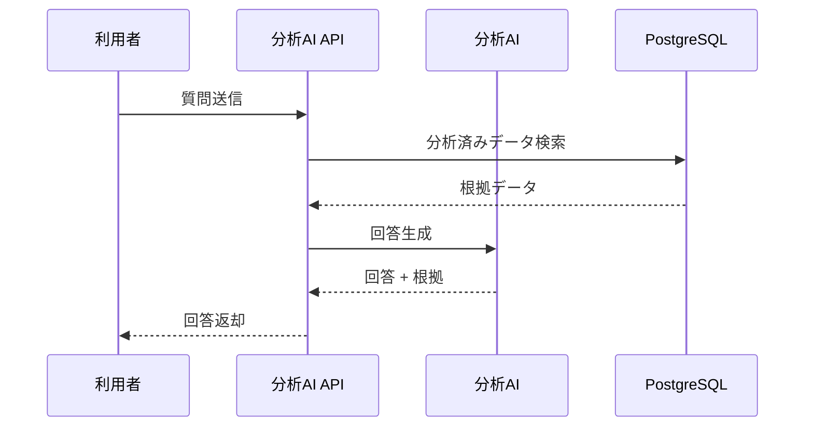

# System 14 基本設計
## 顧客接点データ 全量分析（インサイト配信エージェント）

---

## 1. システム構成設計

### 1.1 全体構成

```
データソース（音声 / 動画 / チャット / メール / コールログ）
    ↓
FastAPI
    ├─ POST /data/upload
    ├─ GET /jobs/{job_id}
    ├─ GET /insights/*
    ├─ POST /workflows
    ├─ GET /dashboard
    ├─ POST /agent/chat
    ├─ GET /agent/action-proposals
    └─ GET /agent/faq-gaps
    ↓
InsightPipelineOrchestrator
    ├─ IngestionJobManager
    ├─ SpeechToTextService
    ├─ UtteranceAnalyzer
    ├─ GroupingService
    ├─ SalesScoringService
    ├─ InsightGenerator
    ├─ WorkflowDispatcher
    └─ AgentChatService
    ↓
PostgreSQL（data_jobs, conversations, utterances, insight_groups, sales_scores, workflows, workflow_delivery_logs）
```

### 1.2 コンポーネント一覧

| コンポーネント | 役割 |
|---|---|
| IngestionRouter | データ取込 API |
| JobManager | 非同期ジョブの状態管理 |
| SpeechToTextService | faster-whisper で話者分離付き文字起こし |
| UtteranceAnalyzer | sentiment / topic / utterance_type 判定 |
| GroupingService | 意味グルーピングとランキング化 |
| SalesScoringService | 営業トーク評価 |
| WorkflowDispatcher | workflow 定義保存、配信ペイロード生成、配信結果ログ保存 |
| AgentChatService | 分析済みデータへの自然言語Q&A |

### 1.3 現行実装状況（2026-04-22）
| 項目 | 現状 |
|---|---|
| Backend | `src/backend/src/studyai/systems/system14/` に実装済み |
| Entrypoint | `src/backend/src/studyai/system14_main.py` |
| API router | `src/backend/src/studyai/systems/system14/api/router.py` |
| DB migration | `src/backend/alembic/versions/20260421_0016_init_system14.py`, `src/backend/alembic/versions/20260422_0017_add_system14_workflow_delivery_logs.py` |
| DB tables | `system14_data_jobs`, `system14_conversations`, `system14_utterances`, `system14_insight_groups`, `system14_sales_scores`, `system14_workflows`, `system14_workflow_delivery_logs`, `system14_agent_answers` |
| Docker | `system14` サービス、ホストポート `18014` |
| Frontend | `src/frontend/src/pages/System14Page.tsx`、route `/system14` |
| 検証 | Docker migration、API CSV upload、UI upload、dashboard / analysis / agent 表示、workflow 配信ログ保存を確認対象 |

---

## 2. 主要設計方針

### 2.1 取込設計

- `POST /data/upload` はジョブ受付のみ行い、処理はバックグラウンドで実行する
- 音声・動画は文字起こし後に conversation / utterance 単位へ分割する
- テキスト系データは source ごとに正規化して conversation 形式へ統一する

### 2.2 分析設計

- utterance 単位で sentiment と type を付与する
- conversation 単位で要約、営業スコア、勝敗理由を集約する
- insight_groups は topic / sentiment / type 単位で期間集約する

### 2.3 配信設計

- workflow は `data_sources / analysis_steps / output_type / delivery` を保持する
- 配信前に部門別の出力粒度へ整形する
- workflow 作成時に指定された `output_type` の分析ペイロードを生成し、配信結果を `system14_workflow_delivery_logs` に保存する
- `dashboard` はログ保存で成功扱い、`webhook` は HTTP POST、`email` は SMTP 設定時のみ送信、`crm` は connector 未実装で明示的に失敗ログとして扱う

---

## 3. IF仕様

### 3.1 エンドポイント一覧

| メソッド | パス | 役割 | 応答方式 |
|---|---|---|---|
| POST | `/data/upload` | データ取込ジョブ受付 | 非同期受付 |
| GET | `/jobs/{job_id}` | ジョブ状態確認 | 同期 |
| GET | `/insights/voice-ranking` | 顧客の声ランキング | 同期 |
| GET | `/insights/sales-score` | 営業トークスコア | 同期 |
| GET | `/insights/win-loss` | 受注失注分析 | 同期 |
| POST | `/workflows` | 配信ワークフロー定義・即時配信実行 | 同期 |
| GET | `/dashboard` | 集約ダッシュボード | 同期 |
| POST | `/agent/chat` | 分析AIチャット | 同期 |
| GET | `/agent/action-proposals` | 改善提案 | 同期 |
| GET | `/agent/faq-gaps` | 不足FAQ検出 | 同期 |

---

## 4. 処理フロー

### 4.1 取込ジョブ

```
データアップロード
  ↓
job 作成
  ↓
データ種別判定
  ├─ 音声 / 動画: 文字起こし
  └─ テキスト: 正規化
  ↓
conversation / utterance 生成
  ↓
分析パイプライン実行
  ↓
DB 保存
  ↓
workflow 条件に応じて通知
```

### 4.2 エージェントQ&A

```
質問受付
  ↓
分析済みデータ検索
  ↓
過去対応 / スコア / グループ情報を集約
  ↓
根拠付き回答生成
```

---

## 5. データ設計

| テーブル | 主な保持内容 |
|---|---|
| `data_jobs` | 取込ジョブ状態、進捗、処理量 |
| `conversations` | 会話単位の本文、source、occurred_at |
| `utterances` | 発話単位の speaker、sentiment、type、topics |
| `insight_groups` | グループラベル、件数、対象発話群 |
| `sales_scores` | conversation ごとの営業スコア |
| `workflows` | 配信条件と配信先 |
| `workflow_delivery_logs` | 配信方法、宛先、payload、response、成功/失敗/skip 状態 |

---

## 6. プロンプト・AI制御設計

### 6.1 AI処理

| 処理 | 用途 |
|---|---|
| 文字起こし補助 | 話者分離付き transcript 生成 |
| utterance 分析 | sentiment / topic / type 判定 |
| grouping | 類似発話の統合 |
| sales scoring | 営業品質評価 |
| agent chat | 根拠付き分析回答 |
| action proposals | 改善提案 / FAQ 候補生成 |

### 6.2 出力ルール

- すべて JSON スキーマで統一する
- 推奨アクションは根拠データとセットで返す
- FAQ 候補は既存 FAQ と重複しないことを条件にする

---

## 7. ガードレール・エラー処理設計

- 個人情報は DB 保存前にマスキングする
- リスク・コンプライアンス発言は即時アラート対象にする
- ジョブ失敗時は最大 3 回まで再試行する
- 大量データは conversation 単位に分割して処理する

---

## 8. 非機能・運用設計

- 月次数千件のデータを前提に、取込と分析を非同期化する
- 集約系 API は保存済み分析結果だけを参照する
- workflow は配信失敗を再送キューへ積む

---

## 9. 技術スタック

| 用途 | 技術 |
|---|---|
| API | FastAPI |
| エージェント | LangGraph |
| LLM | Qwen3-27B / LM Studio |
| 音声文字起こし | faster-whisper |
| 埋め込み | nomic-embed-text |
| ベクトルDB | PostgreSQL + pgvector |
| 通知 | httpx, Webhook, SMTP |
| ORM | SQLAlchemy |
| トレース | MLflow |

## 10. 画面一覧

| 画面名 | 目的 | 備考 |
|---|---|---|
| データ取込タブ | ファイル投入、metadata 入力、ジョブ受付・状態確認を行う | 実装済み |
| ダッシュボードタブ | 集約カード、顧客の声ランキング、直近ジョブを表示する | 実装済み |
| 分析タブ | 顧客の声ランキング、営業スコア、勝敗要因を表示する | 実装済み |
| エージェントタブ | 分析AIチャットとワークフロー定義保存・配信実行を行う | 実装済み |

## 11. 権限制御

| ロール | 利用可能画面 | 主要操作 |
|---|---|---|
| 分析担当者 | データ取込タブ／ダッシュボードタブ／分析タブ | データ投入, 分析確認 |
| 管理者 | 全タブ | 配信設定／深掘り分析 |
| 閲覧者 | ダッシュボードタブ／分析タブ | 結果閲覧 |

## 12. 主要導線

- 投入導線: データ取込タブからジョブを起動し、ダッシュボードタブで結果を確認する。
- 分析導線: 分析タブでランキング、営業スコア、勝敗要因を確認する。
- 深掘り導線: エージェントタブで配信設定と分析AI質問を実施する。

## 13. 画面遷移図



- 新規データ投入後は `ダッシュボードタブ` で分析結果を確認する。
- 詳細指定は `分析タブ` で確認する。
- 配信条件調整や深掘り質問は `エージェントタブ` へ遷移する。

## 14. 画面項目定義
### 14.1 データ取込画面

| 項目ID | 項目名 | UI種別 | 必須 | 備考 |
|---|---|---|---|---|
| `data_type` | 取込種別 | プルダウン | ◯ | 音声/動画/チャット/メール |
| `source` | データソース | プルダウン | ◯ | zoom/callcenter/chat_support など |
| `file` | 取込ファイル | ファイル選択 |  | POST `/data/upload` |
| `metadata` | 付加情報 | テキストエリア |  | JSON 直接入力 |
| `submit_upload` | 取込開始 | ボタン | ◯ | 非同期ジョブ受付 |
| `job_status` | ジョブ状態 | ステータス表示 |  | GET `/jobs/{job_id}` |

### 14.2 ダッシュボードタブ
| 項目ID | 項目名 | UI種別 | 備考 |
|---|---|---|---|
| `dashboard_cards` | ダッシュボード | 集約カード | GET `/dashboard` |
| `voice_ranking` | 顧客の声ランキング | 表 | `GET /dashboard` の `top_topics` |
| `recent_jobs` | 直近ジョブ | 一覧 | `GET /dashboard` の `recent_jobs` |

### 14.3 分析タブ
| 項目ID | 項目名 | UI種別 | 備考 |
|---|---|---|---|
| `voice_ranking` | 顧客の声ランキング | 表 | GET `/insights/voice-ranking` |
| `sales_score` | 営業スコア | カード | GET `/insights/sales-score` |
| `win_loss` | 受注失注分析 | 表 | GET `/insights/win-loss` |
| `action_proposals` | 改善提案 | 表 | GET `/agent/action-proposals` |
| `faq_gaps` | FAQ不足一覧 | 表 | GET `/agent/faq-gaps` |

備考: `action_proposals` と `faq_gaps` は Backend API 実装済み。専用 UI 表示は残作業。

### 14.4 エージェントタブ
| 項目ID | 項目名 | UI種別 | 備考 |
|---|---|---|---|
| `workflow_editor` | 配信条件設定 | フォーム | POST `/workflows` |
| `delivery_targets` | 配信先 | 複数入力 | dashboard / Webhook / メール / CRM を指定可能、CRM は connector 未実装で明示する |
| `agent_question` | 分析AI質問 | テキストエリア | POST `/agent/chat` |
| `agent_answer` | 分析AI回答 | テキスト表示 | 根拠付き回答 |

## 15. シーケンス図
### 15.1 データ取込ジョブ



### 15.2 分析AIチャット


