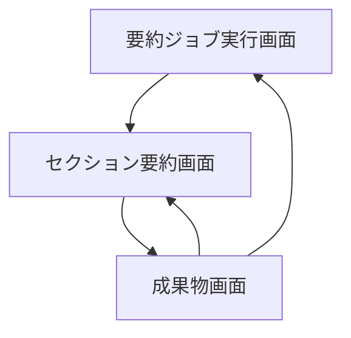
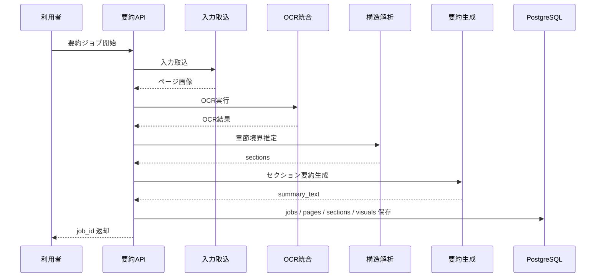
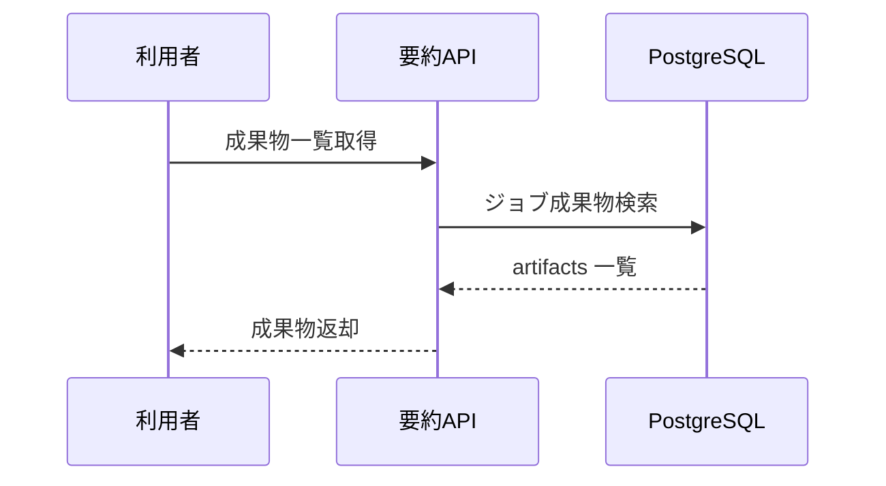

# System 15 基本設計
## 電子書籍 セクション別自動要約システム

---

## 1. システム構成設計

### 1.1 全体構成

```
入力（pdf / image_dir / reader capture）
    ↓
FastAPI
    ├─ POST /jobs
    ├─ GET /jobs/{job_id}
    ├─ GET /jobs/{job_id}/sections
    └─ GET /jobs/{job_id}/artifacts
    ↓
SummarizationPipeline
    ├─ CaptureAdapter
    ├─ PagePreprocessor
    ├─ OCRFusionService
    ├─ StructureAnalyzer
    ├─ VisualAnalyzer
    ├─ SummaryGenerator
    └─ ArtifactManager
    ↓
永続化（ローカルファイル or DB）
```

### 1.2 コンポーネント一覧

| コンポーネント | 役割 |
|---|---|
| JobRouter | ジョブ API |
| CaptureAdapter | リーダー画面キャプチャ / PDF / 画像取込 |
| PagePreprocessor | ページ画像前処理、ノイズ除去 |
| OCRFusionService | VLM OCR と Tesseract の統合 |
| StructureAnalyzer | TOC 検出、セクション境界判定 |
| VisualAnalyzer | Detectron2 / VLM による図表解析 |
| SummaryGenerator | セクション本文 + 図表説明から要約生成 |
| ArtifactManager | 中間成果物と最終成果物の保存 |

---

## 2. 主要設計方針

### 2.1 パイプライン設計

- フェーズは `取込 → OCR → 構造解析 → 図表処理 → 要約生成` の順で固定する
- phase ごとに成果物を保存し、途中失敗時に再開できるようにする
- book_summarization_cli の再開発対象として、各 phase を独立モジュール化する

### 2.2 永続化方針

- 画像、OCR テキスト、図表切り抜き、JSONL を成果物ディレクトリへ保存する
- ジョブ状態と section / visual 要約メタデータは DB 保存にも対応する

---

## 3. IF仕様

### 3.1 エンドポイント一覧

| メソッド | パス | 役割 | 応答方式 |
|---|---|---|---|
| POST | `/jobs` | 要約ジョブ起動 | 非同期受付 |
| GET | `/jobs/{job_id}` | ジョブ状態確認 | 同期 |
| GET | `/jobs/{job_id}/sections` | セクション一覧取得 | 同期 |
| GET | `/jobs/{job_id}/artifacts` | 成果物一覧取得 | 同期 |

### 3.2 入力種別

- `capture`
- `pdf`
- `image_dir`

---

## 4. 処理フロー

### 4.1 ジョブ全体

```
ジョブ受付
  ↓
入力形式判定
  ↓
ページ画像生成
  ↓
OCR 融合
  ↓
TOC / セクション解析
  ↓
図表検出・説明文生成
  ↓
セクション要約生成
  ↓
artifacts 保存
```

### 4.2 OCR 融合

```
VLM OCR 実行
  ↓
Tesseract OCR 実行
  ↓
bbox 重複除去
  ↓
読み順統合
  ↓
信頼度算出
```

---

## 5. データ設計

| 論理モデル | 主な保持内容 |
|---|---|
| `summarization_jobs` | job_id, input_type, status, current_phase, output_dir |
| `pages` | page_no, image_path, ocr_text_path, toc_candidate, ocr_confidence |
| `sections` | section_no, title, page_from, page_to, summary_text, review_required |
| `visuals` | bbox, caption, description, image_path |

### 5.1 保存方針

- 大容量データはファイル保存、メタデータは DB 保存を基本とする
- `section_id` と `visual_id` で成果物を相互参照できるようにする

---

## 6. プロンプト・AI制御設計

### 6.1 AI処理

| 処理 | 用途 |
|---|---|
| VLM OCR補助 | 本文・見出し・キャプション抽出 |
| セクション判定 | 目次と OCR を使った境界判定 |
| 図表説明生成 | visual description 作成 |
| セクション要約 | 本文 + 図表説明の統合要約 |

### 6.2 出力ルール

- 読めない箇所は推測で補完しない
- セクション境界は confidence_score を必ず付ける
- 図表説明は本文との対応が曖昧ならその旨を明示する

---

## 7. ガードレール・エラー処理設計

- 著作権フリーまたは利用許諾済み書籍のみ対象とする
- DRM 付きコンテンツは処理対象外とする
- タイムアウトしたページや図表は quarantine 扱いにして残り処理を継続する
- 低信頼 section は `review_required=true` として返す

---

## 8. 非機能・運用設計

- ジョブは非同期で実行し、phase 状態を逐次保存する
- 中間成果物を残して再実行時間を短縮する
- 1 ページごとの処理時間、OCR 信頼度、section 信頼度をトレースする

---

## 9. 技術スタック

| 用途 | 技術 |
|---|---|
| API | FastAPI |
| OCR | Tesseract OCR, Qwen3-VL-32B |
| レイアウト解析 | Detectron2 |
| 画面操作 | PyAutoGUI |
| PDF 処理 | PyMuPDF |
| DB | PostgreSQL, SQLAlchemy |
| トレース | MLflow |

## 10. 画面一覧

| 画面名 | 目的 | 備考 |
|---|---|---|
| 要約ジョブ実行画面 | 条件入力と処理開始を行う | 基本設計時点の主要画面 |
| セクション要約画面 | 主要操作の起点画面として利用する | 基本設計時点の主要画面 |
| 成果物画面 | 生成物一覧と中間成果物を確認する | 基本設計時点の主要画面 |

## 11. 権限制御

| ロール | 利用可能画面 | 主要操作 |
|---|---|---|
| 実行担当 | 要約ジョブ実行画面, セクション要約画面 | ジョブ起動, 要約確認 |
| 閲覧者 | 成果物画面 | 成果物閲覧 |
| 管理者 | 全画面 | 再実行判断, 設定確認 |

## 12. 主要導線

- 実行導線: 要約ジョブ実行画面から処理を起動し、セクション要約画面で節単位に確認する。
- 成果物導線: 成果物画面で OCR 結果や構造 JSON を確認する。

## 13. 画面遷移図



- 実行後はセクション単位の確認を優先し、必要に応じて成果物一覧へ進む。
- 再実行や対象範囲変更は `成果物画面` から戻す。

## 14. 画面項目定義
### 14.1 要約ジョブ実行画面

| 項目ID | 項目名 | UI種別 | 必須 | 備考 |
|---|---|---|---|---|
| `input_files` | 入力ファイル | ファイル選択 | ○ | PDF/画像群 |
| `input_type` | 入力種別 | ラジオ | ○ | PDF/画像/キャプチャ |
| `page_range` | 対象範囲 | テキスト |  | 任意 |
| `submit_job` | 要約開始 | ボタン | ○ | POST `/jobs` |
| `job_status` | ジョブ状態 | ステータス表示 |  | GET `/jobs/{job_id}` |

### 14.2 セクション要約画面

| 項目ID | 項目名 | UI種別 | 備考 |
|---|---|---|---|
| `sections_grid` | セクション一覧 | 表 | GET `/jobs/{job_id}/sections` |
| `summary_text` | セクション要約 | テキスト表示 | 選択セクション詳細 |
| `review_required` | 要確認 | チェック表示 | 要確認箇所 |
| `visual_descriptions` | 図表説明 | テキスト表示 | 図表ごとの説明 |

### 14.3 成果物画面

| 項目ID | 項目名 | UI種別 | 備考 |
|---|---|---|---|
| `artifacts_grid` | 成果物一覧 | 表 | GET `/jobs/{job_id}/artifacts` |
| `ocr_preview` | OCR結果 | テキスト表示 | ページ単位 |
| `structure_preview` | 構造JSON | テキスト表示 | 節構造 |

## 15. シーケンス図
### 15.1 要約ジョブ実行



### 15.2 成果物取得



