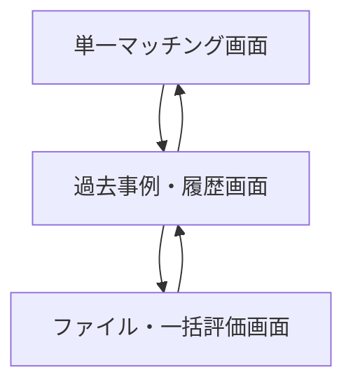
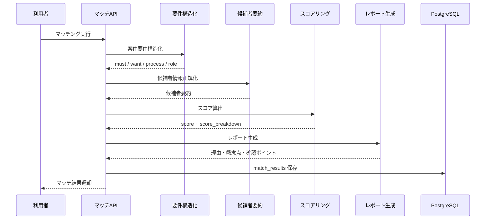
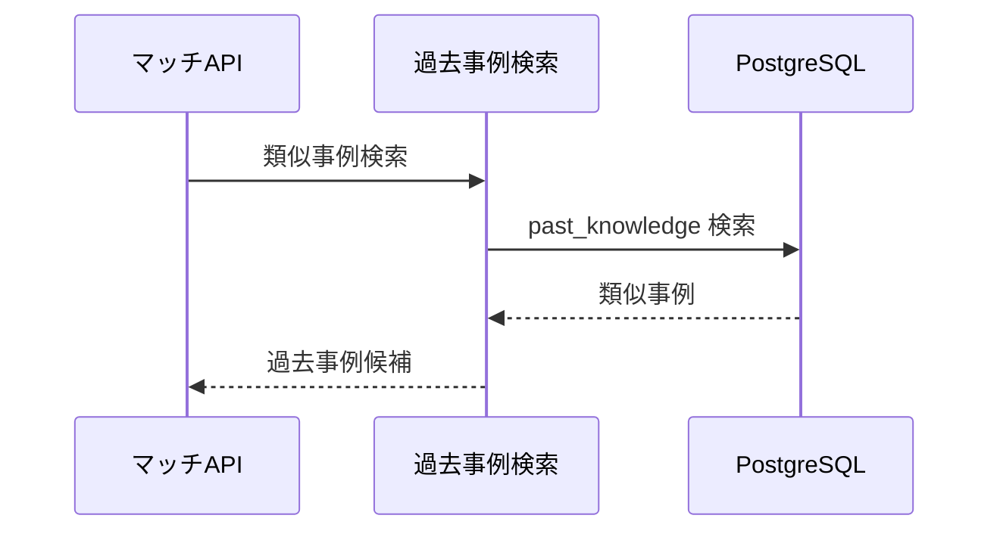

# System 16 基本設計
## 案件マッチングシステム（プロジェクト・スキルシート）

---

## 1. システム構成設計

### 1.1 全体構成

```
クライアント
    ↓
FastAPI
    ├─ POST /match
    ├─ POST /match/file
    ├─ POST /match/bulk
    ├─ POST /skillsheet/parse
    ├─ POST /knowledge/past-case
    ├─ GET /matches
    └─ GET /matches/{match_id}
    ↓
MatchingService
    ├─ RequirementStructurer
    ├─ SkillsheetParser
    ├─ CandidateProfiler
    ├─ MatchScorer
    ├─ PastCaseRetriever
    └─ ReportGenerator
    ↓
PostgreSQL（match_results, past_knowledge）
```

### 1.2 コンポーネント一覧

| コンポーネント | 役割 |
|---|---|
| MatchRouter | マッチング API |
| SkillsheetParser | Excel スキルシート構造化 |
| RequirementStructurer | 要件書から必須 / 歓迎 / 工程 / 役割を抽出 |
| CandidateProfiler | 候補者スキル要約生成 |
| MatchScorer | score_breakdown 算出 |
| PastCaseRetriever | 類似アサイン事例検索 |
| ReportGenerator | 理由、懸念点、確認ポイント生成 |

---

## 2. 主要設計方針

### 2.1 入力設計

- `/match` は構造化済みテキスト同士の比較に使う
- `/match/file` は requirement_file と candidate_file を受け付け、内部で parse 後に同じマッチングパイプラインへ流す
- `/match/bulk` は 1 要件に対する複数候補評価を扱う

### 2.2 スコア設計

- `technical_skills / process_experience / domain_experience / role_experience` の 4 軸で点数化する
- 最終 score は重み付き合算で求める
- 過去事例は点数決定ではなくコメント補強に使う

### 2.3 正規化・レビュー方針

- スキル名、ツール名、役割名は同義語辞書で正規化してから評価する
- Excel スキルシートは標準レイアウトA/Bを優先し、非標準レイアウトは `review_required` を付ける
- `parse_confidence < 0.75`、必須スキル未解決が3件超、必須工程未検出のいずれかで人確認対象にする
- `review_required = true` の結果は画面上で強調表示し、自動で高適合扱いにしない

---

## 3. IF仕様

### 3.1 エンドポイント一覧

| メソッド | パス | 役割 |
|---|---|---|
| POST | `/match` | テキスト入力マッチング |
| POST | `/match/file` | ファイル入力マッチング |
| POST | `/match/bulk` | 一括候補評価 |
| POST | `/skillsheet/parse` | スキルシート構造化 |
| POST | `/knowledge/past-case` | 過去事例登録 |
| GET | `/matches` | 結果一覧 |
| GET | `/matches/{match_id}` | 結果詳細 |

### 3.2 応答設計要点

- `/match` は同期で `score / level / score_breakdown / report / similar_cases` を返す
- `/match/bulk` は候補ごとの結果配列を返す
- `/skillsheet/parse` は候補比較前に単独利用できる

---

## 4. 処理フロー

### 4.1 単一マッチング

```
要件入力
  ↓
要件構造化
  ↓
候補データ構造化
  ↓
4 軸スコア算出
  ↓
過去事例検索
  ↓
レポート生成
  ↓
match_results 保存
```

### 4.2 スキルシートパース

```
xlsx 受付
  ↓
シート読込
  ↓
案件行抽出
  ↓
期間計算
  ↓
スキルサマリー集計
```

---

## 5. データ設計

| テーブル | 主な保持内容 |
|---|---|
| `match_results` | requirement_text, candidate_data_masked, score, breakdown, report |
| `past_knowledge` | requirement_summary, candidate_profile, result, notes, embedding |
| `skill_aliases` | canonical_name, alias_name, category |

### 5.1 保存方針

- 候補データはマスク済み JSON を保存する
- 類似事例検索は `past_knowledge.embedding` を利用する
- マッチング結果には `parse_confidence`, `review_required`, `review_reasons` を保持する

---

## 6. プロンプト・AI制御設計

### 6.1 AI処理

| 処理 | 用途 |
|---|---|
| スキルシート構造化 | 案件一覧、スキル集計、役割抽出 |
| 要件構造化 | 必須 / 歓迎 / 工程 / 役割 / ドメイン抽出 |
| マッチング分析 | score と report 生成 |

### 6.2 出力ルール

- スコア理由は必ず 4 軸に対応させる
- 懸念点がある場合は確認質問まで生成する
- 個人属性ではなくスキル・経験・工程のみで評価する

---

## 7. ガードレール・エラー処理設計

- 氏名や個人連絡先は保存前にマスクする
- スコアは説明可能な重み計算に限定する
- 要件や候補に不足項目がある場合は `insufficient_data` を返せる設計にする
- ファイルパース失敗時は sheet 名と失敗行をエラー詳細へ含める
- `review_required = true` の結果は管理者レビューなしに確定利用しない

---

## 8. 非機能・運用設計

- 単一マッチングは同期、一括は候補数に応じて分割評価する
- 類似事例検索は保存済みケースのみ対象にする
- 評価結果は後続レビューのため一覧・詳細取得を提供する
- 同義語辞書は管理者が更新可能とし、更新後評価では最新版辞書を参照する

---

## 9. 技術スタック

| 用途 | 技術 |
|---|---|
| API | FastAPI |
| LLM | Qwen3-27B / LM Studio |
| Excel 解析 | openpyxl / pandas |
| 埋め込み | nomic-embed-text |
| ベクトルDB | PostgreSQL + pgvector |
| ORM | SQLAlchemy |
| トレース | MLflow |

## 10. 画面一覧

| 画面名 | 目的 | 備考 |
|---|---|---|
| 単一マッチング画面 | 主要操作の起点画面として利用する | 基本設計時点の主要画面 |
| ファイル・一括評価画面 | 主要操作の起点画面として利用する | 基本設計時点の主要画面 |
| 過去事例・履歴画面 | 過去結果の参照と再実行判断を行う | 基本設計時点の主要画面 |

## 11. 権限制御

| ロール | 利用可能画面 | 主要操作 |
|---|---|---|
| アサイン担当 | 単一マッチング画面, ファイル・一括評価画面 | 単票評価, 一括比較 |
| 管理者 | 過去事例・履歴画面を含む全画面 | 過去事例登録, 履歴確認 |
| 閲覧者 | 過去事例・履歴画面 | 結果参照 |

## 12. 主要導線

- 単票導線: 単一マッチング画面で要件と候補者を評価する。
- 一括導線: ファイル・一括評価画面で複数候補を比較する。
- 履歴導線: 過去事例・履歴画面で既存事例と過去結果を確認する。

## 13. 画面遷移図



- 単票評価と一括評価は別導線とし、比較・再確認は `過去事例・履歴画面` から行う。
- 過去事例登録後は単一・一括の両評価へ戻れるようにする。

## 14. 画面項目定義
### 14.1 単一マッチング画面

| 項目ID | 項目名 | UI種別 | 必須 | 備考 |
|---|---|---|---|---|
| `requirement_text` | 案件要件 | テキストエリア | ○ | POST `/match` |
| `candidate_data` | 候補者情報 | テキストエリア | ○ | マスク済み入力想定 |
| `submit_match` | マッチング実行 | ボタン | ○ | 単一評価 |
| `match_score` | 総合スコア | 数値表示 |  | 結果表示 |
| `match_level` | 適合レベル | バッジ表示 |  | S / A / B / C |
| `parse_confidence` | 解析信頼度 | 数値表示 |  | 0.00〜1.00 |
| `review_required` | 要レビュー | バッジ表示 |  | 人確認対象 |
| `review_reasons` | 要レビュー理由 | リスト |  | 低信頼・必須不足など |
| `score_breakdown` | 内訳 | 表 | technical_skills / process_experience / domain_experience / role_experience |
| `report` | レポート | テキスト表示 | 合致理由・懸念点・確認ポイント |
| `similar_cases` | 類似事例 | 表 | 過去案件参照結果 |

### 14.2 ファイル・一括評価画面

| 項目ID | 項目名 | UI種別 | 備考 |
|---|---|---|---|
| `requirement_file` | 要件ファイル | ファイル選択 | POST `/match/file` |
| `skillsheet_file` | スキルシート | ファイル選択 | POST `/skillsheet/parse` |
| `bulk_candidates` | 候補一覧ファイル | ファイル選択 | POST `/match/bulk` |
| `layout_type` | 検出レイアウト | テキスト表示 | 標準A / 標準B / review_required |
| `bulk_results_grid` | 一括評価結果 | 表 | 候補者別スコア |

### 14.3 過去事例・履歴画面

| 項目ID | 項目名 | UI種別 | 備考 |
|---|---|---|---|
| `past_case_editor` | 過去事例登録 | フォーム | POST `/knowledge/past-case` |
| `matches_grid` | マッチング履歴 | 表 | GET `/matches` |
| `match_detail` | マッチ詳細 | テキスト表示 | GET `/matches/{match_id}` |

## 15. シーケンス図
### 15.1 単一マッチング



### 15.2 過去事例参照付き評価



