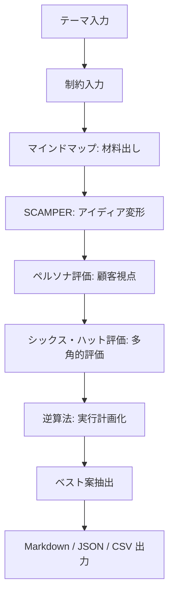

# AIアイディア出しワークフローアプリ 設計用まとめ

## 0. 前提

このMarkdownは、このチャット内で話した内容だけを元にまとめたもの。  
他のチャットの情報、過去の個人メモ、別プロジェクト情報は持ち込まない。

目的は、AIにアプリ設計を依頼するための材料として、
「AIを使ったアイディア出し」をアプリに落とし込むための要件・機能・画面・処理フローを整理すること。

---

## 1. 参照したURL・サイト

ユーザーが提示したURLは以下。

- Google検索結果  
  `https://www.google.com/search?q=ai+アイディア出し`
- note記事  
  `https://note.com/na232lbedzd8nid6/n/n1c24396ea681`
- StudyHacker記事  
  `https://studyhacker.net/idea-ai`
- Yoom記事  
  `https://lp.yoom.fun/blog-posts/infinite-ideation-with-generative-ai-prompt-tips-and-frameworks`
- Iketel記事  
  `https://www.iketel.co.jp/raction/column/16`

---

## 2. このチャットで得た結論

AIを使ったアイディア出しで重要なのは、

> AIに一発で面白いアイディアを出させることではない。

むしろ、

> 発想法を順番にAIへ実行させ、途中結果を保存・評価・再利用すること。

つまり、作るべきアプリは単なるチャットアプリではなく、

> 発想法を工程化したAIワークフローアプリ

である。

---

## 3. アプリのコンセプト

### 3.1 アプリの一言説明

ユーザーがテーマと制約を入力すると、AIが複数の発想法を順番に実行し、
材料出し、アイディア展開、顧客視点評価、多角的評価、実行計画化まで行うアプリ。

### 3.2 目指すもの

- アイディアを大量に出す
- 既存案を変形する
- 顧客・利用者視点で検討する
- リスクや実現性を評価する
- 最終的に実行できる計画へ落とす
- 途中結果を保存し、再生成・比較・修正できるようにする

### 3.3 目指さないもの

初期版では以下は重視しない。

- AIが完全自律で事業判断すること
- エージェントが勝手に市場調査を続けること
- チーム共有
- 高度な外部サービス連携
- Miro / Notion / WordPress 連携
- ログイン機能
- 美麗なダッシュボード

---

## 4. 基本ワークフロー

標準コースは以下。

```text
テーマ入力
↓
制約入力
↓
マインドマップで材料出し
↓
SCAMPERで変形
↓
ペルソナで顧客視点チェック
↓
シックス・ハットで評価
↓
逆算法で実行計画化
↓
ベスト案を保存・比較・出力
```

Mermaidで表すと以下。



---

## 5. 使う発想法

### 5.1 マインドマップ型の材料出し

テーマをいきなり完成案にせず、まず材料へ分解する。

観点例：

- 関連性
- 性質
- 構成
- 抽象化
- 時間軸

目的：

- 発想の材料を増やす
- テーマの周辺領域を広げる
- 組み合わせ候補を作る

### 5.2 SCAMPER法

既存の材料やアイディアを7方向に変形する。

| 項目 | 意味 |
|---|---|
| S | Substitute / 代替 |
| C | Combine / 結合 |
| A | Adapt / 応用・適応 |
| M | Modify / 修正・拡大・縮小 |
| P | Put to other uses / 転用 |
| E | Eliminate / 除去 |
| R | Reverse / 逆転 |

目的：

- ありきたりな案を変形する
- 既存案から派生案を作る
- 商品・サービス・機能改善に使う

### 5.3 ペルソナ評価

AIに複数の架空ユーザーを作らせ、その視点からアイディアを評価させる。

評価項目例：

- 刺さるポイント
- 違和感
- 不安
- 使う理由
- 使わない理由
- 改善案
- 利用可能性スコア

目的：

- 自分視点だけの発想を避ける
- ターゲットごとの反応を見る
- 顧客視点で改善する

### 5.4 シックス・ハット法

アイディアを6種類の視点から評価する。

| 色 | 視点 |
|---|---|
| 白 | 事実・データ |
| 赤 | 感情・直感 |
| 黒 | リスク・欠点 |
| 黄 | 利点・可能性 |
| 緑 | 新しい発想・代替案 |
| 青 | まとめ・判断 |

このチャットでは、追加で以下のような視点も有効とした。

| 色 | 視点 |
|---|---|
| 紫 | 皮肉屋・前提へのツッコミ |

目的：

- AIの出した案をそのまま信じない
- 欠点やリスクを洗い出す
- 改善案を作る

### 5.5 逆算法

最終目標から逆算して、実行ステップへ落とす。

出力項目例：

- 最終目標
- 中間段階
- 初日にやること
- 1週間以内にやること
- 必要なもの
- 検証方法

目的：

- アイディアを実行可能な計画にする
- ふわっとした案で終わらせない
- MVPや初動に落とす

---

## 6. アプリ画面案

### 6.1 テーマ入力画面

入力項目：

- テーマ
- 背景
- 目的
- どんな種類のアイディアがほしいか

例：

```text
何についてアイディアを出したいですか？

例：
・AIを使った副業アイディア
・新しいWebサービス
・業務改善案
・YouTube企画
・既存商品の改善案
```

### 6.2 制約入力画面

入力項目：

- 予算
- 期間
- 人数
- 対象ユーザー
- 避けたいこと
- 使える技術
- 収益化したいか
- 実現難易度の希望

例：

```text
予算：
期間：
人数：
対象ユーザー：
避けたいこと：
使える技術：
収益化したいか：
```

### 6.3 発想ステップ選択画面

ユーザーが使う発想法を選べる。

```text
[✓] マインドマップ
[✓] SCAMPER
[✓] ペルソナ評価
[✓] シックス・ハット
[✓] 逆算法
```

プリセット例：

#### 標準コース

```text
マインドマップ → SCAMPER → ペルソナ → 評価 → 実行計画
```

#### 大量発想コース

```text
マインドマップ → SCAMPER → 50案生成 → ランキング
```

#### 事業案コース

```text
市場仮説 → ペルソナ → 課題 → 解決策 → 収益化 → 実行計画
```

### 6.4 ステップ実行画面

各ステップごとに以下の操作を用意する。

- このステップを実行
- このステップを再生成
- 結果を採用
- 結果を手動修正
- 次へ進む
- 前のステップに戻る

画面イメージ：

```text
[1] テーマ
    ↓
[2] 材料出し
    ↓
[3] 変形
    ↓
[4] 顧客視点
    ↓
[5] 評価
    ↓
[6] 実行計画
    ↓
[7] 出力
```

### 6.5 アイディア一覧画面

表示項目：

- アイディア名
- 概要
- ターゲット
- スコア
- 実現難易度
- リスク
- 次のアクション

できれば、評価軸ごとのスコアも持つ。

### 6.6 出力画面

出力形式：

- Markdown
- JSON
- CSV

初期版ではMarkdown出力が最優先。

---

## 7. 内部処理の考え方

### 7.1 アプリの本体

このアプリの本体はLLMそのものではない。

本体は以下。

- 発想ワークフロー管理
- プロンプトテンプレート管理
- 途中結果の保存
- 評価軸の管理
- 再実行・比較機能

LLMは、各工程を処理するエンジンとして使う。

### 7.2 処理構造

```text
ユーザー入力
↓
ワークフローエンジン
↓
プロンプトテンプレート
↓
LLM
↓
構造化出力
↓
保存
↓
次ステップへ渡す
```

### 7.3 途中結果を保存する理由

一発回答ではなく、以下のように段階ごとの成果物を残す。

```text
材料
↓
候補
↓
評価
↓
改善
↓
実行案
```

途中結果を保存すると、以下が可能になる。

- この案だけ再評価
- このペルソナだけ変更
- SCAMPERからやり直し
- 制約を追加して再生成
- 評価軸を変えて再ランキング
- 最終案を比較する

---

## 8. データ構造案

### 8.1 Project

```text
Project
├─ id
├─ title
├─ theme
├─ background
├─ purpose
├─ constraints
├─ selected_workflow
├─ created_at
├─ updated_at
└─ status
```

### 8.2 WorkflowRun

```text
WorkflowRun
├─ id
├─ project_id
├─ workflow_name
├─ started_at
├─ completed_at
├─ status
└─ current_step
```

### 8.3 StepResult

```text
StepResult
├─ id
├─ workflow_run_id
├─ step_name
├─ input_json
├─ prompt_text
├─ llm_output_raw
├─ output_json
├─ adopted
├─ created_at
└─ version
```

### 8.4 Idea

```text
Idea
├─ id
├─ project_id
├─ source_step_id
├─ idea_name
├─ description
├─ target_user
├─ value_proposition
├─ feasibility_score
├─ market_need_score
├─ uniqueness_score
├─ profitability_score
├─ risk_score
├─ total_score
├─ risks
├─ action_plan
└─ selected
```

### 8.5 Persona

```text
Persona
├─ id
├─ project_id
├─ name
├─ attributes
├─ needs
├─ pain_points
├─ evaluation_notes
└─ score
```

---

## 9. プロンプトテンプレート案

### 9.1 マインドマップ

```text
テーマ「{{theme}}」について、マインドマップ的に分解してください。

以下の観点で出してください。

1. 関連性：直接関係するもの
2. 性質：機能・特徴・性格
3. 構成：何で成り立っているか
4. 抽象化：上位カテゴリ・意味
5. 時間軸：過去・現在・未来での変化

各項目10個ずつ出してください。
その後、面白そうな組み合わせを10個作ってください。

制約条件：
{{constraints}}
```

### 9.2 SCAMPER

```text
以下の材料を使って、SCAMPER法でアイディアを展開してください。

テーマ：{{theme}}
材料：{{mindmap_output}}
制約条件：{{constraints}}

S：代替
C：結合
A：適応
M：修正・拡大・縮小
P：転用
E：除去
R：逆転

各項目3案ずつ出してください。
最後に、実現しやすい順にベスト10を選んでください。
```

### 9.3 ペルソナ評価

```text
以下のアイディアについて、3種類のペルソナを作り、
それぞれの視点で評価してください。

アイディア一覧：
{{ideas}}

出してほしい内容：
1. ペルソナ属性
2. 刺さるポイント
3. 違和感・不安
4. 改善案
5. 使う可能性を10点満点で評価
```

### 9.4 シックス・ハット評価

```text
以下のアイディアをシックス・ハット法でレビューしてください。

アイディア：{{idea}}

白：事実・データ
赤：感情・直感
黒：リスク・欠点
黄：利点・可能性
緑：新しい発想・代替案
青：まとめ・次の判断

追加で、紫：皮肉屋として、前提そのものへのツッコミも出してください。
最後に、改善後のアイディアを3案出してください。
```

### 9.5 逆算法

```text
以下の上位アイディアについて、逆算法で実行計画を作ってください。

アイディア：{{selected_idea}}
制約条件：{{constraints}}

出力してください：
1. 最終目標
2. 中間段階
3. 初日にやること
4. 1週間以内にやること
5. 必要なもの
6. 最初に検証する仮説
7. 失敗しそうなポイント
8. 代替案
```

---

## 10. MVP機能

最初のバージョンで作るべき機能。

1. テーマ入力
2. 制約入力
3. 発想法を順番に実行
4. 各ステップの結果表示
5. アイディア一覧表示
6. スコアリング
7. ベスト3抽出
8. Markdown出力

---

## 11. 初期版では後回しにする機能

以下は初期版では不要。

- ログイン
- チーム共有
- 綺麗なダッシュボード
- 外部API連携
- Miro連携
- Notion連携
- WordPress連携
- 画像生成
- 音声入力
- 高度なAIエージェント化
- 自動市場調査

---

## 12. 技術構成案

### 12.1 Webアプリ構成

```text
フロントエンド：React / Next.js
バックエンド：Python FastAPI または Node.js
DB：SQLite
LLM：OpenAI API / Claude API / Gemini API / ローカルLLM
出力：Markdown / JSON / CSV
```

### 12.2 デスクトップアプリ構成

```text
UI：Tauri / Electron / Avalonia など
バックエンド：Python または Node.js
DB：SQLite
LLM：API またはローカルLLM
```

### 12.3 最小ファイル構成案

```text
idea_app/
├─ workflows/
│  └─ ideation_standard.yaml
├─ prompts/
│  ├─ mindmap.md
│  ├─ scamper.md
│  ├─ persona.md
│  ├─ six_hats.md
│  └─ reverse_plan.md
├─ app/
│  ├─ project.py
│  ├─ workflow_runner.py
│  ├─ llm_client.py
│  └─ storage.py
└─ outputs/
   └─ project_x.md
```

---

## 13. ワークフロー定義ファイル案

YAMLで発想工程を定義できるようにするとよい。

```yaml
name: ideation_standard
label: 標準アイディア出しコース
steps:
  - id: mindmap
    label: マインドマップ材料出し
    prompt: prompts/mindmap.md
    input:
      - theme
      - constraints
    output: mindmap_output

  - id: scamper
    label: SCAMPER展開
    prompt: prompts/scamper.md
    input:
      - theme
      - constraints
      - mindmap_output
    output: scamper_ideas

  - id: persona
    label: ペルソナ評価
    prompt: prompts/persona.md
    input:
      - scamper_ideas
      - constraints
    output: persona_evaluation

  - id: six_hats
    label: シックス・ハット評価
    prompt: prompts/six_hats.md
    input:
      - persona_evaluation
    output: evaluated_ideas

  - id: reverse_plan
    label: 逆算法による実行計画
    prompt: prompts/reverse_plan.md
    input:
      - evaluated_ideas
      - constraints
    output: action_plans
```

---

## 14. 重要な設計方針

### 14.1 AI任せにしすぎない

各ステップで人間が介入できるようにする。

必要な操作：

- 結果を採用
- 結果を修正
- 再生成
- 前のステップに戻る
- 一部のアイディアだけ再評価

### 14.2 発散と収束を分ける

発散フェーズでは評価しない。  
収束フェーズで評価・ランキングする。

例：

```text
Step1：50案出す
Step2：評価軸で絞る
Step3：上位案だけ実行計画化する
```

### 14.3 構造化出力にする

LLMの出力は、できればJSONで受ける。

理由：

- アイディア一覧に表示しやすい
- スコアリングしやすい
- 再評価しやすい
- Markdown / CSV に変換しやすい

### 14.4 プロンプトは外部ファイル管理にする

コードに直書きせず、`prompts/*.md` として管理する。

理由：

- 発想法を追加しやすい
- プロンプト改善がしやすい
- ワークフローを差し替えやすい

---

## 15. 事業案検討向けの追加工程

単なるアイディア出しではなく、商売・副業・サービス企画に使うなら以下を追加するとよい。

```text
1. 誰の困りごとか
2. その困りごとは金を払ってでも解決したいか
3. 既存の代替手段は何か
4. 自分が作れる最小版は何か
5. 最初の客をどう見つけるか
6. 収益化方法は何か
```

この工程を入れると、ブレストアプリから事業案検討アプリに近づく。

---

## 16. AIエージェント化について

初期版ではAIエージェント化は不要。

最初は、

```text
1つのLLMに、工程ごとに違う役割を与える
```

だけでよい。

後から拡張する場合は、以下のように分けられる。

```text
市場調査エージェント
競合調査エージェント
ペルソナ評価エージェント
収益性評価エージェント
実行計画エージェント
```

ただし、初期MVPでは、エージェント化よりもワークフロー管理を優先する。

---

## 17. AIに設計依頼するときの指示文

以下をAI設計用の依頼文として使える。

```text
このMarkdownの内容を元に、
「AIに発想法を順番に実行させるアイディア出しワークフローアプリ」を設計してください。

重要方針：
- 単なるチャットアプリではなく、工程型UIにする
- 発想法は、マインドマップ、SCAMPER、ペルソナ評価、シックス・ハット評価、逆算法を使う
- 各ステップの途中結果を保存する
- 各ステップで再生成、採用、手動修正、次へ進む操作ができるようにする
- MVPではログインや外部連携は不要
- SQLiteで保存できる構成にする
- プロンプトは外部ファイルで管理する
- 最終結果はMarkdownで出力できるようにする

出してほしいもの：
1. 画面一覧
2. 画面遷移
3. データモデル
4. API設計
5. ワークフロー実行設計
6. LLMプロンプト管理設計
7. MVPの実装順序
8. フォルダ構成
9. Mermaid図
10. 最小実装コードのたたき台
```

---

## 18. 最終まとめ

このアプリの価値は、AIに「自由に考えさせる」ことではない。

価値は、

```text
発想法を工程化し、
AIに順番に実行させ、
途中結果を保存し、
人間が判断しながら、
最終的に実行可能なアイディアへ落とすこと
```

にある。

初期版の完成形は以下。

```text
テーマ入力
↓
制約入力
↓
マインドマップ生成
↓
SCAMPER展開
↓
ペルソナ評価
↓
シックス・ハット評価
↓
逆算法で実行計画
↓
ベスト3をMarkdown出力
```

この形なら、AI設計にも渡しやすく、MVPとしても実装しやすい。
