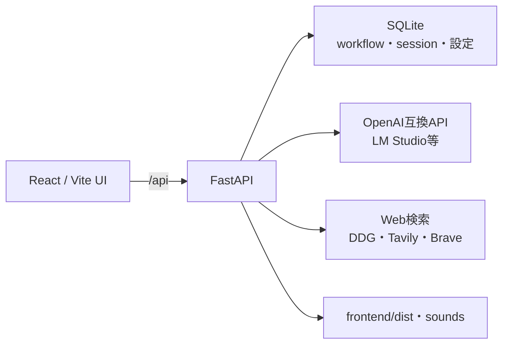

# ⚡ IdeaForge — 発想炉

「より良い、そして斬新なアイディアを発案するための」ローカルWebアプリ。
発想法を**工程(ノード)としてグラフに組み**、AIに順番に実行させ、人間が各ゲートで
**採用 / 再生成 / 修正** を判断しながら、実行可能なアイディアまで鍛造する。

## このアプリで学ぶこと

- Reactのグラフ編集とFastAPIのCRUDをSQLiteへ保存する流れ
- ノード、edge、実行状態、分岐した生成案を分けて管理する考え方
- OpenAI互換APIを使い、ノード単位でLLM設定を切り替える方法
- AIの自動生成と、人間が採用・再生成・修正を判断するgateの分離

| 段階 | 確認内容 | 必要なもの |
|---|---|---|
| 1. 保存層 | schema、初期provider、workflow・session状態 | Python標準libraryのみ |
| 2. LLMなしデモ | 画面表示、workflow編集、SQLite保存 | IdeaForgeのPython依存package |
| 3. 完全デモ | ノード実行、gate、再生成、履歴、report | 会話用LLM。検索blockはnetworkまたは検索APIも使用 |

## 15分で再開する（LLMなし）

リポジトリルートから、一時SQLiteだけを使うテストを実行します。`backend/ideaforge.db`は作成・変更しません。

```powershell
python -m unittest discover -s StudyFabel\ideaforge\backend\tests -v
```

実行前に、初期化で作られるtableと既定providerを予想します。実行後は、workflowのgraphとsessionのstateを別fieldに保存する理由を説明します。

## 起動方法

1. **Python 3.10+** をインストール済みであること
2. `run.bat` をダブルクリック
   - 初回は `venv`(仮想環境)を自動作成し、その中に依存パッケージをインストールする(システムのPythonは汚さない)
   - 2回目以降は既存の venv を activate して起動するだけ
3. ブラウザで http://localhost:8000 が開く

フロントはビルド済み(`frontend/dist`)なので **Node.js は不要**。

## デモ経路

### LLMなしで確認する

1. `run.bat`または`run.sh`で起動し、`http://localhost:8000`を開く。
2. `http://localhost:8000/api/health`が`{"ok":true,"app":"IdeaForge"}`を返すことを確認する。
3. workflowを複製し、名前、node配置、edgeを変更して保存する。
4. ブラウザを再読み込みし、変更がSQLiteから復元されることを確認する。
5. この段階では「実行」とLLM接続testを使わない。画面編集と状態保存の確認に限定する。

### 実LLMまで確認する

1. LM Studio等で会話用modelとOpenAI互換serverを起動する。
2. IdeaForgeの設定でbase URLを登録し、接続testを実行する。
3. presetを選び、入力blockから実行する。
4. gateで採用、再生成、修正を行い、複数案が保持されることを確認する。
5. session履歴から再開し、最後にMarkdown reportを出力する。

## LLMの設定(⚙ 設定)

OpenAI互換APIとして抽象化。用途でノードごとに切替可能。

| 使い方 | base URL | APIキー | モデル名 |
|---|---|---|---|
| LM Studio | `http://localhost:1234/v1` | `lm-studio`(任意) | 空欄=ロード中のモデル |
| OpenAI | `https://api.openai.com/v1` | sk-… | gpt-4oなど |
| その他互換API | 各サービスの/v1 | 各キー | 各モデル |

LM Studio側は「開発者」タブ→ローカルサーバーを起動しておくこと。
接続テストが「All connection attempts failed」になる場合は、`localhost` が IPv6 に解決されて失敗している可能性があるため、`http://127.0.0.1:1234/v1` のように **127.0.0.1** を指定する。
「既定」に選んだプロバイダが基本使用され、ノード単位でインスペクタから上書きできる。

## Web検索(⚙ 設定)

| エンジン | キー |
|---|---|
| DuckDuckGo | 不要(デフォルト) |
| Tavily | 無料枠あり・要APIキー |
| Brave Search | 無料枠あり・要APIキー |

検索失敗時はLLMが「検索なしで推論」に自動フォールバックする。

## サウンド(⚙ 設定 → サウンド)

- 激アツ演出のレベル1〜3に音声ファイル(.mp3/.wav/.ogg)を割当可能。**未設定なら内蔵ファンファーレ**が鳴る
- ファイルは `backend/sounds/` に置くか、設定画面の「＋音声ファイルを追加」でアップロード
- **🎵 テーマ曲**: 好きな曲ファイル(盆回し等はお手持ちの音源)を sounds に置いて「テーマ曲」に指定 → ヘッダーの🎵でループ再生。無音タメ演出中は自動で音量が下がり、爆発と同時にファンファーレが鳴る

## 使い方

- **プリセット4種**: 王道・8ステップ完全版(原典) / 異分野移植スプリント / 並列発想フュージョン / 天邪鬼・前提破壊
- **ビルダー**: 左パレットから発想ブロック(SCAMPER・オズボーン・TRIZ・ランダム刺激・形態分析・ブレインライティング・弁証法・逆張り・ワースト反転・ペルソナ・シックスハット・プレモータム・逆算・Web探索・異分野移植 ほか)をドラッグして配置し、ノードの下端→上端を繋ぐ。分岐・並列・統合(merge)も組める
- **実行**: ▶実行 → 入力フォーム → 自動でグラフを流れる。**✋ゲート**で停止したら 採用 / 🎲再生成 / ✏修正。再生成した案は**分岐保持**され、タブ(案1/案2/…)で見比べて好きな版を採用できる
- **🎰 これだ!!**: 人間の直感で殿堂入り認定 → 超・激・アツ演出
- **激アツ演出**: 評価系ノードのスコアを自動検知。7点台=アツい / 8点台=激アツ(暗転タメ→金爆発) / 9点以上=超・激・アツ(完全無音停止→白フラッシュ→虹カットイン+虹枠+シェイク)
- **履歴**: セッションは自動保存。🕘履歴からいつでも再開・閲覧
- **レポート**: 最終ノード完了後、Markdownでダウンロード

## 開発(フロントを改造する場合のみ)

```bash
cd frontend
npm install
npm run dev        # 開発サーバー(要: バックエンド起動済み)
npm run build      # dist再生成 → run.batで配信
```

## 構成と責務



```
ideaforge/
├─ run.bat / run.sh       # 起動スクリプト
├─ backend/               # FastAPI + SQLite(ideaforge.db に全データ保存)
│   ├─ main.py            # API + 静的配信
│   ├─ llm.py             # OpenAI互換ストリーミングプロキシ
│   ├─ search.py          # DuckDuckGo / Tavily / Brave
│   └─ db.py
└─ frontend/
    ├─ dist/              # ビルド済み(そのまま配信される)
    └─ src/
        ├─ blocks.ts      # 発想ブロック定義(プロンプトはここを編集)
        ├─ presets.ts     # プリセットワークフロー
        ├─ engine.ts      # グラフ実行エンジン(分岐保持・激アツ検出)
        └─ components/    # グラフエディタ / 実行モニタ / 演出
```

`IDEAFORGE_DB_PATH`環境変数を指定するとSQLiteの保存先を変更できます。自動テストは一時directoryを指定し、通常の`backend/ideaforge.db`から隔離します。

## テスト方針

| 対象 | 現在の確認方法 | 証明する範囲 |
|---|---|---|
| SQLite保存層 | `unittest`、GitHub Actions | schema、初期data、設定、workflow・session JSON保存 |
| FastAPI・静的配信 | 起動後のhealth、画面、API手動確認 | routeと配信の結合 |
| フロントエンド | `npm run build` | TypeScript・Vite build |
| LLM・検索 | local serverまたは各APIで手動確認 | streaming、model応答、検索fallback |

自動テスト合格はLLM応答品質やWeb検索結果を証明しません。完全デモでは、使用model、入力、採用・再生成の判断、最終reportを学習記録へ残します。

※ APIキーはローカルの `backend/ideaforge.db` に平文保存される(自分専用PC前提)。
※ 認証機能はなくCORSも全許可のため、localhostでの個人学習用です。外部公開用の構成ではありません。
※ プリセットは初回起動時に自動登録される。プロンプトは全ノードでインスペクタから編集可能。
