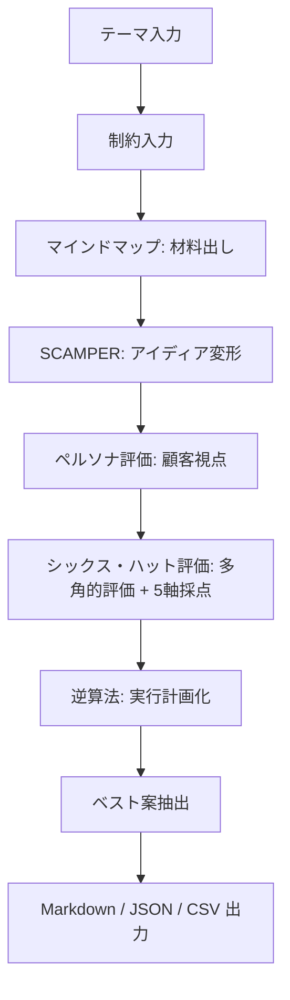

# AIアイディア出しワークフローアプリ 設計用まとめ v2（決定版）

## 0. 前提

このMarkdownは、初版まとめ（ai_ideation_workflow_app_summary.md）を元に、
インタビュー形式で全未決事項を解消した**決定版**。
初版で両論併記・未決だった項目は、本書では全て1つに確定している。

目的は変わらず、AIにアプリ設計・実装を依頼するための材料とすること。

---

## 1. インタビューで確定した決定事項一覧

| # | 論点 | 決定 |
|---|---|---|
| 1 | 利用者 | 自分専用。ログイン・マルチテナント不要 |
| 2 | アプリ形態 | ローカルWebアプリ（localhost起動） |
| 3 | 開発体制 | AIに実装させ、自分で調整 |
| 4 | LLM | ローカルLLM（LM Studio）のみ。商用LLM（OpenAI / Anthropic / Google）は将来拡張（共通IFで切替可能、config/models.yamlのコメント解除+APIキー設定で有効化） |
| 5 | LLM切替粒度 | ステップごとに実行画面のUIで選択（現行はLM Studioのモデルのみ） |
| 6 | 構造化出力 | プロンプト指示 + スキーマ検証 + 自動リトライ1回 |
| 7 | 実装スタック | Next.js一本（TypeScriptのみ、1リポジトリ） |
| 8 | ワークフロー定義 | workflows/*.yaml で外部管理（MVPに含む） |
| 9 | プロンプト | prompts/*.md で外部管理（MVPに含む） |
| 10 | 上流修正時の下流 | 確認ダイアログ後に一括再実行 |
| 11 | APIキー | .envファイル管理。設定画面なし |
| 12 | スコア算出 | LLMが5軸を10点満点採点、総合はアプリ側で単純平均 |
| 13 | MVPコース | 標準コースのみ。他コースはYAML追加で後日 |
| 14 | 出力形式 | Markdown / JSON / CSV の3形式（MVPに含む） |
| 15 | CSV仕様 | 全ステップ結果を含める（ステップごとに別CSV、ZIP一括DL） |
| 16 | ペルソナ | 専用編集UIあり（属性・ニーズ等を直接編集可能） |
| 17 | 実行中UI | スピナーのみ。ストリーミングなし |
| 18 | コスト可視化 | トークン数記録 + 概算円表示（単価は設定ファイル手書き） |
| 19 | 実行環境 | Windowsホスト直（Node 22 + npm run dev）。Dockerは使わない |
| 20 | 開発フォルダ | . |
| 21 | LM Studio | 同じくホストで起動、http://localhost:1234/v1 で接続 |

---

## 2. コンセプト（初版から変更なし）

ユーザーがテーマと制約を入力すると、AIが複数の発想法を順番に実行し、
材料出し、アイディア展開、顧客視点評価、多角的評価、実行計画化まで行う
**発想法を工程化したAIワークフローアプリ**。

価値は「AIに自由に考えさせる」ことではなく、

```text
発想法を工程化し、
AIに順番に実行させ、
途中結果を保存し、
人間が判断しながら、
最終的に実行可能なアイディアへ落とすこと
```

### 目指さないもの（初期版）

- ログイン / チーム共有 / 外部サービス連携（Miro, Notion, WordPress）
- AIの完全自律判断・自動市場調査・エージェント化
- 美麗なダッシュボード / 画像生成 / 音声入力

---

## 3. 基本ワークフロー（標準コース）



発想法5種（マインドマップ・SCAMPER・ペルソナ・シックス・ハット+紫・逆算法）の
内容とプロンプト案は初版 §5・§9 のとおり。変更なし。

---

## 4. 技術構成（確定）

```text
フレームワーク：Next.js（App Router）、TypeScriptのみ
UI：React（Next.js内）
API：Next.js API Routes（Route Handlers）
DB：SQLite（better-sqlite3）
スキーマ検証：zod
LLM：LM Studio（ローカル、OpenAI互換API）のみ。商用LLMは将来拡張（コード対応済み）
APIキー：不要（LM Studioのみのため）。.env.localにはベースURLのみ。商用切替時にキー追加
起動：npm run dev → http://localhost:3000
```

### 動作環境（確定）

```text
ホストOS：Windows。Dockerは使わない（自分専用のお試しのため不要と判断）
必要なもの：Node.js 22（インストール済みであること）
開発フォルダ：.
LM Studio：同ホストで起動。LMSTUDIO_BASE_URL=http://localhost:1234/v1 を .env.local に記載
SQLite：data/app.db（普通のローカルファイル。バックアップはフォルダコピーでよい）
将来配布したくなったらDocker化はその時に検討する
```

選定理由：自分専用ローカル利用のため1リポジトリ・1言語・1プロセスが最優先。
サーバとフロントで型を共有でき、AI生成コードの保守が楽。

### フォルダ構成

```text
category/StudyAIIdeaGeneration/
├─ .env.local               # APIキー・LMSTUDIO_BASE_URL
├─ workflows/
│  └─ ideation_standard.yaml
├─ prompts/
│  ├─ mindmap.md
│  ├─ scamper.md
│  ├─ persona.md
│  ├─ six_hats.md
│  └─ reverse_plan.md
├─ config/
│  └─ pricing.yaml          # モデル単価表（手書き）
├─ src/
│  ├─ app/                  # 画面 + API Routes
│  ├─ lib/
│  │  ├─ llm/
│  │  │  ├─ client.ts       # 共通IF
│  │  │  ├─ openai.ts       # LM Studioも同実装を流用（baseURL差し替え）
│  │  │  ├─ anthropic.ts
│  │  │  └─ google.ts
│  │  ├─ workflow.ts        # YAML読込・実行エンジン
│  │  ├─ schema.ts          # zodスキーマ（ステップ出力検証）
│  │  └─ db.ts
│  └─ ...
├─ data/
│  └─ app.db                # SQLite
└─ outputs/                 # エクスポート先
```

---

## 5. LLM実行の設計（確定）

### 5.1 プロバイダ構成（現行：LM Studioのみ）

- 現行の有効プロバイダは **LM Studio（ローカル）のみ**。単価¥0。
- LM StudioはOpenAI互換APIのため openai.ts を baseURL 差し替えで流用
- ローカルモデルはJSON出力の信頼性が低いため、検証+リトライ+raw退避（§5.2）が特に効く前提
- ステップ実行画面のドロップダウンで model をその都度選択（初期値は前回そのステップで使ったもの）

**将来拡張（商用LLM切替）**

- `lib/llm/client.ts` の共通インターフェース（prompt in → text out + トークン数）に
  OpenAI / Anthropic / Google の実装（1社1ファイル）を接続済み
- 有効化は config/models.yaml のコメント解除 + .env.local へのAPIキー追加のみ。コード変更不要
- 各社のnative構造化出力機能は**使わない**（共通コードパス維持のため）

### 5.2 構造化出力フロー

```text
プロンプトに「以下のJSONスキーマで出力せよ」を付加
↓
LLM応答
↓
JSON抽出 → zodで検証
↓ 失敗時
自動リトライ1回（エラー内容を添えて再依頼）
↓ それでも失敗
raw テキストのまま StepResult に保存 + 画面に警告表示
→ ユーザーが手動修正UIでJSONを直して採用
```

### 5.3 トークン・コスト記録

- StepResult に input_tokens / output_tokens / model を保存
- config/pricing.yaml の単価表から概算円を計算し、ステップ・プロジェクト単位で表示

---

## 6. 再実行・下流の扱い（確定）

上流ステップを再生成または手動修正して「採用」した時：

```text
ダイアログ表示：
「以降の N ステップを再実行します。推定コスト：約 ¥XX。実行しますか？」
↓ OK
下流ステップを順番に自動実行（各結果は新versionとして保存）
↓ キャンセル
下流は旧結果のまま「stale」バッジ表示。個別再実行も可能
```

- 完全自動再実行はしない（人間介入方針 §14.1 を維持）
- StepResult は version 列で履歴を保持し、新旧比較できる

---

## 7. スコアリング（確定）

- シックス・ハット評価ステップで、LLMに5軸（実現性・市場ニーズ・独自性・収益性・リスク）を各10点満点で採点させる
- 総合スコアは**アプリ側で単純平均**を計算（LLMに計算させない）
- LLMの点数は「目安」と割り切る。重み付け調整・再ランキングはv2へ

---

## 8. 画面一覧（確定・7画面）

| 画面 | 内容 |
|---|---|
| 1. プロジェクト一覧 | 過去プロジェクトを開く / 新規作成 |
| 2. テーマ入力 | テーマ・背景・目的・欲しいアイディアの種類 |
| 3. 制約入力 | 予算・期間・人数・対象ユーザー・避けたいこと等 |
| 4. ステップ実行 | 進行バー、provider/modelドロップダウン、実行/再生成/採用/手動修正/戻る、スピナー、トークン・概算コスト表示 |
| 5. ペルソナ編集 | LLM生成した3ペルソナの属性・ニーズ・ペインを直接編集して評価に反映 |
| 6. アイディア一覧 | 名前・概要・ターゲット・5軸+総合スコア・難易度・リスク・次アクション。ソート可 |
| 7. 出力 | Markdown / JSON / CSV(ZIP) のダウンロード |

実行中表示はスピナーのみ（ストリーミングなし）。

---

## 9. データ構造（初版§8を維持、以下を追記）

```text
StepResult に追記：
├─ provider
├─ model
├─ input_tokens
├─ output_tokens
├─ is_stale          # 上流が変わったのに未再実行
└─ parse_failed      # JSON検証失敗でrawのまま

Persona に追記：
└─ edited_by_user    # 手動編集済みフラグ
```

---

## 10. 出力仕様（確定）

| 形式 | 内容 |
|---|---|
| Markdown | プロジェクト全体のまとめ（最終案ベスト3 + 各ステップ要約）。最優先実装 |
| JSON | DB内容のほぼ素通しエクスポート（Project + 全StepResult + Idea + Persona） |
| CSV | ステップごとに別ファイル（mindmap.csv, scamper.csv, personas.csv, ideas.csv, plans.csv）をZIPで一括DL。ネスト項目は「 / 」結合で1セル化 |

---

## 11. AIに実装依頼するときの指示文

```text
このMarkdownの内容を元に、
「AIに発想法を順番に実行させるアイディア出しワークフローアプリ」を実装してください。

確定済み方針（変更しないこと）：
- Next.js（App Router・TypeScript）+ better-sqlite3 + zod の1リポジトリ構成
- ローカル専用。ログイン・認証なし。APIキーは .env.local
- Windowsホスト直で実行（Node 22、npm run dev）。Dockerは使わない
- 開発フォルダは .
- LM Studioは http://localhost:1234/v1 で接続
- LLMは LM Studio（ローカル、OpenAI互換）のみ有効。商用LLM（OpenAI / Anthropic / Google）はコード対応済みの将来拡張で、config/models.yaml と .env.local の設定だけで切替可能。共通IFは lib/llm/client.ts
- 各社のnative構造化出力は使わず、プロンプト指示+zod検証+リトライ1回で統一
- ステップごとにUIで provider/model を選択（初期値は前回値）
- ワークフローは workflows/*.yaml、プロンプトは prompts/*.md で外部管理
- 上流修正時は確認ダイアログ（再実行ステップ数+推定コスト）→下流一括再実行
- StepResult は version で履歴保持、stale/parse_failed フラグあり
- スコアはLLM5軸採点+アプリ側単純平均
- ペルソナ専用編集画面あり
- 出力は Markdown / JSON / CSV(ステップ別ZIP)
- 実行中はスピナーのみ（ストリーミング不要）
- トークン数を記録し config/pricing.yaml の単価で概算円表示

各段階で動作確認できる状態を保ってください。
```
